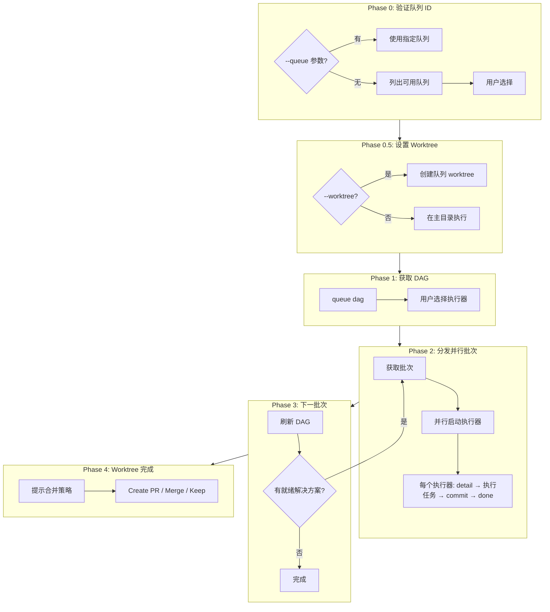

# /issue:execute

> **分类**: Issue
> **源文件**: [.claude/commands/issue/execute.md](../../../.claude/commands/issue/execute.md)

## 概述

`/issue:execute` 是最小编排器，使用基于 DAG 的并行编排执行队列。每个执行器接收完整解决方案并处理所有任务。

**设计原则**:
- `queue dag` → 返回带解决方案 ID 的并行批次
- `detail <id>` → 只读解决方案获取
- `done <id>` → 更新解决方案完成状态
- 无竞态条件：状态只通过 `done` 更改
- **执行器按顺序处理解决方案内的所有任务**
- **单一 worktree 用于整个队列**

## 命令语法

```bash
/issue:execute --queue <queue-id> [options]
```

### 参数说明

| 参数 | 类型 | 必填 | 默认值 | 说明 |
|------|------|------|--------|------|
| --queue | string | 是 | - | 要执行的队列 ID |
| -y, --yes | flag | 否 | - | 自动确认，使用推荐设置 |
| --worktree | flag/string | 否 | - | 使用 worktree 隔离，可指定现有路径 |

## 使用场景

### 什么时候使用

- **执行 Issue 队列**: 已通过 `/issue:queue` 形成队列
- **DAG 并行执行**: 需要基于依赖的并行执行
- **Worktree 隔离**: 想要隔离执行环境

### 什么时候不使用

- **无队列**: 先运行 `/issue:queue`
- **单个 Issue**: 使用 `/workflow:lite-execute`

## 工作流程

### 四阶段执行流程



### Queue ID 要求

**Queue ID 是必需的。** 必须通过 `--queue <queue-id>` 指定要执行的队列。

**如果未提供 Queue ID**:
1. 列出可用队列
2. 显示给用户
3. 让用户选择

**不要自动选择队列。** 需要明确用户确认以防止错误执行。

### Phase 1: 获取 DAG 与用户选择

```javascript
// 获取依赖图和并行批次
const dag = JSON.parse(Bash(`ccw issue queue dag --queue ${QUEUE_ID}`));

// 用户选择
AskUserQuestion({
  questions: [
    { question: '选择执行器类型:', options: ['Codex (推荐)', 'Gemini', 'Agent'] },
    { question: '执行模式:', options: ['执行 (推荐)', 'Dry-run'] },
    { question: '使用 git worktree 隔离?', options: ['是 (推荐)', '否'] }
  ]
});
```

**推荐执行器**: **Codex** - 最适合长时间自主工作（2 小时超时），支持后台执行和完整写入权限

### Phase 2: 分发并行批次

**执行器流程**:
```
1. detail <solution-id>  → 获取完整解决方案和所有任务
2. 执行 T1 → T2 → T3 ... → 按顺序执行所有任务
3. commit (一次)         → 解决方案完成后提交一次
4. done <solution-id>    → 报告完成
```

**重要**:
- 执行器顺序处理解决方案内的所有任务
- 每个解决方案提交一次（不是每个任务）
- 使用格式化的 conventional commit 消息

**执行器 Prompt 模板**:
```
## Execute Solution: ${SOLUTION_ID}

### Step 1: Get Solution Details
ccw issue detail ${SOLUTION_ID}

### Step 2: Execute All Tasks Sequentially
For each task:
- Follow task.implementation steps
- Run task.test commands
- Verify task.convergence criteria
- Do NOT commit after each task

### Step 3: Commit Solution (Once)
After ALL tasks pass:
  git commit -m "<type>(<scope>): <brief description>"

### Step 4: Report Completion
On success:
  ccw issue done ${SOLUTION_ID} --result '{...}'

On failure:
  ccw issue done ${SOLUTION_ID} --fail --reason '{...}'
```

### Phase 4: Worktree 完成

所有批次完成后：
```
Queue complete. What to do with worktree branch?
- Create PR (推荐) → 推送分支并创建 PR
- Merge to main → 合并所有提交并清理 worktree
- Keep branch → 清理 worktree，保留分支
```

## 并行执行模型

```
┌─────────────────────────────────────────────────────────────────┐
│ Orchestrator                                                    │
├─────────────────────────────────────────────────────────────────┤
│ 0. Validate QUEUE_ID                                            │
│                                                                 │
│ 0.5 (if --worktree) Create ONE worktree for entire queue        │
│    → .ccw/worktrees/queue-exec-<queue-id>                       │
│                                                                 │
│ 1. ccw issue queue dag --queue ${QUEUE_ID}                      │
│    → { parallel_batches: [["S-1","S-2"], ["S-3"]] }             │
│                                                                 │
│ 2. Dispatch batch 1 (parallel, SAME worktree):                  │
│    ┌──────────────────────────────────────────────────────┐     │
│    │        Shared Queue Worktree (or main)               │     │
│    │  ┌──────────────────┐ ┌──────────────────┐          │     │
│    │  │ Executor 1       │ │ Executor 2       │          │     │
│    │  │ detail S-1       │ │ detail S-2       │          │     │
│    │  │ [T1→T2→T3]       │ │ [T1→T2]          │          │     │
│    │  │ commit S-1       │ │ commit S-2       │          │     │
│    │  │ done S-1         │ │ done S-2         │          │     │
│    │  └──────────────────┘ └──────────────────┘          │     │
│    └──────────────────────────────────────────────────────┘     │
│                                                                 │
│ 3. ccw issue queue dag (refresh)                                │
│    → S-3 now ready → dispatch batch 2 (same worktree)           │
└─────────────────────────────────────────────────────────────────┘
```

**为什么适用于并行**:
- **一个 worktree 用于整个队列** → 所有解决方案共享同一隔离工作区
- `detail <id>` 是只读 → 无竞态条件
- 每个执行器顺序处理解决方案内的所有任务
- 每个解决方案一次提交
- `done <id>` 只更新自己的解决方案状态
- 同一批次中的解决方案无文件冲突（DAG 保证）

## CLI 端点契约

### `ccw issue queue list --brief --json`

```json
{
  "active_queue_id": "QUE-20251215-001",
  "queues": [
    { "id": "QUE-20251215-001", "status": "active", "issue_ids": ["ISS-001"] }
  ]
}
```

### `ccw issue queue dag --queue <queue-id>`

```json
{
  "queue_id": "QUE-...",
  "total": 3,
  "ready_count": 2,
  "completed_count": 0,
  "parallel_batches": [["S-1", "S-2"], ["S-3"]]
}
```

### `ccw issue detail <item_id>`

```json
{
  "item_id": "S-1",
  "issue_id": "ISS-xxx",
  "solution": {
    "tasks": [
      { "id": "T1", "title": "...", "implementation": [...] },
      { "id": "T2", "title": "...", "implementation": [...] }
    ]
  }
}
```

### `ccw issue done <item_id>`

标记解决方案完成/失败，更新队列状态。

## 使用示例

### 示例 1: 执行特定队列

```bash
/issue:execute --queue QUE-20251215-001
```

**预期输出**:
```
## Queue DAG (Solution-Level)

- Total Solutions: 5
- Ready: 3
- Completed: 0
- Parallel in batch 1: 3

Select executor type: [Codex (推荐) / Gemini / Agent]
Execution mode: [Execute (推荐) / Dry-run]
Use git worktree? [Yes (推荐) / No]

### Executing Solutions (DAG batch 1): S-1, S-2, S-3
...
```

### 示例 2: 使用 Worktree 隔离

```bash
/issue:execute --queue QUE-xxx --worktree
```

### 示例 3: 恢复现有 Worktree

```bash
/issue:execute --queue QUE-xxx --worktree /path/to/existing/worktree
```

### 示例 4: 无 Queue ID（自动列出）

```bash
/issue:execute
```

**预期输出**:
```
Available Queues:
ID                    Status      Progress    Issues
----------------------------------------------------------------------
→ QUE-20251215-001   active      3/10        ISS-001, ISS-002
  QUE-20251210-002   active      0/5         ISS-003

Which queue would you like to execute?
```

## 错误处理

| 错误 | 解决方案 |
|------|---------|
| 无队列 | 先运行 /issue:queue |
| 无就绪解决方案 | 依赖阻塞，检查 DAG |
| 执行器超时 | 解决方案未标记完成，可重试 |
| 解决方案失败 | 使用 `ccw issue retry` 重置 |

## 关联组件

- **相关 Commands**: 
  - [plan](plan.md) - 规划 Issue
  - [queue](queue.md) - 形成执行队列
  - [convert-to-plan](convert-to-plan.md) - 转换规划
- **相关 CLI**: `ccw issue queue dag`, `ccw issue detail`, `ccw issue done`

---

*最后更新: 2025-02*
