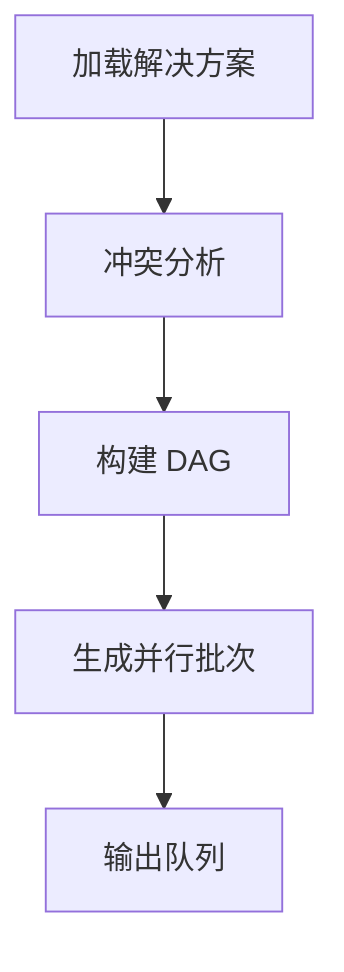

# /issue:queue

---
id: CMD-issue-queue
version: 1.0.0
status: active
---

> **Category**: Issue
> **Arguments**: `[--issues <id1,id2,...>] [--priority]`

---

## 概述

从已绑定解决方案的 Issue 形成执行队列。使用 issue-queue-agent 进行冲突分析和智能排序，生成 DAG 驱动的并行执行计划。

---

## 核心能力

### 队列功能

| 功能 | 说明 |
|------|------|
| **冲突检测** | 分析文件冲突风险 |
| **DAG 构建** | 基于依赖关系的执行图 |
| **并行批次** | 无冲突任务并行执行 |
| **优先级排序** | 按优先级和依赖排序 |

### 产出物

- `queue.json` - 队列定义
- `dag.json` - 依赖图
- `parallel-batches.json` - 并行批次

---

## 工作流程



---

## 使用场景

### 自动形成队列

```bash
# 自动选择所有已规划的 Issue
/issue:queue
```

### 指定 Issue

```bash
# 指定 Issue ID
/issue:queue --issues ISS-001,ISS-002,ISS-003
```

---

## 最佳实践

1. **规划后立即排队**: 确保方案新鲜
2. **检查冲突**: 排队后查看冲突报告
3. **按队列执行**: 使用 `/issue:execute` 执行

---

## 相关文档

- [Issue Plan](plan.md)
- [Issue Execute](execute.md)

---

*本文档由 CCW 知识系统维护*
