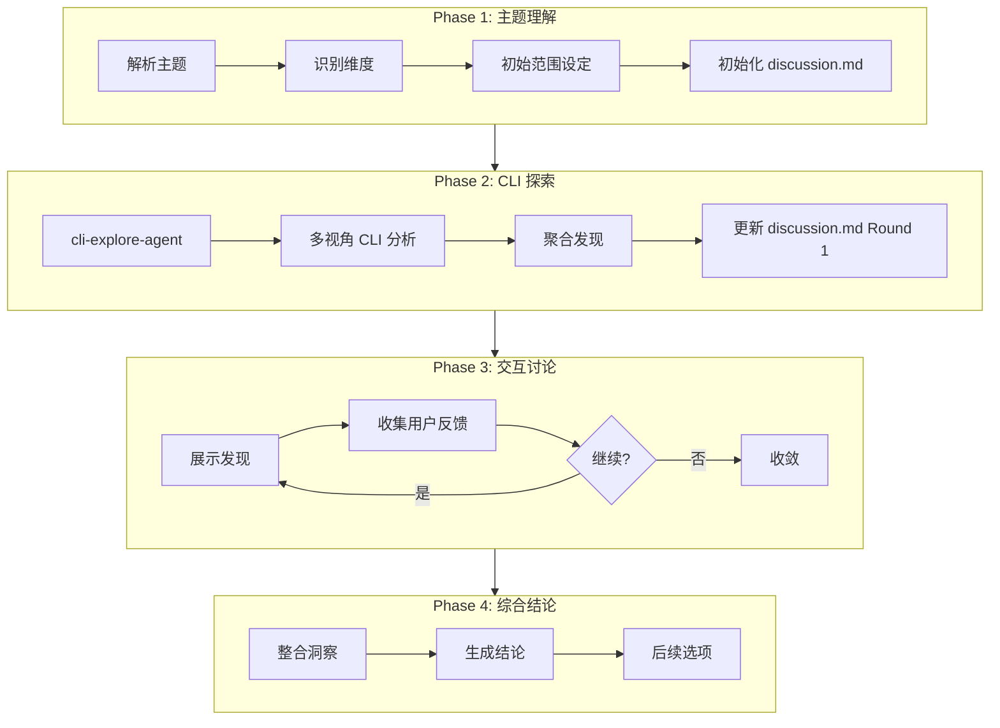

# /workflow:analyze-with-file

> **分类**: Workflow
> **源文件**: [.claude/commands/workflow/analyze-with-file.md](../../../.claude/commands/workflow/analyze-with-file.md)

## 概述

`/workflow:analyze-with-file` 是交互式协作分析命令，通过文档化的讨论过程、CLI 辅助探索和渐进式理解，实现深度代码分析。

**核心能力**:
- **文档化讨论**: 记录理解演进、促进多轮问答
- **多视角分析**: 支持最多 4 个并行分析视角
- **CLI 工具集成**: 使用 Gemini/Codex 进行深度探索
- **决策追踪**: 完整的决策记录和变更追踪

## 命令语法

```bash
/workflow:analyze-with-file [options] "主题或问题"
```

### 参数说明

| 参数 | 类型 | 必填 | 默认值 | 说明 |
|------|------|------|--------|------|
| 主题 | string | 是 | - | 要分析的主题或问题 |
| -y, --yes | flag | 否 | - | 自动确认探索决策 |
| -c, --continue | flag | 否 | - | 继续现有会话 |

## 使用场景

### 什么时候使用

- **探索复杂主题**: 需要协作分析
- **需要文档化讨论**: 决策需要多视角
- **理解迭代演进**: 需要用户输入迭代理解
- **实现前建立共识**: 构建共享理解

### 什么时候不使用

- **调试特定 Bug**: 使用 `/workflow:debug-with-file`
- **生成新想法**: 使用 `/workflow:brainstorm-with-file`
- **简单任务分解**: 使用 `/workflow:lite-plan`

## 工作流程

### 四阶段分析流程



### 决策记录协议

**关键触发点**:

| 触发 | 记录内容 | 目标章节 |
|------|---------|---------|
| 方向选择 | 选择了什么、为什么、放弃了什么 | Decision Log |
| 关键发现 | 发现内容、影响范围、置信度 | Key Findings |
| 假设变更 | 旧假设 → 新理解、变更原因、影响 | Corrected Assumptions |
| 用户反馈 | 用户原始输入、采纳/调整理由 | User Input |

**决策记录格式**:
```markdown
> **Decision**: [决策描述]
> - **Context**: [触发此决策的原因]
> - **Options considered**: [评估的替代方案]
> - **Chosen**: [选择的方法] — **Reason**: [理由]
> - **Impact**: [对分析方向/结论的影响]
```

### Phase 1: 主题理解

**步骤**:

1. **解析主题 & 识别维度**

| 维度 | 关键词 |
|------|--------|
| architecture | 架构, architecture, design, structure |
| implementation | 实现, implement, code, coding |
| performance | 性能, performance, optimize, bottleneck |
| security | 安全, security, auth, permission |
| concept | 概念, concept, theory, principle |
| comparison | 比较, compare, vs, difference |
| decision | 决策, decision, choice, tradeoff |

2. **初始范围设定** (非自动模式)
   - **Focus**: 从检测维度生成的方向中多选
   - **Perspectives**: 最多 4 个分析视角多选
   - **Depth**: Quick Overview / Standard Analysis / Deep Dive

3. **初始化 discussion.md**

### Phase 2: CLI 探索

**步骤**:

1. **代码库探索** (cli-explore-agent)
   - 单视角: 通用代码库分析
   - 多视角: 每个视角特定的并行探索（最多 4 个）

2. **多视角 CLI 分析** (探索后执行)
   - 单视角: 启动综合 CLI 分析
   - 多视角: 并行启动 CLI 调用（最多 4 个）

**分析视角**:

| 视角 | 工具 | 关注点 | 适用场景 |
|------|------|--------|---------|
| Technical | Gemini | 实现、代码模式、技术可行性 | 理解如何和技术细节 |
| Architectural | Claude | 系统设计、可扩展性、组件交互 | 理解结构和组织 |
| Business | Codex | 价值、ROI、利益相关者影响 | 理解业务影响 |
| Domain Expert | Gemini | 领域特定模式、最佳实践、标准 | 行业特定知识 |

3. **聚合发现**
   - 整合所有代码库探索和 CLI 视角发现
   - 提取收敛主题、冲突观点、独特贡献

### Phase 3: 交互讨论

**用户选项**:

| 选项 | 描述 | 操作 |
|------|------|------|
| 同意，继续深入 | 方向正确，深化探索 | 继续当前方向 CLI 分析 |
| 需要调整方向 | 不同理解或焦点 | 新范围 CLI 探索 |
| 分析完成 | 获得足够信息 | 退出到 Phase 4 |
| 有具体问题 | 特定问题 | CLI 或直接分析回答 |

**每轮记录**:
- 用户输入摘要
- 方向调整（如有）
- 用户问答（如有）
- 更新的理解
- 纠正的假设
- 新洞察

**最大轮数**: 5 轮

### Phase 4: 综合与结论

**步骤**:

1. **整合洞察**
   - 提取讨论时间线中的所有发现
   - 编译决策追踪
   - 关键结论（带证据和置信度）
   - 建议（带理由和优先级）

2. **最终 discussion.md 更新**
   - Summary: 高层概览
   - Key Conclusions: 排名（带证据和置信度）
   - Recommendations: 优先行动项
   - Decision Trail: 关键决策汇总

3. **后续选项**
   - 创建 Issue
   - 生成任务
   - 导出报告
   - 完成

## 输出结构

```
.workflow/.analysis/ANL-{slug}-{date}/
├── discussion.md              # 理解演进和讨论
├── exploration-codebase.json  # 单一代码库上下文
├── explorations/              # 多视角代码库探索（如选择）
│   ├── technical.json
│   └── architectural.json
├── explorations.json          # 单视角发现
├── perspectives.json          # 多视角发现（如选择）
└── conclusions.json           # 最终综合
```

## 使用示例

### 示例 1: 架构分析

```bash
/workflow:analyze-with-file "如何优化这个项目的认证架构"
```

**预期输出**:
```
Phase 1: Topic Understanding
Identified dimensions: architecture, security
User focus: System Design, Integration Points

Phase 2: CLI Exploration
Exploration completed: 15 relevant files found
Key findings:
- JWT with refresh tokens
- Rate limiting at API gateway
- Database-backed sessions

Phase 3: Discussion (Round 1)
User agrees with direction, wants deeper code analysis
...
```

### 示例 2: 多视角分析

```bash
/workflow:analyze-with-file "评估支付模块的整体设计"
```

**选择视角**: Technical, Architectural, Business

### 示例 3: 继续会话

```bash
/workflow:analyze-with-file --continue "认证架构"
```

### 示例 4: 自动模式

```bash
/workflow:analyze-with-file -y "性能瓶颈分析"
```

## 错误处理

| 错误 | 解决方案 |
|------|---------|
| cli-explore-agent 失败 | 使用可用上下文继续，记录限制 |
| CLI 超时 | 使用更短 prompt 重试，或跳过视角 |
| 讨论中用户超时 | 保存状态，显示恢复命令 |
| 达到最大轮数 | 强制综合，提供继续选项 |
| 无相关发现 | 扩大搜索，询问用户澄清 |

## 最佳实践

1. **清晰主题定义**: 详细主题 → 更好的维度识别
2. **复杂任务代理优先**: 代码分析、实现或重构任务委托给代理或 CLI
3. **审查 discussion.md**: 在结论前检查理解演进
4. **拥抱纠正**: 追踪错误→正确的转换作为学习
5. **文档化演进**: discussion.md 捕获完整思维过程
6. **立即记录决策**: 使用决策记录格式即时捕获
7. **链接决策与结果**: 写结论时明确引用哪些决策导致哪些结果

## 关联组件

- **相关 Commands**: 
  - [brainstorm-with-file](brainstorm-with-file.md) - 头脑风暴
  - [debug-with-file](debug-with-file.md) - 调试分析
  - [lite-plan](lite-plan.md) - 简单规划
- **相关 Agents**: cli-explore-agent, code-developer

---

*最后更新: 2025-02*
