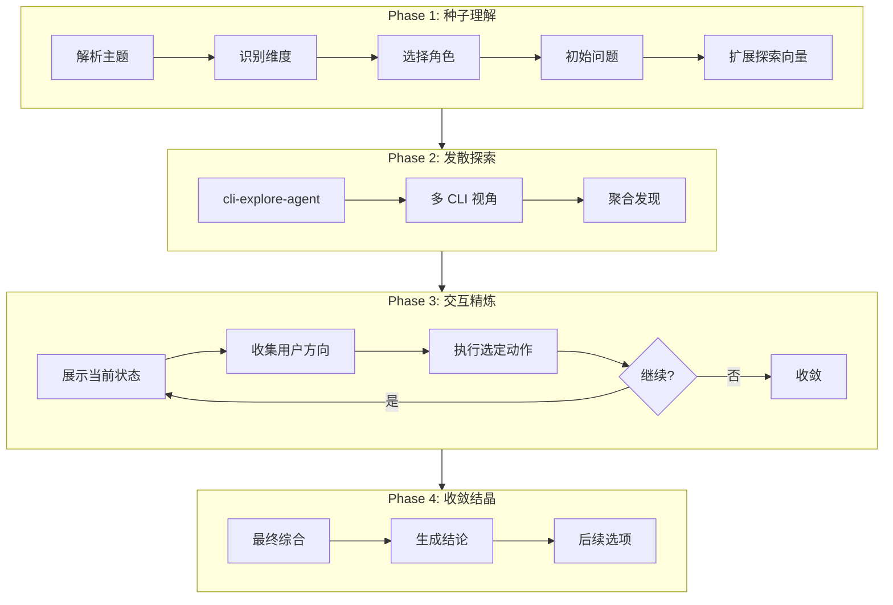

# /workflow:brainstorm-with-file

> **分类**: Workflow
> **源文件**: [.claude/commands/workflow/brainstorm-with-file.md](../../../.claude/commands/workflow/brainstorm-with-file.md)

## 概述

`/workflow:brainstorm-with-file` 是交互式头脑风暴命令，通过多 CLI 协作、想法扩展和文档化的思维演进，将初始想法发展为可行的解决方案。

**核心能力**:
- **多 CLI 协作**: Gemini/Codex/Claude 多视角分析
- **文档化思维演进**: 完整的想法发展时间线
- **发散-收敛循环**: 系统化的创意探索和收敛
- **交互式精炼**: 用户主导的方向选择

## 命令语法

```bash
/workflow:brainstorm-with-file [options] "想法或主题"
```

### 参数说明

| 参数 | 类型 | 必填 | 默认值 | 说明 |
|------|------|------|--------|------|
| 主题 | string | 是 | - | 头脑风暴的想法或主题 |
| -y, --yes | flag | 否 | - | 自动确认决策，使用推荐角色 |
| -c, --continue | flag | 否 | - | 继续现有会话 |
| -m, --mode | string | 否 | balanced | 模式: creative/structured/balanced |

## 使用场景

### 什么时候使用

- **新功能/产品起步**: 没有明确方向时
- **复杂问题探索**: 多种可能解决方案
- **需要文档化思考**: 团队评审的思维过程
- **多利益相关者视角**: 整合不同视角

### 什么时候不使用

- **代码分析**: 使用 `/workflow:analyze-with-file`
- **方向已明确**: 使用 `/workflow:lite-plan`
- **需要复杂规划**: 使用 `/workflow:plan`

## 工作流程

### 四阶段交互式头脑风暴



### Phase 1: 种子理解

**目标**: 分析主题、选择角色、收集用户输入、扩展探索向量。

**步骤**:

1. **解析种子 & 识别维度**

| 维度 | 关键词 |
|------|--------|
| technical | 技术, technical, implementation, code, 实现 |
| ux | 用户, user, experience, UX, UI, 体验 |
| business | 业务, business, value, ROI, 价值 |
| innovation | 创新, innovation, novel, creative |
| feasibility | 可行, feasible, practical, 实际 |
| scalability | 扩展, scale, growth, performance |
| security | 安全, security, risk, 风险 |

2. **角色选择**

**专业角色** (基于主题关键词推荐):

| 角色 | CLI 工具 | 关注领域 | 关键词 |
|------|---------|---------|--------|
| system-architect | Claude | 架构、模式 | 架构, architecture, system |
| product-manager | Gemini | 业务价值、路线图 | 产品, product, feature |
| ui-designer | Gemini | 视觉设计、交互 | UI, 界面, interface |
| ux-expert | Codex | 用户研究、可用性 | UX, 体验, experience |
| data-architect | Claude | 数据建模、存储 | 数据, data, database |
| test-strategist | Codex | 质量、测试 | 测试, test, quality |

**简单视角** (回退):

| 视角 | CLI 工具 | 关注点 |
|------|---------|--------|
| creative | Gemini | 创新、跨领域 |
| pragmatic | Codex | 实现、可行性 |
| systematic | Claude | 架构、结构 |

3. **扩展探索向量**
   - 核心问题: 根本问题/机会
   - 用户视角: 谁受益，如何受益
   - 技术角度: 什么能实现
   - 替代方案: 其他解决方案
   - 挑战: 潜在阻碍
   - 创新角度: 10 倍更好的方法
   - 集成: 与现有系统的适配

4. **初始化 brainstorm.md**

### Phase 2: 发散探索

**目标**: 收集代码库上下文，然后并行执行多视角分析。

**步骤**:

1. **代码库探索** (cli-explore-agent)
   - 运行模块深度分析
   - 搜索主题相关代码
   - 输出: `exploration-codebase.json`

2. **多 CLI 视角分析** (并行执行)

```javascript
// 创意视角 (Gemini)
Bash(`ccw cli -p "Creative brainstorming... innovative ideas" --tool gemini`)

// 务实视角 (Codex)
Bash(`ccw cli -p "Pragmatic brainstorming... implementation reality" --tool codex`)

// 系统视角 (Claude)
Bash(`ccw cli -p "Systematic brainstorming... architectural thinking" --tool claude`)
```

3. **聚合多视角发现**
   - 收敛主题（所有同意）
   - 冲突观点（需要解决）
   - 独特贡献（视角特定洞察）

### Phase 3: 交互精炼

**目标**: 通过用户引导的探索循环迭代精炼想法。

**用户方向选项**:

| 选项 | 描述 | 输出 |
|------|------|------|
| 深入探索 | 对选定想法进行深入分析 | `ideas/{slug}.md` |
| 继续发散 | 从未探索向量生成更多想法 | 更新 perspectives.json |
| 挑战验证 | 魔鬼代言人挑战 | 挑战结果 |
| 合并综合 | 合并多个想法 | 合并想法 |
| 准备收敛 | 开始收敛（退出循环） | 进入 Phase 4 |

**精炼动作 CLI 示例**:

**深入探索**:
```javascript
Bash(`ccw cli -p "
PURPOSE: Deep dive analysis on idea '${idea.title}'
TASK:
• Elaborate the core concept in detail
• Identify implementation requirements
• List potential challenges and mitigations
• Suggest proof-of-concept approach
EXPECTED: Detailed concept, requirements, risk matrix, MVP definition
" --tool gemini --mode analysis`)
```

**魔鬼代言人挑战**:
```javascript
Bash(`ccw cli -p "
PURPOSE: Devil's advocate - rigorously challenge these brainstorm ideas
TASK:
• For each idea, identify 3 strongest objections
• Challenge core assumptions
• Rate survivability after challenge (1-5)
EXPECTED: Per-idea challenge report, ideas that survive
" --tool codex --mode analysis`)
```

**最大循环次数**: 6 轮

### Phase 4: 收敛与结晶

**目标**: 综合最终想法，生成结论，提供后续选项。

**输出**:

1. **synthesis.json**:
   - top_ideas[]: 前 5 排名想法
   - parked_ideas[]: 暂存想法
   - key_insights[]: 过程学习
   - recommendations: 主要/替代/不推荐

2. **最终 brainstorm.md 更新**:
   - 执行摘要
   - 顶级想法（带排名、描述、优势、挑战）
   - 主要建议
   - 替代方案
   - 暂存想法
   - 会话统计

3. **后续选项** (AskUserQuestion):
   - 创建实施计划: 启动 workflow-plan
   - 创建 Issue: 启动 issue-discover
   - 深入分析: 启动 analyze-with-file
   - 导出分享: 生成可分享报告
   - 完成: 无进一步操作

## 输出结构

```
.workflow/.brainstorm/BS-{slug}-{date}/
├── brainstorm.md                  # 完整思维演进时间线
├── exploration-codebase.json      # 代码库上下文
├── perspectives.json              # 多 CLI 发现
├── synthesis.json                 # 最终综合
└── ideas/                         # 单独想法深入分析
    ├── idea-1.md
    └── merged-idea-1.md
```

## 使用示例

### 示例 1: 基本使用

```bash
/workflow:brainstorm-with-file "如何重新设计用户通知系统"
```

**预期输出**:
```
Phase 1: Seed Understanding
Identified dimensions: technical, ux, business
Recommended roles: system-architect, product-manager, ux-expert

Exploration vectors generated:
1. Core question: 通知系统的根本痛点是什么？
2. User perspective: 用户如何从改进中受益？
3. Technical angle: 什么技术能实现实时通知？
...

Phase 2: Multi-Perspective Exploration
Creative (Gemini): 5 innovative ideas...
Pragmatic (Codex): 3 practical approaches...
Systematic (Claude): 2 architectural patterns...

Which ideas to explore?
[ ] AI-powered notification prioritization
[ ] Real-time WebSocket push
[ ] User preference learning
...
```

### 示例 2: 创意模式

```bash
/workflow:brainstorm-with-file -y -m creative "创新的 AI 辅助功能"
```

### 示例 3: 结构化模式

```bash
/workflow:brainstorm-with-file -m structured "优化缓存策略"
```

### 示例 4: 继续会话

```bash
/workflow:brainstorm-with-file --continue "通知系统"
```

## 协作模式

| 模式 | 用途 | 描述 |
|------|------|------|
| Parallel Divergence | 新主题 | 所有角色同时从不同角度探索 |
| Sequential Deep-Dive | 有前景的想法 | 一个角色扩展，其他批判/精炼 |
| Debate Mode | 有争议的方法 | 角色支持/反对不同方法 |
| Synthesis Mode | 准备决策 | 整合洞察为可执行结论 |

## 上下文溢出保护

**每角色限制**:
- 主分析输出: < 3000 字
- 子文档（如有）: < 2000 字
- 最大子文档数: 每角色 5 个

**综合保护**:
- 如果总分析 > 100KB，综合只读取主分析文件
- 大型想法自动拆分到 ideas/ 文件夹

## 错误处理

| 错误 | 解决方案 |
|------|---------|
| cli-explore-agent 失败 | 继续使用空探索上下文 |
| CLI 超时 | 使用更短 prompt 重试，或跳过视角 |
| 没有好想法 | 重新定义问题，调整约束，尝试新角度 |
| 用户失去兴趣 | 总结进度，提供断点和恢复选项 |
| 视角冲突 | 作为权衡呈现，让用户决定 |
| 达到最大轮数 | 强制综合，突出未解决问题 |

## 最佳实践

1. **清晰主题定义**: 详细主题 → 更好的角色选择和探索
2. **复杂任务代理优先**: 代码分析、POC 实现期间，委托给代理或 CLI
3. **审查 brainstorm.md**: 在最终决策前检查思维演进
4. **拥抱冲突**: 视角冲突往往揭示重要的权衡
5. **文档化演进**: brainstorm.md 捕获完整思维过程供团队审查
6. **使用继续模式**: 恢复会话以建立在之前的探索上

## 关联组件

- **相关 Commands**: 
  - [analyze-with-file](analyze-with-file.md) - 代码分析
  - [plan](plan.md) - 复杂规划
  - [lite-plan](lite-plan.md) - 简单规划
- **相关 Skills**: brainstorm
- **相关 Agents**: cli-explore-agent, code-developer

---

*最后更新: 2025-02*
