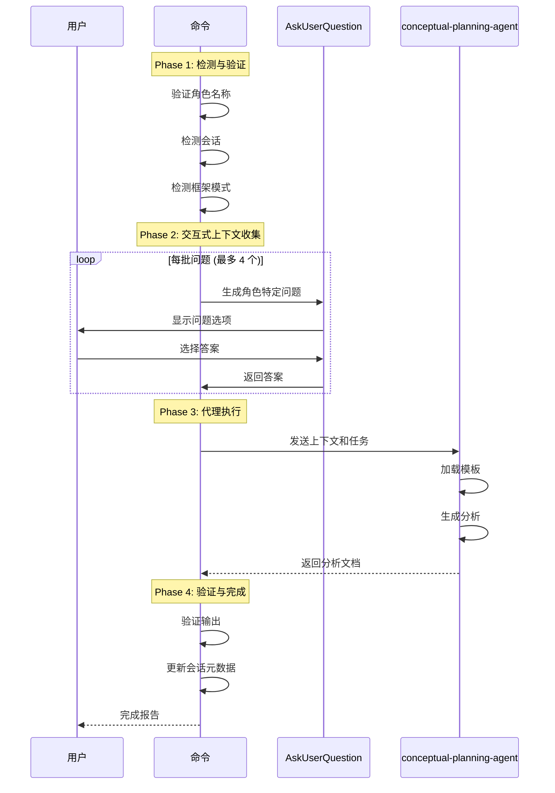

# /workflow:brainstorm:role-analysis

> **分类**: Workflow > Brainstorm
> **源文件**: [.claude/commands/workflow/brainstorm/role-analysis.md](../../../../.claude/commands/workflow/brainstorm/role-analysis.md)

## 概述

`/workflow:brainstorm:role-analysis` 是统一的角色分析生成命令。它支持交互式上下文收集、框架对齐和增量更新，用单个参数化工作流替代了 9 个独立的角色命令。

**核心能力**:
- **多角色支持**: 单个命令支持所有 9 种头脑风暴角色
- **交互式上下文**: 基于角色和框架动态生成问题
- **增量更新**: 将新见解合并到现有分析中
- **框架对齐**: 处理 guidance-specification.md 中的讨论点
- **代理委托**: 使用 conceptual-planning-agent 执行角色特定模板

## 命令语法

```bash
/workflow:brainstorm:role-analysis <role-name> [options]
```

### 参数说明

| 参数 | 类型 | 必填 | 默认值 | 说明 |
|------|------|------|--------|------|
| role-name | string | 是 | - | 角色标识符 |
| --session | string | 否 | 自动检测 | 指定头脑风暴会话 ID |
| --update | flag | 否 | - | 强制增量更新模式 |
| --include-questions | flag | 否 | - | 强制进行上下文收集 |
| --skip-questions | flag | 否 | - | 跳过所有交互问题 |
| --style-skill | string | 否 | - | (ui-designer 专用) 加载样式 SKILL 包 |

## 支持的角色

| 角色 ID | 标题 | 关注领域 | 上下文问题数 |
|---------|------|---------|-------------|
| `ux-expert` | UX 专家 | 用户研究、信息架构、用户旅程 | 4 |
| `ui-designer` | UI 设计师 | 视觉设计、高保真原型、设计系统 | 4 |
| `system-architect` | 系统架构师 | 技术架构、可扩展性、集成模式 | 5 |
| `product-manager` | 产品经理 | 产品策略、路线图、优先级 | 4 |
| `product-owner` | 产品负责人 | 待办管理、用户故事、验收标准 | 4 |
| `scrum-master` | 敏捷教练 | 流程促进、障碍移除、团队动态 | 3 |
| `subject-matter-expert` | 领域专家 | 领域知识、业务规则、合规性 | 4 |
| `data-architect` | 数据架构师 | 数据模型、存储策略、数据流 | 5 |
| `api-designer` | API 设计师 | API 契约、版本控制、集成模式 | 4 |

## 使用场景

### 什么时候使用

- **生成角色特定分析**: 从特定角色视角分析项目需求
- **增量更新分析**: 根据新信息更新现有分析
- **交互式探索**: 通过问答深入理解需求
- **框架对齐**: 确保 analysis 与 guidance-specification 对齐

### 什么时候不使用

- **批量角色生成**: 使用 `/workflow:brainstorm:auto-parallel` 代替
- **无活跃会话**: 需要先运行 `/workflow:brainstorm:artifacts`
- **快速原型**: 不需要深度分析时

## 工作流程

### 四阶段执行协议



### Phase 1: 检测与验证

**步骤 1.1: 角色验证**

```bash
VALIDATE role_name IN [
  ux-expert, ui-designer, system-architect, product-manager,
  product-owner, scrum-master, subject-matter-expert,
  data-architect, api-designer
]
```

**步骤 1.2: 会话检测**

- 如果提供 `--session`: 使用指定会话
- 否则: 自动查找 `.workflow/active/WFS-*/`

**步骤 1.3: 框架检测与功能列表提取**

```javascript
// 检测 feature_mode
const hasFeatureDecomposition = guidanceSpec.includes('Feature Decomposition');
const hasFeatureSubdocs = Glob(`${brainstorm_dir}/*/analysis-F-*-*.md`).length > 0;
const feature_mode = hasFeatureDecomposition && hasFeatureSubdocs;
```

**步骤 1.4: 更新模式检测**

- 如果 `--update` 或 analysis 已存在: 进入增量更新模式
- 否则: 全新生成模式

### Phase 2: 交互式上下文收集

**问题分类法**:

| 类别 | 关注点 | 问题示例 |
|------|--------|---------|
| User Intent | 用户目标 | "该分析的核心目标是什么？" |
| Requirements | 需求细化 | "需求的优先级如何排序？" |
| Architecture | 架构决策 | "技术栈的选择考量？" |
| UX | 用户体验 | "交互复杂度的取舍？" |
| Feasibility | 可行性 | "资源约束下的实现范围？" |
| Risk | 风险管理 | "风险容忍度是多少？" |
| Process | 流程规范 | "开发迭代的节奏？" |
| Decisions | 决策确认 | "冲突的解决方案？" |
| Terminology | 术语统一 | "统一使用哪个术语？" |

**多轮问题执行**:

```javascript
const BATCH_SIZE = 4;
for (let i = 0; i < questions.length; i += BATCH_SIZE) {
  const batch = questions.slice(i, i + BATCH_SIZE);
  const answers = await AskUserQuestion({
    questions: batch.map(q => ({
      question: q.question,
      header: q.category,
      multiSelect: false,
      options: q.options
    }))
  });
  // 存储答案
}
```

### Phase 3: 代理执行

**执行 conceptual-planning-agent**:

```javascript
Task({
  subagent_type: "conceptual-planning-agent",
  run_in_background: false,
  prompt: `
    ASSIGNED_ROLE: ${role_name}
    OUTPUT_LOCATION: ${brainstorm_dir}/${role_name}/
    FEATURE_MODE: ${feature_mode}
    UPDATE_MODE: ${update_mode}
    USER_CONTEXT: ${user_context}
    
    // 加载角色模板、会话元数据、用户上下文
    // 生成分析文档
  `
});
```

### Phase 4: 验证与完成

1. **验证输出**: 确认 analysis.md 存在并包含正确引用
2. **更新会话元数据**: 记录完成状态和历史
3. **生成完成报告**: 显示输出位置和后续步骤

## 使用示例

### 示例 1: 生成新分析（带交互）

```bash
/workflow:brainstorm:role-analysis ux-expert
```

**预期输出**:
```
[Round 1/1] UX专家 上下文询问

用户研究的深度要求?
○ 基础访谈 - 快速收集用户反馈
○ 深度研究 - 完整的用户画像和旅程
○ 数据驱动 - 基于现有数据分析

信息架构的复杂度?
○ 扁平结构 - 简单导航
○ 层级结构 - 多级菜单
○ 动态结构 - 基于上下文自适应

✅ UX专家 Analysis Complete

**Output**: .workflow/active/WFS-xxx/.brainstorming/ux-expert/analysis.md
**Mode**: New Generation
**Framework**: ✓ Aligned
**Context Questions**: 4 answered
```

### 示例 2: 快速生成（跳过问题）

```bash
/workflow:brainstorm:role-analysis system-architect --skip-questions
```

**预期行为**: 直接生成分析，不进行交互问答。

### 示例 3: 更新现有分析

```bash
/workflow:brainstorm:role-analysis ui-designer --session WFS-xxx --update
```

**预期输出**:
```
Analysis exists. Mode: Incremental Update

[Round 1/1] 澄清问题

是否需要更新设计系统规范?
○ 是 - 添加新的组件定义
○ 否 - 保持现有规范
○ 扩展 - 仅添加新组件，不修改现有

✅ UI设计师 Analysis Updated

**Changes**:
- Added "Clarifications" section with new user context
- Merged new insights into existing sections
```

### 示例 4: 强制问题收集

```bash
/workflow:brainstorm:role-analysis product-manager --include-questions
```

**预期行为**: 即使分析已存在，也强制进行上下文问题收集。

## 输出结构

### 功能点模式 (feature_mode)

```
.workflow/active/WFS-{session}/.brainstorming/
├── guidance-specification.md
└── {role-name}/
    ├── {role-name}-context.md         # 交互问答记录
    ├── analysis.md                    # 角色概览索引 (< 1500 字)
    ├── analysis-cross-cutting.md      # 跨功能决策 (< 2000 字)
    ├── analysis-F-001-{slug}.md       # 按功能的分析 (< 2000 字)
    └── analysis-F-002-{slug}.md
```

### 回退模式 (无功能列表)

```
.workflow/active/WFS-{session}/.brainstorming/
├── guidance-specification.md
└── {role-name}/
    ├── {role-name}-context.md
    ├── analysis.md                    # 主分析文档 (< 3000 字)
    └── analysis-{slug}.md             # 可选子文档 (最多 5 个)
```

### 分析文档结构（功能点模式）

**analysis.md (角色概览索引)**:

```markdown
# 系统架构师分析: [主题]

## Framework Reference
**Topic Framework**: @../guidance-specification.md
**Role Focus**: 技术架构、可扩展性、集成模式

## Role Perspective Overview
[角色对整体项目的视角摘要]

## Feature Point Index
| Feature | Sub-document | Key Insight |
|---------|-------------|-------------|
| F-001: 实时同步 | @./analysis-F-001-sync.md | WebSocket + CRDT |
| F-002: 权限控制 | @./analysis-F-002-auth.md | RBAC 模型 |

## Cross-Cutting Summary
**Full analysis**: @./analysis-cross-cutting.md
[跨功能决策和共享模式概览]
```

## 关联组件

- **被调用**: 
  - `/workflow:brainstorm:auto-parallel` (Phase 2 并行角色执行)
  - 手动调用单角色分析
- **调用**:
  - `conceptual-planning-agent` (代理执行)
  - `AskUserQuestion` (交互式上下文收集)
- **协调**:
  - `/workflow:brainstorm:artifacts` (创建分析框架)
  - `/workflow:brainstorm:synthesis` (整合角色分析)

## 错误处理

| 错误信息 | 原因 | 解决方案 |
|---------|------|---------|
| Unknown role: "xxx" | 无效的角色名称 | 使用有效角色 ID: ux-expert, ui-designer 等 |
| No active session | 无活跃头脑风暴会话 | 先运行 `/workflow:brainstorm:artifacts` |
| No framework found | 未找到 guidance-specification.md | 运行 `/workflow:brainstorm:artifacts` 创建框架 |
| Agent execution failed | 代理执行失败 | 使用 `--skip-questions` 重试或检查框架有效性 |

## 最佳实践

1. **利用交互问答**: 回答问题能显著提高分析质量
2. **功能点模式**: 当 guidance-specification 有功能分解时，充分利用 feature_mode
3. **增量更新**: 使用 `--update` 保持分析演进而非重写
4. **角色组合**: 选择互补的角色（如 architect + data-architect + api-designer）

## 高级用法

### 手动多角色工作流

```bash
# 1. 创建框架
/workflow:brainstorm:artifacts "构建实时协作平台" --count 3

# 2. 生成各角色分析（带上下文收集）
/workflow:brainstorm:role-analysis system-architect --include-questions
/workflow:brainstorm:role-analysis ui-designer --include-questions
/workflow:brainstorm:role-analysis product-manager --include-questions

# 3. 综合见解
/workflow:brainstorm:synthesis
```

### 迭代完善

```bash
# 初始生成
/workflow:brainstorm:role-analysis ux-expert

# 用户审查后需要更深入
/workflow:brainstorm:role-analysis ux-expert --update --include-questions
# → 提出澄清问题，合并新见解
```

## 质量检查清单

**必需分析元素**:
- [ ] 框架讨论点已处理（如果 framework_mode）
- [ ] 用户上下文已整合（如果收集了上下文）
- [ ] 角色模板指南已应用
- [ ] 输出文件遵循命名约定（仅 analysis*.md）
- [ ] 框架引用使用 @ 符号
- [ ] 会话元数据已更新

**功能点模式额外检查**:
- [ ] analysis.md 是索引（< 1500 字）
- [ ] analysis-cross-cutting.md 存在
- [ ] 每个功能有对应的 analysis-F-{id}-{slug}.md

---

*最后更新: 2025-02*
