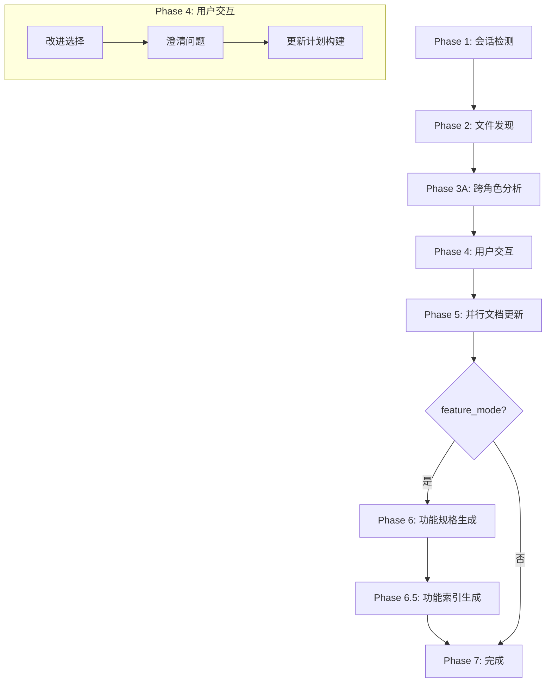

# /workflow:brainstorm:synthesis

> **分类**: Workflow > Brainstorm
> **源文件**: [.claude/commands/workflow/brainstorm/synthesis.md](../../../../.claude/commands/workflow/brainstorm/synthesis.md)

## 概述

`/workflow:brainstorm:synthesis` 是头脑风暴工作流的综合澄清命令。它通过智能问答和目标更新，澄清并完善各角色的分析结果，消除歧义、增强概念深度，并生成按功能点组织的规格文档。

**核心能力**:
- **跨角色分析**: 识别不同角色分析之间的共识、冲突和空白
- **智能问答**: 通过 AskUserQuestion 进行多轮澄清交互
- **增量更新**: 将用户反馈整合到现有分析文档中
- **功能规格生成**: 按功能点生成统一的特性规格文档（feature_mode）

## 命令语法

```bash
/workflow:brainstorm:synthesis [-y|--yes] [--session session-id]
```

### 参数说明

| 参数 | 类型 | 必填 | 默认值 | 说明 |
|------|------|------|--------|------|
| -y, --yes | flag | 否 | - | 自动模式：自动选择所有改进，跳过澄清问题 |
| --session | string | 否 | 自动检测 | 指定头脑风暴会话 ID |

## 使用场景

### 什么时候使用

- **角色分析完成后**: 所有选定角色的分析文档已生成
- **需要消除歧义**: 分析中存在模糊点或冲突
- **准备进入规划阶段**: 需要将头脑风暴成果转换为可执行计划
- **功能点整合**: 需要将多角色分析整合为统一的功能规格

### 什么时候不使用

- **角色分析未完成**: 应先完成所有角色分析
- **无需澄清**: 分析已经足够清晰和一致
- **快速迭代**: 时间紧迫且可接受当前分析质量

## 工作流程

### 八阶段工作流



### Phase 1: 发现与验证

1. **检测会话**: 使用 `--session` 参数或查找 `.workflow/active/WFS-*`
2. **验证文件**:
   - `guidance-specification.md` (可选，缺失时警告)
   - `*/analysis*.md` (必需，为空时报错)
3. **加载用户意图**: 从 `workflow-session.json` 提取
4. **检测功能模式**: 检查角色分析是否使用功能点组织

### Phase 2: 角色发现与路径准备

**主流程准备文件路径**:

```javascript
// 发现分析文件
const roleAnalysisPaths = Glob(`${brainstorm_dir}/*/analysis*.md`);

// 提取角色信息
const participatingRoles = extractRoleNames(roleAnalysisPaths);
```

### Phase 3A: 分析与增强代理

**代理执行跨角色分析**:

```javascript
Task(conceptual-planning-agent, {
  input: {
    brainstorm_dir,
    analysis_input_paths,
    participating_roles,
    feature_mode
  },
  output: {
    enhancement_recommendations,  // EP-001, EP-002, ...
    feature_conflict_map          // feature_mode 时生成
  }
});
```

**改进建议格式**:

```json
{
  "id": "EP-001",
  "title": "API 契约规范",
  "affected_roles": ["system-architect", "api-designer"],
  "category": "Architecture",
  "current_state": "高层 API 描述",
  "enhancement": "添加详细的请求/响应 schema 定义",
  "rationale": "使实现更精确",
  "priority": "High"
}
```

### Phase 4: 用户交互

**所有交互通过 AskUserQuestion 进行（中文问题）**

#### 步骤 1: 改进选择

```javascript
AskUserQuestion({
  questions: [{
    question: "请选择要应用的改进建议",
    header: "改进选择",
    multiSelect: true,
    options: [
      { label: "EP-001: API 契约", description: "添加详细的请求/响应 schema 定义" },
      { label: "EP-002: 用户意图", description: "明确用户需求优先级和验收标准" }
    ]
  }]
});
```

#### 步骤 2: 澄清问题

**9 类问题分类法**:

| 类别 | 关注点 | 问题示例 |
|------|--------|---------|
| User Intent | 用户目标 | "MVP 阶段的核心目标是什么？" |
| Requirements | 需求细化 | "功能优先级如何排序？" |
| Architecture | 架构决策 | "技术栈选择的考量？" |
| UX | 用户体验 | "交互复杂度的取舍？" |
| Feasibility | 可行性 | "资源约束下的范围？" |
| Risk | 风险管理 | "风险容忍度是多少？" |
| Process | 流程规范 | "迭代节奏如何安排？" |
| Decisions | 决策确认 | "冲突如何解决？" |
| Terminology | 术语统一 | "统一使用哪个术语？" |

### Phase 5: 并行文档更新

**每个角色一个代理，并行执行**:

```javascript
// 并行更新各角色分析文档
for (const role of participating_roles) {
  Task(conceptual-planning-agent, {
    role,
    enhancements: roleEnhancements[role],
    clarifications: roleClarifications[role],
    output: `Updated ${role}/analysis.md`
  });
}
```

### Phase 6: 功能规格生成 [feature_mode]

**仅当 feature_mode 为 true 时执行**

**目的**: 为每个功能生成统一的规格文档，整合所有角色视角。

**四层聚合规则**:

| 层级 | 方法 | 说明 |
|------|------|------|
| Layer 1 | 直接引用 | 共识存在时直接引用角色分析原文 |
| Layer 2 | 结构化提取 | 提取并组织各角色的关键信息 |
| Layer 3 | 冲突提炼 | 根据 confidence 级别处理冲突 |
| Layer 4 | 跨功能标注 | 添加功能间依赖和集成点 |

**冲突置信度处理**:

| 置信度 | 格式 | 说明 |
|--------|------|------|
| `[RESOLVED]` | **Decision**: [方案] | 已有明确共识，直接采用 |
| `[SUGGESTED]` | **Recommended**: [方案] | 推荐方案，但标注来源 |
| `[UNRESOLVED]` | **[DECISION NEEDED]** | 需下游决策，列出所有选项 |

**功能规格模板 (7 节，1500-2500 字)**:

```markdown
# Feature Spec: F-001 - 功能名称

**Priority**: High
**Contributing Roles**: [角色列表]

## 1. Requirements Summary
[功能需求、用户体验需求、技术需求、领域需求]

## 2. Design Decisions [核心部分]
[架构和设计决策，包含选项、选择理由、权衡]

## 3. Interface Contract
[API 端点、数据模型、组件接口]

## 4. Constraints & Risks
[技术约束、业务风险、缓解策略]

## 5. Acceptance Criteria
[功能验收、性能验收、用户体验验收]

## 6. Detailed Analysis References
[指向角色分析文档的引用]

## 7. Cross-Feature Dependencies
[功能间依赖关系]
```

### Phase 6.5: 功能索引生成 [feature_mode]

生成 `feature-index.json` 供下游消费者使用:

```json
{
  "version": "1.0",
  "session_id": "WFS-xxx",
  "feature_mode": true,
  "features": [
    {
      "id": "F-001",
      "slug": "real-time-sync",
      "name": "实时协作同步",
      "priority": "High",
      "spec_path": "feature-specs/F-001-real-time-sync.md",
      "contributing_roles": ["system-architect", "ux-expert"],
      "cross_cutting_refs": ["F-003 依赖同步策略"]
    }
  ],
  "cross_cutting_specs": [
    "system-architect/analysis-cross-cutting.md"
  ]
}
```

### Phase 7: 完成

1. **更新 Context Package**: 同步更新的分析到 context-package.json
2. **更新会话元数据**: 记录澄清结果和功能规格信息
3. **生成完成报告**: 显示已应用的改进和后续步骤

## 使用示例

### 示例 1: 基本使用

```bash
/workflow:brainstorm:synthesis
```

**预期输出**:
```
Analysis Complete:
  Roles: system-architect, ux-expert, product-manager
  Enhancements Found: 5
  Conflicts Detected: 2

请选择要应用的改进建议:
[ ] EP-001: API 契约规范
[ ] EP-002: 用户意图明确
[ ] EP-003: 架构决策文档化
...

澄清问题 (1/2):
MVP 阶段的核心目标是什么?
○ 快速验证 - 最小功能集，快速上线
○ 技术壁垒 - 完善架构，长期发展
○ 功能完整 - 覆盖所有规划功能
...
```

### 示例 2: 自动模式

```bash
/workflow:brainstorm:synthesis -y
```

**预期行为**: 自动选择所有改进，使用默认答案，跳过澄清问题。

### 示例 3: 指定会话

```bash
/workflow:brainstorm:synthesis --session WFS-20250215-abc123
```

## 输出结构

**目录结构 (feature_mode)**:

```
.workflow/active/WFS-{session}/.brainstorming/
├── guidance-specification.md
├── feature-index.json           # Phase 6.5 输出
├── feature-specs/               # Phase 6 输出
│   ├── F-001-{slug}.md
│   └── F-002-{slug}.md
├── {role-1}/
│   ├── analysis.md              # 更新后的分析
│   ├── analysis-cross-cutting.md
│   └── analysis-F-001-{slug}.md
└── {role-2}/
    └── ...
```

**更新后的角色分析结构**:

```markdown
## Clarifications
### Session 2025-02-15
- **Q**: MVP 阶段核心目标？ (Category: User Intent)
  **A**: 快速验证，最小功能集

## {现有章节}
{根据澄清结果优化的内容}
```

## 关联组件

- **相关 Commands**: 
  - [role-analysis](role-analysis.md) - 生成角色分析
  - [artifacts](artifacts.md) - 创建框架
  - [auto-parallel](auto-parallel.md) - 并行角色执行
- **相关 Skills**: [brainstorm](../../../skills/brainstorm.md)
- **相关 Agents**: conceptual-planning-agent

## 错误处理

| 错误信息 | 原因 | 解决方案 |
|---------|------|---------|
| No active session | 无活跃头脑风暴会话 | 先运行 `/workflow:brainstorm:artifacts` |
| No role analyses found | 角色分析文档不存在 | 先运行 `/workflow:brainstorm:role-analysis` |
| Agent execution failed | 代理执行失败 | 检查日志，使用 `--skip-questions` 重试 |

## 最佳实践

1. **完成所有角色分析**: 在运行 synthesis 前确保所有选定角色的分析已完成
2. **认真回答澄清问题**: 澄清问题的答案直接影响最终分析质量
3. **检查冲突解决方案**: 特别关注 `[UNRESOLVED]` 标记的冲突
4. **功能模式优势**: 当 guidance-specification 包含功能分解时，充分利用 feature_mode

## 质量检查清单

**内容**:
- [ ] 所有角色分析已加载/分析
- [ ] 跨角色分析完成（共识、冲突、空白）
- [ ] 9 类歧义扫描完成
- [ ] 问题优先级排序

**分析**:
- [ ] 用户意图已验证
- [ ] 跨角色综合完成
- [ ] 歧义已解决
- [ ] 术语一致

**文档**:
- [ ] 澄清章节已格式化
- [ ] 各章节反映答案
- [ ] 无占位符（TODO/TBD）
- [ ] 有效的 Markdown

---

*最后更新: 2025-02*
