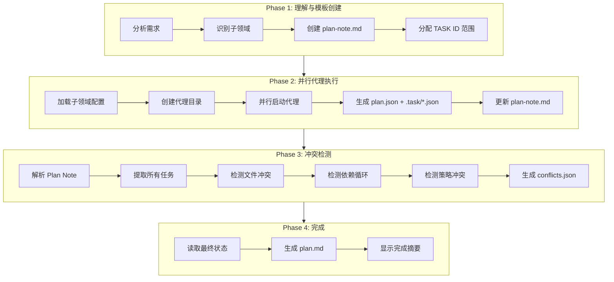

# /workflow:collaborative-plan-with-file

> **分类**: Workflow
> **源文件**: [.claude/commands/workflow/collaborative-plan-with-file.md](../../../.claude/commands/workflow/collaborative-plan-with-file.md)

## 概述

`/workflow:collaborative-plan-with-file` 是协作规划命令，使用 Plan Note 架构实现多代理并行规划。它通过预分配章节消除合并需求，自动检测冲突，生成可执行计划。

**核心能力**:
- **Plan Note 架构**: 共享协作文档，无需合并
- **并行代理**: 2-5 个代理同时规划不同子领域
- **冲突检测**: 自动检测文件、依赖、策略冲突
- **预分配章节**: 每个代理独占章节，无锁操作

## 命令语法

```bash
/workflow:collaborative-plan-with-file [options] "任务描述"
```

### 参数说明

| 参数 | 类型 | 必填 | 默认值 | 说明 |
|------|------|------|--------|------|
| 任务描述 | string | 是 | - | 要规划的任务 |
| --max-agents | number | 否 | 5 | 最大子代理数量 |
| -y, --yes | flag | 否 | - | 自动批准拆分，跳过确认 |

## 使用场景

### 什么时候使用

- **复杂多模块任务**: 需要多个专业视角并行规划
- **大型功能开发**: 涉及多个子系统的协调
- **需要协作文档**: 想要共享的可追踪规划文档
- **冲突预防**: 需要自动检测和解决冲突

### 什么时候不使用

- **简单任务**: 使用 `/workflow:lite-plan`
- **单模块规划**: 不需要并行代理
- **快速迭代**: 时间紧迫需要轻量规划

## 工作流程

### 四阶段协作规划



### Phase 1: 理解与模板创建

**代理任务**:
1. **识别最新文档**: 搜索并优先使用最新 README、设计文档、架构指南
2. **理解需求**: 从任务描述和文档提取核心目标、关键点、约束
3. **识别歧义**: 列出不明确点或多种可能解释
4. **拆分子领域**: 识别 2-{maxAgents} 个可并行的焦点区域
5. **创建 Plan Note**: 生成带预分配章节的 plan-note.md

**输出文件**:

| 文件 | 用途 |
|------|------|
| `plan-note.md` | 协作模板，含预分配章节 |
| `requirement-analysis.json` | 子领域分配和 TASK ID 范围 |

**Plan Note 结构**:
```markdown
---
session_id: CPLAN-xxx
sub_domains: [focus-area-1, focus-area-2]
agent_task_id_ranges:
  focus-area-1: [TASK-001, TASK-100]
  focus-area-2: [TASK-101, TASK-200]
---

## 需求理解
...

## 任务池 - Focus Area 1
<!-- Agent 1 的预分配章节 -->

## 任务池 - Focus Area 2
<!-- Agent 2 的预分配章节 -->

## 依赖关系
<!-- 自动生成 -->

## 冲突标记
<!-- Phase 3 填充 -->

## 上下文证据 - Focus Area 1
<!-- Agent 1 的证据 -->

## 上下文证据 - Focus Area 2
<!-- Agent 2 的证据 -->
```

### Phase 2: 并行代理执行

**代理输出**:

| 输出 | 描述 |
|------|------|
| `plan.json` | 规划概览，含 task_ids[] |
| `.task/TASK-*.json` | 独立任务文件 |
| 更新 plan-note.md | 填充预分配章节 |

**代理执行规则**:
- 每个代理只修改其预分配章节
- 独占使用分配的 TASK ID 范围
- 无需锁定（独占章节）
- 为每个任务包含冲突风险评估

**任务摘要格式**:
```markdown
### TASK-001: 任务标题 [focus-area]

**状态**: pending
**复杂度**: medium
**依赖**: []
**范围**: src/auth/**
**修改点**:
- `src/auth/login.ts:45`: 添加 token 刷新逻辑
**冲突风险**: low
```

### Phase 3: 冲突检测

**冲突类型**:

| 类型 | 严重程度 | 检测逻辑 |
|------|---------|---------|
| file_conflict | high | 同一 file:location 被多个代理修改 |
| dependency_cycle | critical | 任务依赖图中存在循环 |
| strategy_conflict | medium | 同一文件有来自不同代理的高风险任务 |

**检测函数**:

- `parsePlanNote(markdown)`: 解析 YAML frontmatter 和章节
- `extractTasksFromSection(content)`: 提取任务列表
- `detectFileConflicts(tasks)`: 检测文件修改冲突
- `detectDependencyCycles(tasks)`: 检测依赖循环
- `detectStrategyConflicts(tasks)`: 检测策略冲突

**冲突输出** (`conflicts.json`):
```json
{
  "detected_at": "2025-02-15T10:00:00Z",
  "total_tasks": 15,
  "conflicts": [
    {
      "type": "file_conflict",
      "severity": "high",
      "tasks_involved": ["TASK-001", "TASK-102"],
      "description": "src/auth/login.ts:45 被两个代理同时修改",
      "suggested_resolution": "协调修改顺序或合并变更"
    }
  ]
}
```

### Phase 4: 完成

**plan.md 结构**:

| 章节 | 内容 |
|------|------|
| Header | Session ID, 创建时间, 原始需求 |
| 需求理解 | 从 plan-note.md 复制 |
| 子领域拆分 | 各焦点区域描述和 TASK ID 范围 |
| 任务概览 | 按焦点区域分组的任务列表 |
| 冲突报告 | 检测到的冲突摘要 |
| 执行 | 执行计划的命令 |

## 输出结构

```
.workflow/.planning/CPLAN-{slug}-{date}/
├── plan-note.md                  # 核心: 需求 + 任务 + 冲突
├── requirement-analysis.json     # 子领域分配
├── agents/                       # 各代理详细规划
│   ├── {focus-area-1}/
│   │   ├── planning-context.md   # 证据 + 理解
│   │   ├── plan.json             # 规划概览
│   │   └── .task/                # 独立任务文件
│   │       ├── TASK-001.json
│   │       └── TASK-002.json
│   └── {focus-area-2}/
│       └── ...
├── conflicts.json                # 冲突详情
└── plan.md                       # 人类可读摘要
```

## 使用示例

### 示例 1: 基本使用

```bash
/workflow:collaborative-plan-with-file "实现实时通知系统"
```

**预期输出**:
```
Phase 1: Understanding & Template Creation
Sub-domains identified:
1. websocket-infrastructure: WebSocket 连接和消息传递
2. notification-logic: 通知业务逻辑和持久化
3. client-integration: 前端订阅和 UI 展示

Phase 2: Parallel Agent Execution (3 agents)
Agent 1: websocket-infrastructure - 5 tasks
Agent 2: notification-logic - 4 tasks
Agent 3: client-integration - 6 tasks

Phase 3: Conflict Detection
Total tasks: 15
Conflicts detected: 1 (medium severity)
- STRAT-001: Multiple agents modify src/config/index.ts

Phase 4: Completion
Output: .workflow/.planning/CPLAN-notification-2025-02-15/
```

### 示例 2: 指定最大代理数

```bash
/workflow:collaborative-plan-with-file "重构认证模块" --max-agents=4
```

### 示例 3: 自动模式

```bash
/workflow:collaborative-plan-with-file -y "添加支付网关支持"
```

## 配置选项

| 标志 | 默认值 | 说明 |
|------|--------|------|
| `--max-agents` | 5 | 最大子代理数量 |
| `-y, --yes` | false | 自动确认所有决策 |

## 错误处理

| 错误 | 解决方案 |
|------|---------|
| Understanding 代理失败 | 重试一次，提供更多上下文 |
| Planning 代理失败 | 跳过失败代理，继续其他 |
| plan-note 章节未找到 | 代理创建章节（防御性） |
| 冲突检测失败 | 继续使用空冲突 |

## 最佳实践

1. **清晰需求**: 详细需求 → 更好的子领域拆分
2. **参考最新文档**: Understanding 代理应优先使用最新文档
3. **不确定时询问**: 存在歧义时询问用户而非假设
4. **审查 Plan Note**: 执行前检查 plan-note.md
5. **解决冲突**: 执行前处理高/严重冲突
6. **检查详情**: 使用 agents/{focus-area}/plan.json 深入了解

## 关联组件

- **相关 Commands**: 
  - [lite-plan](lite-plan.md) - 轻量规划
  - [plan](plan.md) - 标准规划
  - [unified-execute-with-file](unified-execute-with-file.md) - 执行
- **相关 Agents**: cli-lite-planning-agent

---

*最后更新: 2025-02*
