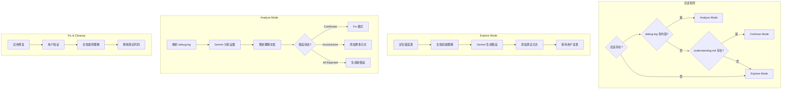

# /workflow:debug-with-file

> **分类**: Workflow
> **源文件**: [.claude/commands/workflow/debug-with-file.md](../../../.claude/commands/workflow/debug-with-file.md)

## 概述

`/workflow:debug-with-file` 是增强的基于证据的调试命令，通过文档化的探索过程、理解演进和 Gemini 辅助纠正，实现系统化的 Bug 诊断。

**核心能力**:
- **文档化探索**: 记录探索时间线和理解演进
- **假设驱动**: 生成可测试的假设并验证
- **Gemini 辅助纠正**: 验证和纠正假设
- **学习保留**: 保留从失败尝试中学到的东西

## 命令语法

```bash
/workflow:debug-with-file [options] "Bug 描述或错误信息"
```

### 参数说明

| 参数 | 类型 | 必填 | 默认值 | 说明 |
|------|------|------|--------|------|
| Bug 描述 | string | 是 | - | Bug 描述、错误信息或堆栈跟踪 |
| -y, --yes | flag | 否 | - | 自动确认所有决策 |

## 使用场景

### 什么时候使用

- **复杂 Bug 诊断**: 需要系统化追踪根因
- **假设驱动调试**: 需要验证多个可能原因
- **理解演进记录**: 想要完整的调试过程记录
- **学习保留**: 想要保留调试过程中的洞察

### 什么时候不使用

- **简单 Bug**: 使用 `/workflow:lite-fix`
- **快速修复**: 已知确切问题和解决方案

## 工作流程

### 三模式执行流程



### Explore Mode (探索模式)

**Step 1.1: 定位错误源**

```javascript
// 从 Bug 描述提取关键词
const keywords = extractErrorKeywords(bug_description);

// 搜索代码库中的错误位置
for (const keyword of keywords) {
  Grep({ pattern: keyword, path: ".", output_mode: "content", "-C": 3 });
}
```

**Step 1.2: 文档初始理解**

创建 `understanding.md`:

```markdown
# Understanding Document

**Session ID**: DBG-{slug}-{date}
**Bug Description**: {bug_description}
**Started**: {timestamp}

## Exploration Timeline

### Iteration 1 - Initial Exploration

#### Current Understanding
- Error pattern: {errorPattern}
- Affected areas: {files}
- Initial hypothesis: {thoughts}

#### Evidence from Code Search
...

## Current Consolidated Understanding
{consolidated}
```

**Step 1.3: Gemini 辅助假设生成**

```bash
ccw cli -p "
PURPOSE: Generate debugging hypotheses for: ${bug_description}
TASK:
• Analyze error pattern and code search results
• Identify 3-5 most likely root causes
• For each hypothesis, specify:
  - What might be wrong
  - What evidence would confirm/reject it
  - Where to add instrumentation
EXPECTED: JSON with hypotheses, likelihood ranking, evidence criteria
" --tool gemini --mode analysis --rule analysis-diagnose-bug-root-cause
```

**假设输出格式**:

```json
{
  "hypotheses": [
    {
      "id": "H1",
      "description": "数据结构不匹配 - 期望的键不存在",
      "testable_condition": "检查目标键是否存在于字典中",
      "logging_point": "file.py:func:42",
      "evidence_criteria": {
        "confirm": "数据显示缺失键",
        "reject": "键存在且值有效"
      },
      "likelihood": 1,
      "status": "pending"
    }
  ]
}
```

**Step 1.4: 添加 NDJSON 调试日志**

为每个假设添加临时日志语句以观察程序状态。使用 NDJSON 格式以便结构化解析。

### Analyze Mode (分析模式)

**Step 2.1: 解析调试日志**

```javascript
const entries = Read(debugLogPath)
  .split('\n')
  .filter(l => l.trim())
  .map(l => JSON.parse(l));

const byHypothesis = groupBy(entries, 'hid');
```

**Step 2.2: Gemini 辅助证据分析**

```bash
ccw cli -p "
PURPOSE: Analyze debug log evidence to validate/correct hypotheses
TASK:
• Parse log entries by hypothesis
• Evaluate evidence against expected criteria
• Determine verdict: confirmed | rejected | inconclusive
• Identify incorrect assumptions
EXPECTED: Verdicts + corrections + updated consolidated understanding
" --tool gemini --mode analysis --rule analysis-diagnose-bug-root-cause
```

**Step 2.3: 更新理解文档**

```markdown
### Iteration 2 - Evidence Analysis

#### Log Analysis Results

**H1**: REJECTED
- Evidence: {"key": "config", "exists": true}
- Reasoning: Key exists with valid value

**H2**: CONFIRMED
- Evidence: {"timing": "30s after startup"}
- Reasoning: Timestamp shows runtime update, not init

#### Corrected Understanding

- ~~Assumed dict key "config" was missing~~ → Key exists, but value is None
  - Why wrong: Only checked existence, not value validity
  - Evidence: H1 log shows {"config": null, "exists": true}

---

## Current Consolidated Understanding

### What We Know
- Error occurs during runtime update, not initialization
- Config value is None (not missing key)

### What Was Disproven
- ~~Initialization error~~ (Timing evidence)
- ~~Missing key hypothesis~~ (Key exists)

### Current Investigation Focus
Why is config value None during update?
```

### Fix & Cleanup (修复与清理)

**Step 3.1: 应用修复**

基于确认的假设应用代码修复。

**Step 3.2: 文档解决**

```markdown
### Iteration N - Resolution

#### Fix Applied
- Modified files: config_manager.py
- Fix description: Add null check before update
- Root cause addressed: Config None value during runtime update

#### Verification Results
{verification}

#### Lessons Learned
1. Always validate config values, not just existence
2. Runtime updates have different state than initialization

#### Key Insights for Future
- Add config validation layer
- Consider startup vs runtime state differences
```

**Step 3.3: 清理**

移除所有临时调试日志语句。验证生产代码中没有残留的检测代码。

## 输出结构

```
.workflow/.debug/DBG-{slug}-{date}/
├── debug.log           # NDJSON 日志（执行证据）
├── understanding.md    # 探索时间线 + 综合理解
├── hypotheses.json     # 假设历史与裁决
└── resolution.md       # 可选：最终摘要
```

## 使用示例

### 示例 1: 初次调用

```bash
/workflow:debug-with-file "TypeError: Cannot read property 'id' of undefined at UserService.authenticate"
```

**预期输出**:
```
Session: DBG-userservice-authenticate-2025-02-15
Mode: Explore

Locating error source...
Found in: src/services/UserService.js:42

Initial understanding documented.
Gemini generated 3 hypotheses:
  H1 (Likelihood: 1): user object is null before property access
  H2 (Likelihood: 2): async timing issue - user not loaded
  H3 (Likelihood: 3): API response structure changed

Debug logging added to:
  - UserService.js:38 (before authenticate call)
  - UserService.js:42 (at error location)

Awaiting reproduction. Run your test/usage scenario, then call:
/workflow:debug-with-file "TypeError..."
```

### 示例 2: 复现后分析

```bash
/workflow:debug-with-file "TypeError: Cannot read property 'id' of undefined"
```

**预期输出** (debug.log 有内容):
```
Session: DBG-userservice-authenticate-2025-02-15
Mode: Analyze

Parsing debug.log... 47 entries found.

Gemini Analysis:
  H1: REJECTED - user object exists in 47/47 logs
  H2: CONFIRMED - Timing shows user loaded AFTER authenticate call in 23/47 cases

Root Cause Identified:
  Async timing issue - authenticate called before user load completes

Fix recommendation:
  Add await or promise chain in UserService.authenticate

Apply fix? [Yes / Manual / Continue Investigation]
```

### 示例 3: 自动模式

```bash
/workflow:debug-with-file -y "WebSocket connection randomly drops"
```

## Gemini 集成点

### 1. 假设生成 (Explore Mode)

| 目的 | 生成基于证据的可测试假设 |
|------|------------------------|
| 输入 | Bug 描述 + 代码搜索结果 |
| 输出 | JSON 假设列表，带可能性和证据标准 |

### 2. 证据分析 (Analyze Mode)

| 目的 | 验证假设并纠正误解 |
|------|------------------|
| 输入 | debug.log + understanding.md + hypotheses.json |
| 输出 | 裁决 + 纠正 + 更新的综合理解 |

### 3. 新假设生成 (所有假设被拒绝后)

| 目的 | 基于已证伪的假设生成新假设 |
|------|--------------------------|
| 输入 | understanding.md (带证伪章节) + hypotheses.json |
| 输出 | 避免之前被拒绝路径的新假设 |

## 理解纠正机制

### 纠正格式

```markdown
- ~~Assumed dict key "config" was missing~~ → Key exists, but value is None
  - Why wrong: Only checked existence, not value validity
  - Evidence: H1 log shows {"config": null, "exists": true}
```

### 综合规则

1. **简化已证伪项**: 移到 "What Was Disproven" 带单行摘要
2. **保留有效洞察**: 提升已确认发现到 "What We Know"
3. **避免重复**: 不在综合章节重复时间线细节
4. **聚焦当前状态**: 我们现在知道什么，而不是过程
5. **保留关键纠正**: 保留重要的错误→正确转换供学习

## 错误处理

| 情况 | 操作 |
|------|------|
| 空 debug.log | 验证复现触发了代码路径 |
| 所有假设被拒绝 | 使用 Gemini 基于证伪假设生成新假设 |
| 修复无效 | 文档失败修复尝试，用精炼理解迭代 |
| >5 次迭代 | 审查综合理解，升级到 `/workflow:lite-fix` |
| Gemini 不可用 | 回退到手动假设生成，无 Gemini 洞察文档 |
| 理解太长 | 积极综合，归档旧迭代到单独文件 |

## 完成后扩展

完成后询问用户是否扩展为 Issue（test/enhance/refactor/doc），选中项调用 `/issue:new "{summary} - {dimension}"`。

## 关联组件

- **相关 Commands**: 
  - [lite-fix](lite-fix.md) - 快速 Bug 修复
  - [analyze-with-file](analyze-with-file.md) - 协作分析
- **相关 Agents**: cli-explore-agent

---

*最后更新: 2025-02*
