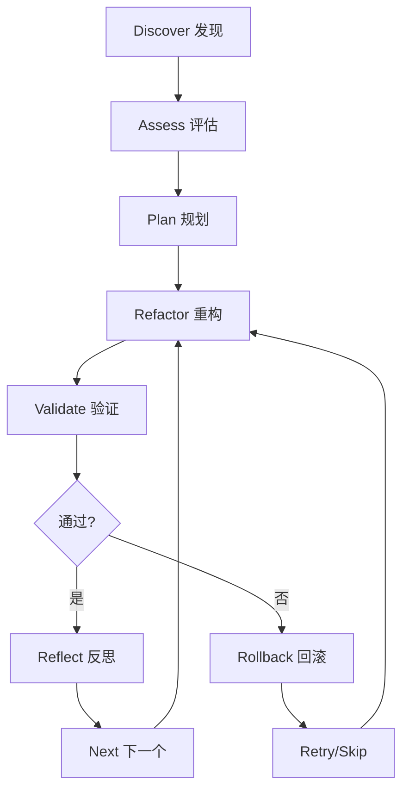

# /workflow:refactor-cycle

> **分类**: Workflow
> **源文件**: [.claude/commands/workflow/refactor-cycle.md](../../../.claude/commands/workflow/refactor-cycle.md)

## 概述

`/workflow:refactor-cycle` 是技术债务发现和自迭代重构命令。它通过多维度分析、优先级排序、回归验证和反思驱动调整，实现系统化的技术债务清理。

**核心能力**:
- **系统化发现**: 多维度扫描（代码质量、架构、依赖、测试缺口、可维护性）
- **风险感知优先级**: 影响 × 工作量矩阵，依赖感知排序
- **回归安全**: 每个重构项在继续前都进行验证
- **文档化推理**: 每个债务项、优先级决策和重构结果都有记录

## 命令语法

```bash
/workflow:refactor-cycle [options] "模块或重构目标"
```

### 参数说明

| 参数 | 类型 | 必填 | 默认值 | 说明 |
|------|------|------|--------|------|
| 目标描述 | string | 是 | - | 要重构的模块或目标 |
| -y, --yes | flag | 否 | - | 自动模式：自动确认优先级，使用推荐策略 |
| -c, --continue | flag | 否 | - | 继续中断的会话 |
| --scope | string | 否 | module | 范围：module 或 project |

## 使用场景

### 什么时候使用

- **系统化债务清理**: 模块需要全面的技术债务清理
- **预重构分析**: 需要在重构前进行分析和优先级排序
- **回归安全重构**: 需要带回滚机制的迭代重构
- **文档化决策**: 想要记录每个重构决策的原因

### 什么时候不使用

- **单一 Bug 修复**: 使用 `/workflow:lite-fix`
- **新功能实现**: 使用 `/workflow:plan` + `/workflow:execute`
- **已知确切变更**: 直接执行，无需分析

## 工作流程

### 闭环技术债务生命周期



### Phase 1: 会话初始化

**目标**: 创建会话上下文，初始化核心文件。

**操作步骤**:
1. 从参数提取模块/目标
2. 生成会话 ID: `RFT-{slug}-{date}`
3. 创建会话文件夹: `.workflow/.refactor/{session-id}/`
4. 解析选项: `-c`, `-y`, `--scope`
5. 初始化 `reflection-log.md` 和 `state.json`

### Phase 2: 债务发现

**目标**: 系统化扫描代码库，构建多维度债务清单。

**工作流步骤**:

1. **代码库探索** (cli-explore-agent)
   - 运行模块深度分析
   - 搜索复杂函数、长文件、TODO/FIXME 注释
   - 检测抑制模式 (@ts-ignore, eslint-disable)

2. **多维度 CLI 债务扫描**

| 维度 | 扫描内容 | 严重性信号 |
|------|---------|-----------|
| **代码质量** | 圈复杂度 >10，重复 >20 行，死代码，长文件 >500 行 | Critical: 关键路径死代码 |
| **架构** | 耦合 >5 导入，分层违规，上帝类 >300 行 | Critical: 核心循环依赖 |
| **依赖** | 循环导入，未使用依赖，已知 CVE | Critical: 已知漏洞 |
| **测试缺口** | 未测试关键路径，脆弱测试 | Critical: 认证/支付无测试 |
| **可维护性** | any/@ts-ignore 滥用，魔法数字 | High: 单文件 >10 抑制 |

3. **构建债务清单**

```json
{
  "id": "D-001",
  "dimension": "architecture",
  "title": "auth 和 user 模块循环依赖",
  "location": "src/auth/index.ts ↔ src/user/index.ts",
  "severity": "high",
  "description": "双向导入造成紧耦合",
  "suggested_fix": "提取共享类型到公共模块"
}
```

### Phase 3: 评估与优先级

**目标**: 评分、排序并构建执行队列。

**优先级算法**:
```
Priority Score = impact × (6 - effort)
```
- impact (1-5): 影响程度
- effort (1-5): 修复难度
- 高影响低工作量优先

**依赖感知排序**:
- 提取共享类型 → 然后打破循环依赖
- 修复基类 → 然后修复子类

**用户交互** (非自动模式):
```javascript
AskUserQuestion({
  question: "技术债务优先级如何调整？",
  options: [
    "确认优先级，开始重构",
    "只处理 Critical/High",
    "自定义选择",
    "调整评分"
  ]
})
```

**捕获基线指标**: 运行测试和诊断，记录重构前状态。

### Phase 4: 迭代重构循环

**核心循环**: 每个债务项执行以下步骤

```
1. Plan     → 设计具体重构方案
2. Refactor → @code-developer 应用变更
3. Validate → 测试 + 诊断 + 质量检查
4. Decision → PASS (提交+下一个) | PARTIAL (修复+重试) | FAIL (回滚+跳过)
5. Reflect  → 记录结果到 reflection-log.md
6. Commit   → 安全检查点
```

**每项最大重试次数**: 3 次

**验证步骤**:
1. 运行完整测试套件 - 对比基线
2. 检查新测试失败（任何不在基线中的失败 = 回归）
3. 运行语法检查

**决策处理**:

| 结果 | 操作 |
|------|------|
| PASS | 标记完成，提交，下一个 |
| PARTIAL | 分析失败，修复，重试 |
| FAIL | 回滚，跳过，记录原因 |

**反思记录** (追加到 reflection-log.md):

```markdown
### Item D-001: 循环依赖 — COMPLETED (2025-02-15)

**Changes**: src/auth/index.ts, src/user/index.ts
**Validation**: Tests 100% | Diagnostics delta: -2 errors
**What Changed**: 提取共享类型到 src/shared/types/
**What We Learned**: 循环依赖往往是接口耦合的信号
**Impact on Remaining Items**: D-002 现在可以安全重构
```

### Phase 5: 完成

**目标**: 对比最终指标，完成反思日志。

**输出**:
- 指标对比表（前后对比）
- 完成项列表
- 跳过项及原因
- 剩余债务
- 关键洞察和建议

## 输出结构

```
.workflow/.refactor/RFT-{slug}-{date}/
├── reflection-log.md    # 债务发现 + 优先级 + 每项反思 + 结论
├── state.json           # 债务清单 + 队列 + 计划 + 验证 + 状态
└── .trace/              # 原始日志
    ├── discovery-cli.txt
    ├── item-{N}-cli.txt
    └── test-output.log
```

## 使用示例

### 示例 1: 模块级重构

```bash
/workflow:refactor-cycle "src/auth 模块的技术债务清理"
```

**预期输出**:
```
Phase 2: Debt Discovery - 2025-02-15
Scan Summary:
- Total Items Found: 12
- By Dimension: Code Quality (3), Architecture (4), Dependencies (2), Test Gaps (2), Maintainability (1)
- By Severity: Critical (1), High (4), Medium (5), Low (2)

Priority Queue (12 items)
| Rank | ID | Title | Severity | Impact | Effort | Score |
| 1 | D-003 | 循环依赖 | critical | 5 | 2 | 20 |
...

Proceeding with refactoring...
```

### 示例 2: 自动模式

```bash
/workflow:refactor-cycle -y "支付服务重构优化"
```

**预期行为**: 自动确认优先级，使用推荐策略，跳过交互检查点。

### 示例 3: 项目级扫描

```bash
/workflow:refactor-cycle --scope=project "全项目技术债务扫描与重构"
```

### 示例 4: 继续中断会话

```bash
/workflow:refactor-cycle --continue "认证模块"
```

## state.json 完整结构

```json
{
  "session_id": "RFT-xxx",
  "target": "描述",
  "scope": "module|project",
  "phase": "init|explored|prioritized|refactoring|completed",
  
  "exploration": {
    "structure": { "files": [], "modules": [] },
    "metrics": { "largest_files": [], "most_complex": [] },
    "dependency_issues": { "circular": [], "unused_imports": [] },
    "test_mapping": { "tested": [], "untested": [] }
  },
  
  "debt_items": [{
    "id": "D-001",
    "dimension": "architecture",
    "severity": "critical|high|medium|low",
    "impact": 0,
    "effort": 0,
    "priority_score": 0,
    "status": "discovered|queued|in_progress|completed|skipped"
  }],
  
  "queue": [],
  "baseline": {
    "test_pass_rate": 100,
    "diagnostic_errors": 0
  },
  
  "summary": {
    "result": "success|partial|incomplete",
    "items_completed": 0,
    "key_learnings": []
  }
}
```

## 关联组件

- **相关 Commands**: 
  - [lite-fix](lite-fix.md) - 单一 Bug 修复
  - [plan](plan.md) - 新功能规划
  - [integration-test-cycle](integration-test-cycle.md) - 集成测试
- **相关 Agents**: cli-explore-agent, code-developer, test-fix-agent

## 错误处理

| 场景 | 操作 |
|------|------|
| cli-explore-agent 失败 | 回退到 Grep/Glob 手动扫描 |
| CLI 分析超时 | 回退: Gemini → Qwen → Codex |
| 测试套件崩溃 | 记录错误，使用最小测试子集重试 |
| 重构回归 | 最多重试 3 次，然后回滚+跳过 |
| 所有项跳过 | 生成失败报告，建议人工审查 |

## 最佳实践

1. **从模块范围开始**: 项目级扫描产生太多项，先聚焦一个模块
2. **信任优先级**: 影响 × 工作量评分避免分析瘫痪
3. **一次一项**: 每个重构隔离、验证、提交
4. **回滚不是失败**: 跳过风险项比引入回归更好
5. **审查 reflection-log.md**: 累积学习帮助未来重构会话
6. **自动模式用于清理**: 使用 `-y` 处理简单债务（命名、死代码）
7. **交互式用于架构**: 复杂架构重构在优先级时受益于用户输入

## 提交策略

1. **重构前** (Phase 3 基线):
   ```bash
   git stash  # 保存未提交工作
   ```

2. **每项完成后**:
   ```bash
   git commit -m "refactor(${dimension}): ${title} [${id}]"
   ```

3. **回归时 (回滚)**:
   ```bash
   git checkout -- <modified_files>
   ```

4. **最终完成提交**:
   ```bash
   git commit -m "refactor: complete tech debt cycle ${sessionId} (${completed}/${total} items)"
   ```

---

*最后更新: 2025-02*
