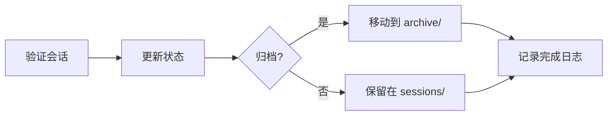

# /workflow:session:complete

---
id: CMD-session-complete
version: 1.0.0
status: active
---

> **Category**: Workflow Session
> **Arguments**: `[--session <id>] [--archive]`

---

## 概述

将活跃的工作流会话标记为已完成，可选归档会话产物。完成后的会话从活跃列表移除，状态更新为 completed。

---

## 核心能力

### 完成操作

- 更新会话状态为 completed
- 记录完成时间和摘要
- 可选归档到 .workflow/archive/

### 归档选项

| 参数 | 说明 |
|------|------|
| `--archive` | 归档会话产物 |
| `--session` | 指定要完成的会话 |

---

## 工作流程



---

## 使用场景

### 完成当前会话

```bash
/workflow:session:complete
```

### 完成并归档

```bash
/workflow:session:complete --archive
```

### 完成指定会话

```bash
/workflow:session:complete --session WFS-20260216-001
```

---

## 最佳实践

1. **任务完成后立即执行**: 避免遗漏
2. **使用归档**: 清理活跃会话列表
3. **添加摘要**: 完成时记录关键成果

---

## 相关文档

- [Session Start](start.md)
- [Session Resume](resume.md)
- [Session Solidify](solidify.md)

---

*本文档由 CCW 知识系统维护*
