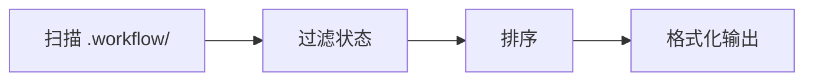

# /workflow:session:list

---
id: CMD-session-list
version: 1.0.0
status: active
---

> **Category**: Workflow Session
> **Arguments**: `[--status <active|paused|completed|all>]`

---

## 概述

列出所有工作流会话，支持按状态过滤。显示会话 ID、类型、状态、创建时间和任务描述。

---

## 核心能力

### 状态过滤

| 状态 | 说明 |
|------|------|
| `active` | 正在进行的会话 |
| `paused` | 已暂停的会话 |
| `completed` | 已完成的会话 |
| `all` | 所有会话（默认） |

### 输出格式

```
Session ID          Type      Status      Created              Task
---------------------------------------------------------------------------
WFS-20260216-001   workflow  active      2026-02-16 10:30    Implement auth
WFS-20260215-002   tdd       paused      2026-02-15 15:00    User service
```

---

## 工作流程



---

## 使用场景

### 列出所有会话

```bash
/workflow:session:list
```

### 只看活跃会话

```bash
/workflow:session:list --status active
```

### 查看已完成会话

```bash
/workflow:session:list --status completed
```

---

## 最佳实践

1. **定期检查**: 用 `--status active` 查看进行中的工作
2. **清理前检查**: 列出 completed 会话决定是否归档
3. **恢复前确认**: 列出 paused 会话选择恢复哪个

---

## 相关文档

- [Session Start](start.md)
- [Session Resume](resume.md)
- [Session Complete](complete.md)

---

*本文档由 CCW 知识系统维护*
