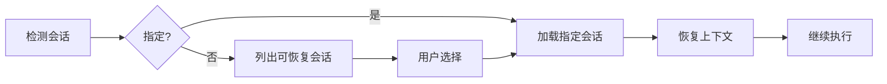

# /workflow:session:resume

---
id: CMD-session-resume
version: 1.0.0
status: active
---

> **Category**: Workflow Session
> **Arguments**: `[--session <id>] [--latest]`

---

## 概述

恢复暂停的工作流会话，自动加载之前的上下文和状态。支持指定会话 ID 或自动恢复最新的暂停会话。

---

## 核心能力

### 恢复模式

| 模式 | 参数 | 说明 |
|------|------|------|
| **指定恢复** | `--session WFS-xxx` | 恢复指定会话 |
| **最新恢复** | `--latest` | 恢复最新的暂停会话 |
| **自动检测** | 无参数 | 列出可恢复会话供选择 |

### 上下文恢复

- 重新加载 planning-notes.md
- 恢复 TodoWrite 状态
- 重新连接会话产物

---

## 工作流程



---

## 使用场景

### 恢复最新会话

```bash
/workflow:session:resume --latest
```

### 恢复指定会话

```bash
/workflow:session:resume --session WFS-20260216-001
```

### 交互选择

```bash
/workflow:session:resume
# 显示可恢复会话列表供选择
```

---

## 最佳实践

1. **使用 --latest**: 快速恢复最近的工作
2. **检查状态**: 恢复前用 list 确认会话状态
3. **及时完成**: 避免积累太多暂停会话

---

## 相关文档

- [Session Start](start.md)
- [Session List](list.md)
- [Session Complete](complete.md)

---

*本文档由 CCW 知识系统维护*
