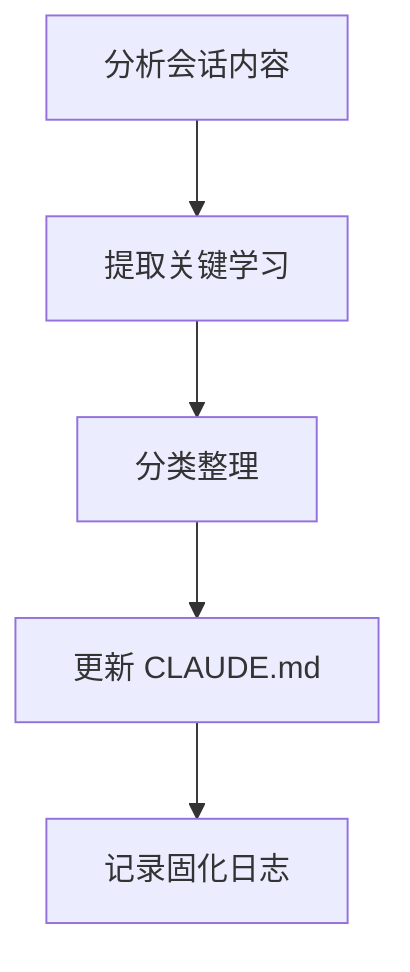

# /workflow:session:solidify

---
id: CMD-session-solidify
version: 1.0.0
status: active
---

> **Category**: Workflow Session
> **Arguments**: `[--session <id>]`

---

## 概述

将会话学习成果固化到持久化存储，更新 CLAUDE.md 或项目规范。捕获会话中的关键发现、最佳实践和约束条件。

---

## 核心能力

### 固化内容

| 类型 | 目标 | 说明 |
|------|------|------|
| **技术发现** | CLAUDE.md | 架构决策、技术约束 |
| **最佳实践** | 项目规范 | 编码规范、模式 |
| **约束条件** | 规划笔记 | 长期有效的约束 |

### 固化流程

1. 提取会话中的关键学习
2. 分类并格式化内容
3. 更新目标文件
4. 记录固化日志

---

## 工作流程



---

## 使用场景

### 固化当前会话

```bash
/workflow:session:solidify
```

### 固化指定会话

```bash
/workflow:session:solidify --session WFS-20260216-001
```

---

## 最佳实践

1. **重要会话后固化**: 捕获关键决策
2. **定期固化**: 避免知识丢失
3. **结合 Complete**: 完成会话前先固化

---

## 相关文档

- [Session Start](start.md)
- [Session Complete](complete.md)
- [Memory Manage](../../memory/manage.md)

---

*本文档由 CCW 知识系统维护*
