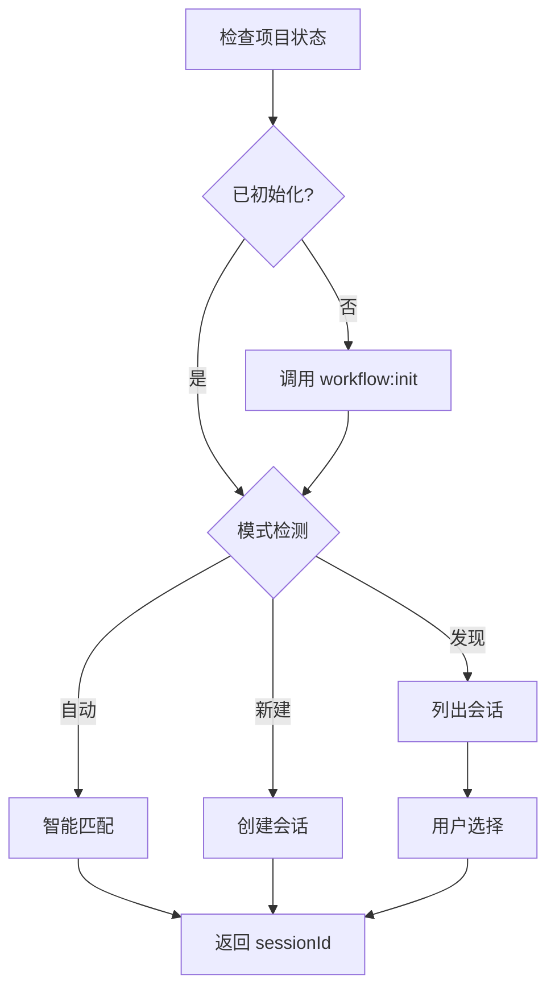

# /workflow:session:start

---
id: CMD-session-start
version: 1.0.0
status: active
source_path: ../../../../.claude/commands/workflow/session/start.md
---

> **Category**: Workflow Session
> **Arguments**: `[--type <workflow|review|tdd|test|docs>] [--auto|--new] [task description]`

---

## 概述

管理工作流会话，支持三种操作模式：发现模式（手动）、自动模式（智能）和强制新建模式。具有双重职责：

1. **项目级初始化**（首次）：创建 `.workflow/project-tech.json` 功能注册表
2. **会话级初始化**（始终）：创建会话目录结构

---

## 核心能力

### 会话类型

| 类型 | 说明 | 默认场景 |
|------|------|----------|
| `workflow` | 标准实现（默认） | `/workflow:plan` |
| `review` | 代码审查会话 | `/workflow:review-cycle` |
| `tdd` | TDD 开发 | `/workflow:tdd-plan` |
| `test` | 测试生成/修复 | `/workflow:test-fix-gen` |
| `docs` | 文档会话 | `/memory:docs` |

### 操作模式

| 模式 | 参数 | 说明 |
|------|------|------|
| **发现** | 无参数 | 列出活跃会话供选择 |
| **自动** | `--auto` | 智能匹配或创建会话 |
| **新建** | `--new` | 强制创建新会话 |

---

## 工作流程



### 执行步骤

1. **项目检查**: 验证 project-tech.json 和 project-guidelines.json
2. **模式检测**: 根据参数选择操作模式
3. **会话管理**: 发现、匹配或创建会话
4. **返回结果**: 输出 sessionId 和会话路径

---

## 使用场景

### 发现现有会话

```bash
# 列出活跃会话
/workflow:session:start
```

### 自动模式

```bash
# 智能匹配或创建
/workflow:session:start --auto "implement OAuth2 authentication"

# 指定类型
/workflow:session:start --type tdd --auto "implement user auth"
```

### 强制新建

```bash
# 创建新会话
/workflow:session:start --new "test payment flow"

# 指定类型的会话
/workflow:session:start --type review --new "Code review for auth module"
```

---

## 最佳实践

### 1. 使用自动模式

```bash
# 推荐使用 --auto 自动匹配
/workflow:session:start --auto "task description"
```

### 2. 选择正确的类型

```bash
# TDD 开发使用 tdd 类型
/workflow:session:start --type tdd --auto "implement feature"

# 代码审查使用 review 类型
/workflow:session:start --type review --auto "review module"
```

### 3. 利用会话恢复

```bash
# 恢复之前的会话
/workflow:session:resume --session WFS-xxx
```

---

## 参数说明

| 参数 | 类型 | 必需 | 默认值 | 说明 |
|------|------|------|--------|------|
| `--type` | string | 否 | workflow | 会话类型 |
| `--auto` | flag | 否 | - | 自动模式 |
| `--new` | flag | 否 | - | 强制新建 |
| `description` | string | 否 | - | 任务描述 |

---

## 相关文档

- [Session List](list.md)
- [Session Resume](resume.md)
- [Session Complete](complete.md)
- [Session Solidify](solidify.md)

---

*本文档由 CCW 知识系统维护*
