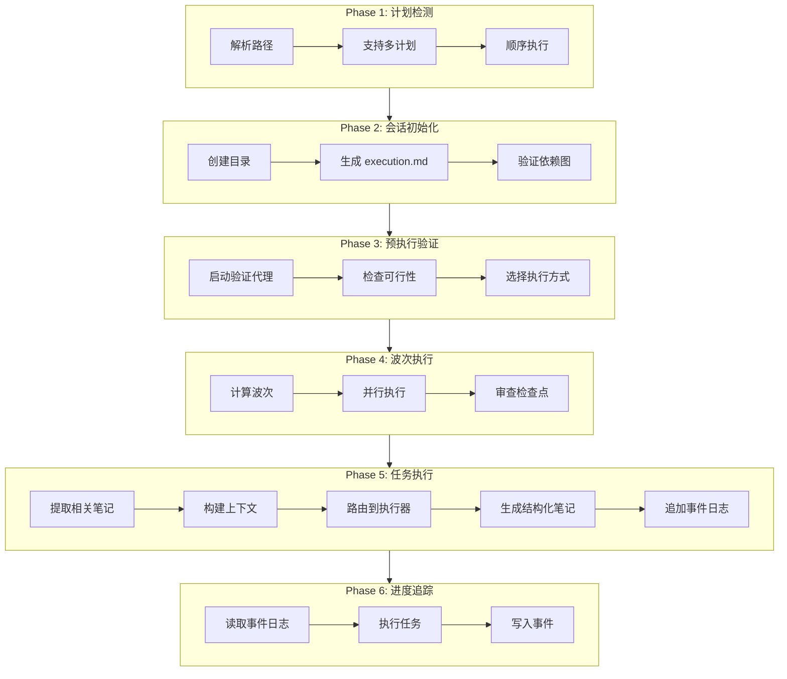

# /workflow:unified-execute-with-file

> **分类**: Workflow
> **源文件**: [.claude/commands/workflow/unified-execute-with-file.md](../../../.claude/commands/workflow/unified-execute-with-file.md)

## 概述

`/workflow:unified-execute-with-file` 是通用执行引擎，用于消费任何规划/头脑风暴/分析输出，通过多代理协调、依赖管理和进度追踪来执行任务。

**核心能力**:
- **统一执行**: 消费 IMPL_PLAN.md、plan.json、synthesis.json 等多种格式
- **多计划顺序执行**: 支持逗号分隔的多计划路径
- **DAG 依赖解析**: 基于依赖关系的波次执行
- **多执行方式**: Agent、CLI-Codex、CLI-Gemini 或自动选择
- **自动提交**: 可选的 git 自动提交支持

## 命令语法

```bash
/workflow:unified-execute-with-file [options] [path[,path2]...]
```

### 参数说明

| 参数 | 类型 | 必填 | 默认值 | 说明 |
|------|------|------|--------|------|
| path | string | 否 | 自动检测 | 计划文件路径，支持逗号分隔多个 |
| -y, --yes | flag | 否 | - | 自动确认所有决策 |
| -p, --plan | string | 否 | - | 显式指定计划路径 |
| --auto-commit | flag | 否 | false | 每个成功任务后自动提交 |
| --commit-prefix | string | 否 | null | 自定义提交消息前缀 |

## 使用场景

### 什么时候使用

- **执行规划输出**: 已有计划文件需要执行
- **多计划顺序执行**: 需要按顺序执行多个计划
- **复杂依赖管理**: 任务间有复杂依赖关系
- **需要进度追踪**: 想要完整的执行日志

### 什么时候不使用

- **简单任务**: 直接使用 `/workflow:lite-execute`
- **无需计划**: 已知确切要做什么
- **交互式开发**: 需要频繁人工干预

## 工作流程

### 六阶段工作流



### Phase 1: 计划检测与顺序执行

**路径解析策略**:

| 输入格式 | 解析策略 |
|---------|---------|
| 逗号分隔 | 顺序执行: `plan1.json → plan2.json → plan3.json` |
| 单路径 | 直接使用 |
| 无路径 | 自动检测 `.workflow/` 中的 IMPL_PLAN.md 或任务 JSON |

### Phase 2: 会话初始化

**操作步骤**:
1. 生成会话 ID: `EXEC-{slug}-{date}-{random}`
2. 创建 `.workflow/.execution/{sessionId}/`
3. 初始化 `execution.md`（计划概览 + 任务表）
4. 初始化 `execution-events.md`（空，将被追加）
5. 验证依赖图（检测循环）
6. 计算执行波次（拓扑排序 + 冲突检查）

### Phase 3: 预执行验证

**启动并行代理**:

**A. 验证代理** (cli-explore-agent):
- 检查文件存在性
- 验证依赖解析
- 识别文件冲突
- 评估任务复杂度
- 分析风险

**B. 审查代理** (universal-executor):
- 设置增量审查系统
- 每 2-4 任务设置检查点
- 配置关注领域

**执行方式选择**:

| 方式 | 描述 | 适用场景 |
|------|------|---------|
| Agent | `Task(code-developer)` | 标准实现 |
| CLI-Codex | `ccw cli --tool codex` | 复杂任务，git 感知 |
| CLI-Gemini | `ccw cli --tool gemini` | 分析型任务 |
| Auto | 按复杂度自动选择 | `-y` 模式默认 |

### Phase 4: 波次执行

**约束条件**:
- 有依赖的任务必须等待完成
- 同文件修改 → 顺序执行
- 每波最多 3 个并行任务（资源限制）
- 每 2-4 任务设置审查检查点

**波次计算算法**:
1. 找到可用任务（依赖满足，未完成）
2. 检查文件冲突
3. 分组非冲突任务（每波最多 3 个）
4. 标记完成，重复

**审查检查点** (非阻塞并行执行):
- 检查点代理在后台运行 (`run_in_background=true`)
- 下一波任务立即开始（不等待）
- 审查发现追加到 execution-events.md

### Phase 5: 任务执行

**步骤**:

1. **提取相关笔记**
   - 读取 execution-events.md 中的所有笔记
   - 按文件重叠筛选
   - 始终包含 Critical 严重性笔记
   - 按严重性排序

2. **构建执行上下文**
   ```javascript
   const executionContext = `
   ⚠️ 执行笔记（来自前置任务）
   ${relevantNotes}
   
   Current Task: ${task.id}
   Modified Files: ${task.files_to_modify}
   
   前置代理执行记录
   ${previousEvents}
   `
   ```

3. **路由到执行器**

   **Agent 执行**:
   ```javascript
   Task({
     subagent_type: "code-developer",
     run_in_background: false,
     prompt: buildAgentPrompt(executionContext, task)
   })
   ```

   **CLI 执行**:
   ```javascript
   Bash({
     command: `ccw cli -p "${cliPrompt}" --tool ${tool} --mode write --id ${fixedId}`,
     run_in_background: true
   })
   ```

4. **生成结构化笔记**
   - 模式检测自动生成笔记
   - `localStorage|sessionStorage` → WARNING (High): XSS 防护提醒
   - `package.json` 修改 → DEPENDENCY (Medium): npm install 提醒

5. **自动提交** (如果启用)
   ```bash
   git add <modified_files>
   git commit -m "type(scope): subject"
   ```

6. **追加到事件日志**

   ```markdown
   ## Task IMPL-001 - COMPLETED ✅
   
   **Timestamp**: 2025-02-15T10:30:00Z
   **Duration**: 45000ms
   **Agent**: code-developer
   
   ### Execution Summary
   实现用户登录功能...
   
   ### Generated Artifacts
   - `src/auth.ts` (2.3KB)
   
   ### 注意事项
   **Category**: WARNING
   **Severity**: High
   **Related Files**: src/auth.ts
   **Message**: 使用了 localStorage，注意 XSS 防护
   
   ---
   ```

### Phase 6: 进度追踪与恢复

**关键概念**: execution-events.md 作为人类可读日志和机器可解析状态存储。

**状态指示器**:
- ✅ (completed)
- ❌ (failed)
- ⏳ (progress)

## 输出结构

```
.workflow/.execution/EXEC-{slug}-{date}/
├── execution.md              # 计划概览 + 任务表 + 时间线
└── execution-events.md       # 统一日志（所有任务执行 + 审查检查点）
```

## 使用示例

### 示例 1: 基本使用

```bash
/workflow:unified-execute-with-file .workflow/plans/auth-plan.md
```

### 示例 2: 多计划顺序执行

```bash
/workflow:unified-execute-with-file plan1.json,plan2.json,plan3.json
```

### 示例 3: 带自动提交

```bash
/workflow:unified-execute-with-file --auto-commit plan.json
```

### 示例 4: 自动模式

```bash
/workflow:unified-execute-with-file -y plan.json
```

### 示例 5: 会话恢复

```bash
/workflow:unified-execute-with-file --continue
/workflow:unified-execute-with-file --continue EXEC-xxx-2025-02-15
```

## 代理类型选择

| 任务类型 | 代理 |
|---------|------|
| code (带测试) | tdd-developer |
| code | code-developer |
| test | test-fix-agent |
| doc | doc-generator |
| analysis | cli-execution-agent |
| debug | debug-explore-agent |
| default | universal-executor |

## 错误处理与恢复

| 情况 | 操作 |
|------|------|
| 任务超时 | 标记超时，询问: 重试/跳过/中止 |
| 缺少依赖 | 自动跳过依赖任务，记录警告 |
| 文件冲突 | 执行前检测，询问解决方案 |
| 输出不匹配 | 对照 expected_output 验证，标记审查 |
| 代理不可用 | 回退到 universal-executor |
| 执行中断 | 使用 `--continue` 恢复 |

**重试逻辑**:
- 自动模式下最多自动重试 2 次
- 交互模式: 达到最大重试后询问用户

## 最佳实践

1. **清晰计划结构**: 结构良好的计划 → 更好的执行
2. **审查验证报告**: 执行前检查 validation-report.json 中的风险
3. **选择正确的执行方式**:
   - Agent: 标准任务，简单实现
   - CLI-Codex: 复杂任务，需要 git 感知上下文
   - CLI-Gemini: 分析型或探索性任务
   - Auto: 让系统根据复杂度决定
4. **使用自动提交**: 启用 `--auto-commit` 自动追踪进度
5. **尽早解决冲突**: 执行前处理文件冲突
6. **监控事件日志**: 检查 execution-events.md 了解详细进度
7. **失败时恢复**: 使用 `--continue` 恢复中断的执行
8. **顺序多计划**: 使用逗号分隔路径按顺序执行多个计划

## 关联组件

- **相关 Commands**: 
  - [plan](plan.md) - 生成计划
  - [lite-execute](lite-execute.md) - 轻量执行
- **相关 Agents**: code-developer, tdd-developer, test-fix-agent, universal-executor

---

*最后更新: 2025-02*
