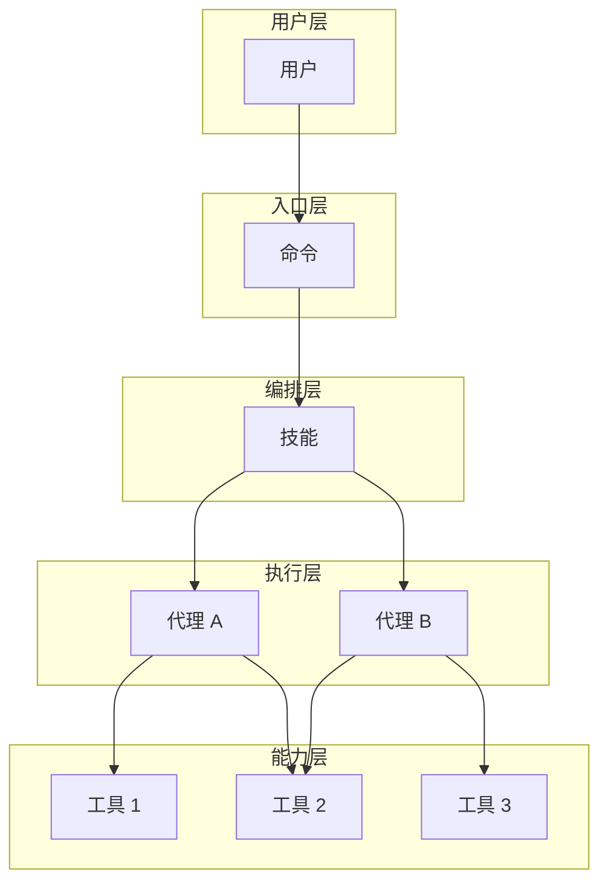

# CCW 心智模型

> 理解 CCW 的核心抽象和组件职责

---

## 核心抽象

CCW 架构围绕 **四个核心抽象** 构建：

```
┌─────────────────────────────────────────────────────────────────────────┐
│                           用户交互层                                     │
│    /命令 (Slash Commands)                                               │
└───────────────────────────────────┬─────────────────────────────────────┘
                                    │
                                    ▼
┌─────────────────────────────────────────────────────────────────────────┐
│                           技能编排层                                     │
│    Skills (多阶段工作流)                                                │
└───────────────────────────────────┬─────────────────────────────────────┘
                                    │
                                    ▼
┌─────────────────────────────────────────────────────────────────────────┐
│                           代理执行层                                     │
│    Agents (单一职责执行者)                                              │
└───────────────────────────────────┬─────────────────────────────────────┘
                                    │
                                    ▼
┌─────────────────────────────────────────────────────────────────────────┐
│                           工具能力层                                     │
│    Tools (MCP 暴露的底层能力)                                           │
└─────────────────────────────────────────────────────────────────────────┘
```

---

## 1. 命令 (Command)

### 定义
**命令**是用户与 CCW 交互的入口点，以斜杠 (`/`) 开头。

### 职责
- 解析用户输入
- 选择合适的执行路径
- 协调技能和代理

### 示例
```
/ccw "实现用户登录"          → 自动编排
/workflow:plan "重构认证"    → 标准规划
/issue:new "发现一个 bug"    → 创建 Issue
```

### 边界
- **不负责**具体实现逻辑
- **不直接**操作文件系统
- **只负责**路由和协调

---

## 2. 技能 (Skill)

### 定义
**技能**是多阶段工作流的定义，编排多个代理完成复杂任务。

### 职责
- 定义执行阶段 (Phases)
- 管理状态转换
- 协调多个代理

### 结构
```
skill-name/
├── SKILL.md           # 入口：元数据 + 执行流程
├── phases/            # 阶段定义
│   ├── 01-init.md     # 数字前缀控制顺序
│   ├── 02-explore.md
│   └── 03-synthesis.md
├── specs/             # 规范文件
├── templates/         # 模板
└── scripts/           # 辅助脚本
```

### 边界
- **不直接**执行代码
- **不包含**具体实现逻辑
- **只定义**执行流程和阶段

### 示例技能
| 技能 | 阶段数 | 用途 |
|------|--------|------|
| brainstorm | 4+ | 多角色头脑风暴 |
| workflow:plan | 4 | 标准规划流程 |
| review-code | 3 | 代码审查 |

---

## 3. 代理 (Agent)

### 定义
**代理**是单一职责的执行者，通过 Markdown 配置定义。

### 职责
- 执行具体任务
- 调用工具完成操作
- 生成结构化输出

### 配置结构
```yaml
---
name: agent-name                    # 唯一标识
description: |                      # 描述 + 触发示例
  Agent description here.
color: green|blue|orange|...       # UI 显示颜色
extends: parent-agent              # 可选：继承
allowed-tools: Task, Read, ...     # 可选：工具白名单
---
```

### 分类
| 分类 | 代理 | 职责 |
|------|------|------|
| **规划类** | action-planning-agent, cli-planning-agent | 生成任务计划 |
| **执行类** | code-developer, tdd-developer | 代码实现 |
| **搜索类** | context-search-agent, cli-explore-agent | 上下文收集 |
| **协调类** | cli-execution-agent, issue-queue-agent | 工具编排 |
| **专用类** | ui-design-agent, doc-generator | 领域任务 |

### 边界
- **只负责**单一领域
- **不编排**其他代理（由 Skill 负责）
- **遵循**工具白名单

---

## 4. 工具 (Tool)

### 定义
**工具**是通过 MCP (Model Context Protocol) 暴露的底层能力。

### 职责
- 提供原子操作
- 文件读写、搜索、网络请求等

### 分类
| 类型 | 工具 | 用途 |
|------|------|------|
| **文件操作** | read_file, write_file, edit_file | 读写修改文件 |
| **搜索** | search_context, smart_search | 语义/结构搜索 |
| **网络** | webReader, analyze_image | 网页读取、图像分析 |
| **团队** | team_msg, getDiagnostics | 团队通信、诊断 |

### 边界
- **不包含**业务逻辑
- **不直接**被用户调用
- **只被**代理使用

---

## 组件协作关系



---

## 为什么是这四个抽象？

### 设计原则

1. **关注点分离**
   - 命令：入口路由
   - 技能：流程编排
   - 代理：具体执行
   - 工具：底层能力

2. **单一职责**
   - 每个抽象只做一件事
   - 边界清晰，易于测试

3. **可组合性**
   - 技能可以编排多个代理
   - 代理可以调用多个工具
   - 命令可以触发多个技能

4. **可扩展性**
   - 添加新命令：无需修改代理
   - 添加新技能：组合现有代理
   - 添加新代理：实现特定能力
   - 添加新工具：扩展底层能力

---

## 心智图总结

```
CCW 架构
├── 入口：命令 (/xxx)
│   └── 路由用户意图 → 技能
│
├── 编排：技能 (Skills)
│   ├── 定义阶段 (Phases)
│   ├── 管理状态
│   └── 协调代理
│
├── 执行：代理 (Agents)
│   ├── 单一职责
│   ├── 调用工具
│   └── 生成输出
│
└── 能力：工具 (Tools)
    ├── 文件操作
    ├── 搜索发现
    ├── 网络请求
    └── 团队协作
```

---

## 相关资源

- [设计决策](design-decisions.md) - 关键技术决策
- [代理生命周期](../implementation/agent-lifecycle.md) - 代理详解
- [技能阶段系统](../implementation/skill-phases.md) - 技能详解

---

*心智模型 - CCW Deep Dive*
