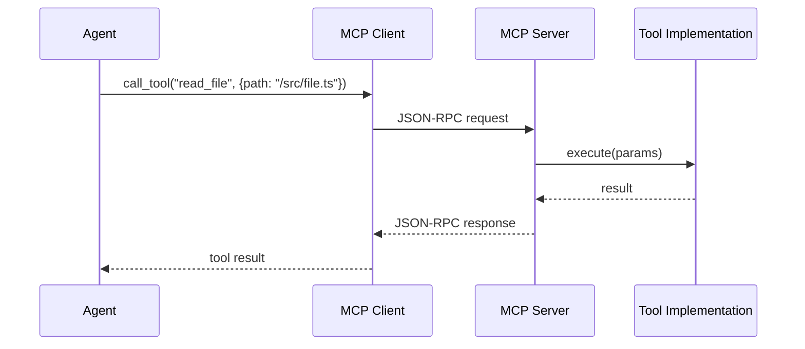

# 模块交互流程

> 核心模块的数据流和交互流程

---

## 概述

本文档描述 CCW 核心模块间的交互流程，包括：
- 核心执行链路数据流
- MCP Server 工具调用链路
- Memory 系统提取流水线
- Workflow/Session 状态流转

---

## 1. 核心执行链路数据流

```
┌────────────────────────────────────────────────────────────────────────┐
│                           User Request                                  │
└───────────────────────────────────┬────────────────────────────────────┘
                                    │
                                    ▼
┌────────────────────────────────────────────────────────────────────────┐
│                         Command Layer                                   │
│  ┌─────────────┐    ┌─────────────┐    ┌─────────────┐                 │
│  │ Parse       │ → │ Validate    │ → │ Route to    │                 │
│  │ Input       │    │ Options     │    │ Handler     │                 │
│  └─────────────┘    └─────────────┘    └─────────────┘                 │
└───────────────────────────────────┬────────────────────────────────────┘
                                    │
                                    ▼
┌────────────────────────────────────────────────────────────────────────┐
│                         CLI Executor                                    │
│  ┌─────────────┐    ┌─────────────┐    ┌─────────────┐                 │
│  │ Load        │ → │ Build       │ → │ Execute     │                 │
│  │ Config      │    │ Command     │    │ Subprocess  │                 │
│  └─────────────┘    └─────────────┘    └─────────────┘                 │
└───────────────────────────────────┬────────────────────────────────────┘
                                    │
                                    ▼
┌────────────────────────────────────────────────────────────────────────┐
│                         External CLI                                    │
│  ┌─────────────┐    ┌─────────────┐    ┌─────────────┐                 │
│  │ Gemini      │    │ Codex       │    │ Claude      │                 │
│  └─────────────┘    └─────────────┘    └─────────────┘                 │
└────────────────────────────────────────────────────────────────────────┘
```

### 关键数据结构

```typescript
// 执行参数
interface ExecuteParams {
  tool: string;          // gemini | codex | claude
  prompt: string;        // 用户提示词
  mode: 'analysis' | 'write' | 'review';
  resume?: string;       // 恢复 ID
  cd?: string;           // 工作目录
}

// 执行结果
interface ExecuteResult {
  transactionId: string;
  output: string;
  status: 'success' | 'failed' | 'timeout';
  duration: number;
}
```

---

## 2. MCP Server 工具调用链路

```
┌────────────────────────────────────────────────────────────────────────┐
│                         MCP Server Architecture                         │
├────────────────────────────────────────────────────────────────────────┤
│                                                                          │
│  ┌─────────────────────────────────────────────────────────────────┐   │
│  │                     Transport Layer                              │   │
│  │         Stdio Transport + JSON-RPC Protocol                      │   │
│  └────────────────────────────────────┬────────────────────────────┘   │
│                                       │                                  │
│  ┌────────────────────────────────────▼────────────────────────────┐   │
│  │                     Tool Registry                                │   │
│  │  ┌──────────┐ ┌──────────┐ ┌──────────┐ ┌──────────┐           │   │
│  │  │read_file │ │edit_file │ │webReader │ │search_ctx│           │   │
│  │  └──────────┘ └──────────┘ └──────────┘ └──────────┘           │   │
│  └────────────────────────────────────┬────────────────────────────┘   │
│                                       │                                  │
│  ┌────────────────────────────────────▼────────────────────────────┐   │
│  │                     HTTP Server + WebSocket                      │   │
│  │              (Dashboard notifications)                           │   │
│  └─────────────────────────────────────────────────────────────────┘   │
│                                                                          │
└────────────────────────────────────────────────────────────────────────┘
```

### 工具调用流程



### 内置工具

| 工具 | 类型 | 用途 |
|------|------|------|
| `read_file` | 文件操作 | 读取文件内容 |
| `write_file` | 文件操作 | 写入文件 |
| `edit_file` | 文件操作 | 编辑文件 |
| `search_context` | 搜索 | ACE 语义搜索 |
| `smart_search` | 搜索 | 结构化搜索 |
| `webReader` | 网络 | 网页读取 |
| `analyze_image` | 多媒体 | 图像分析 |

---

## 3. Memory 系统提取流水线

```
┌────────────────────────────────────────────────────────────────────────┐
│                         Memory Extraction Pipeline                      │
├────────────────────────────────────────────────────────────────────────┤
│                                                                          │
│  Phase 1: Per-Session Extraction                                        │
│  ┌─────────────┐    ┌─────────────┐    ┌─────────────┐                 │
│  │ Session     │ → │ Extract     │ → │ stage1_     │                 │
│  │ Analysis    │    │ Insights    │    │ outputs/    │                 │
│  └─────────────┘    └─────────────┘    └─────────────┘                 │
│                                                                          │
│  Phase 2: Consolidation                                                 │
│  ┌─────────────┐    ┌─────────────┐    ┌─────────────┐                 │
│  │ Aggregate   │ → │ Deduplicate │ → │ MEMORY.md   │                 │
│  │ stage1      │    │ & Synthesize│    │             │                 │
│  └─────────────┘    └─────────────┘    └─────────────┘                 │
│                                                                          │
└────────────────────────────────────────────────────────────────────────┘
```

### 提取内容

| 类别 | 示例 |
|------|------|
| **技术栈** | TypeScript, React, SQLite |
| **编码规范** | 使用 TypeScript strict 模式 |
| **架构模式** | JSON-first 状态管理 |
| **常见问题** | CLI 超时处理 |
| **最佳实践** | Phase-based 技能设计 |

### 存储位置

```
.workflow/
├── sessions/
│   └── WFS-xxx/
│       └── stage1_outputs/
│           └── insights.json
└── MEMORY.md                # 合并后的长期记忆
```

---

## 4. Workflow/Session 状态流转

```
┌────────────────────────────────────────────────────────────────────────┐
│                         Session Lifecycle                               │
├────────────────────────────────────────────────────────────────────────┤
│                                                                          │
│  ┌──────────┐    ┌──────────┐    ┌──────────┐    ┌──────────┐         │
│  │initialized│ → │ planning │ → │  active  │ → │implementing│        │
│  └──────────┘    └──────────┘    └──────────┘    └──────────┘         │
│       │                                                    │            │
│       │              ┌──────────┐    ┌──────────┐          │            │
│       │              │ reviewing│ ← │ reviewing │ ←────────┘            │
│       │              └──────────┘    └──────────┘                       │
│       │                                                    │            │
│       │              ┌──────────┐                          │            │
│       └─────────────→│ completed│ ←────────────────────────┘            │
│                      └──────────┘                                       │
│                                                                          │
└────────────────────────────────────────────────────────────────────────┘
```

### 状态定义

| 状态 | 描述 | 可转换到 |
|------|------|----------|
| `initialized` | 会话已创建 | planning |
| `planning` | 正在规划 | active |
| `active` | 执行中 | implementing, reviewing |
| `implementing` | 实现代码 | reviewing |
| `reviewing` | 审查中 | active, completed |
| `completed` | 已完成 | - |

### Session 文件结构

```
.workflow/sessions/WFS-xxx/
├── session.json           # 会话元数据
├── tasks/                 # 任务文件
│   ├── IMPL-1.json
│   └── IMPL-2.json
├── context-package.json   # 上下文数据包
└── artifacts/             # 生成的产物
    └── summary.md
```

---

## 5. Flow Executor DAG 编排

```
┌────────────────────────────────────────────────────────────────────────┐
│                         Flow Executor                                   │
├────────────────────────────────────────────────────────────────────────┤
│                                                                          │
│  ┌─────────────────────────────────────────────────────────────────┐   │
│  │                     DAG Definition                               │   │
│  │  {                                                               │   │
│  │    "nodes": [A, B, C, D],                                        │   │
│  │    "edges": [A→B, A→C, B→D, C→D]                                │   │
│  │  }                                                               │   │
│  └─────────────────────────────────────────────────────────────────┘   │
│                                                                          │
│  ┌─────────────────────────────────────────────────────────────────┐   │
│  │                     Topological Sort                             │   │
│  │  Wave 1: [A]                                                     │   │
│  │  Wave 2: [B, C] (parallel)                                       │   │
│  │  Wave 3: [D]                                                     │   │
│  └─────────────────────────────────────────────────────────────────┘   │
│                                                                          │
│  ┌─────────────────────────────────────────────────────────────────┐   │
│  │                     Execution                                    │   │
│  │  A → wait → B, C (parallel) → wait → D                          │   │
│  └─────────────────────────────────────────────────────────────────┘   │
│                                                                          │
└────────────────────────────────────────────────────────────────────────┘
```

### Flow 定义示例

```json
{
  "id": "demo-workflow",
  "nodes": [
    {
      "id": "node-1",
      "data": {
        "instruction": "Analyze codebase",
        "tool": "gemini",
        "mode": "analysis"
      }
    },
    {
      "id": "node-2",
      "data": {
        "instruction": "Implement feature",
        "tool": "codex",
        "mode": "write"
      }
    }
  ],
  "edges": [
    { "source": "node-1", "target": "node-2" }
  ]
}
```

---

## 6. 模块交互图

```
┌────────────────────────────────────────────────────────────────────────┐
│                           User Request                                  │
└───────────────────────────────────┬────────────────────────────────────┘
                                    │
                                    ▼
┌────────────────────────────────────────────────────────────────────────┐
│                         Flow Coordinator                                │
│  ┌─────────────┐    ┌─────────────┐    ┌─────────────┐                 │
│  │ Discover    │ → │ Select      │ → │ Execute     │                 │
│  │ Templates   │    │ Template    │    │ DAG         │                 │
│  └─────────────┘    └─────────────┘    └─────────────┘                 │
└───────────────────────────────────┬────────────────────────────────────┘
                                    │
              ┌─────────────────────┼─────────────────────┐
              ▼                     ▼                     ▼
┌──────────────────┐    ┌──────────────────┐    ┌──────────────────┐
│ Planning Agents  │    │ Execution Agents │    │ Search Agents    │
│ ────────────────│    │ ────────────────│    │ ────────────────│
│ action-planning  │    │ code-developer   │    │ context-search   │
│ cli-planning     │    │ tdd-developer    │    │ cli-explore      │
│ issue-plan       │    │ test-fix-agent   │    │ debug-explore    │
└────────┬─────────┘    └────────┬─────────┘    └────────┬─────────┘
         │                       │                       │
         └───────────────────────┼───────────────────────┘
                                 │
                                 ▼
┌────────────────────────────────────────────────────────────────────────┐
│                         Context Package                                 │
│  ┌─────────────┐    ┌─────────────┐    ┌─────────────┐                 │
│  │ metadata    │    │ project_ctx │    │ assets      │                 │
│  └─────────────┘    └─────────────┘    └─────────────┘                 │
│  ┌─────────────┐    ┌─────────────┐                                     │
│  │ brainstorm  │    │ conflict    │                                     │
│  └─────────────┘    └─────────────┘                                     │
└───────────────────────────────────┬────────────────────────────────────┘
                                    │
              ┌─────────────────────┼─────────────────────┐
              ▼                     ▼                     ▼
┌──────────────────┐    ┌──────────────────┐    ┌──────────────────┐
│ MCP Tools        │    │ CLI Tools        │    │ File System      │
│ ────────────────│    │ ────────────────│    │ ────────────────│
│ ACE search       │    │ Gemini/Qwen      │    │ Read/Write/Edit  │
│ CCW smart_search │    │ Codex/Claude     │    │ Glob/Grep        │
│ Exa web/code     │    │ ccw cli          │    │ Bash             │
└──────────────────┘    └──────────────────┘    └──────────────────┘
```

---

## 相关资源

- [CLI 执行](cli-execution.md) - 执行链路详解
- [代理生命周期](agent-lifecycle.md) - 代理系统
- [技能阶段系统](skill-phases.md) - 技能编排
- [设计决策](../architecture/design-decisions.md) - 技术选择

---

*模块交互流程 - CCW Deep Dive*
