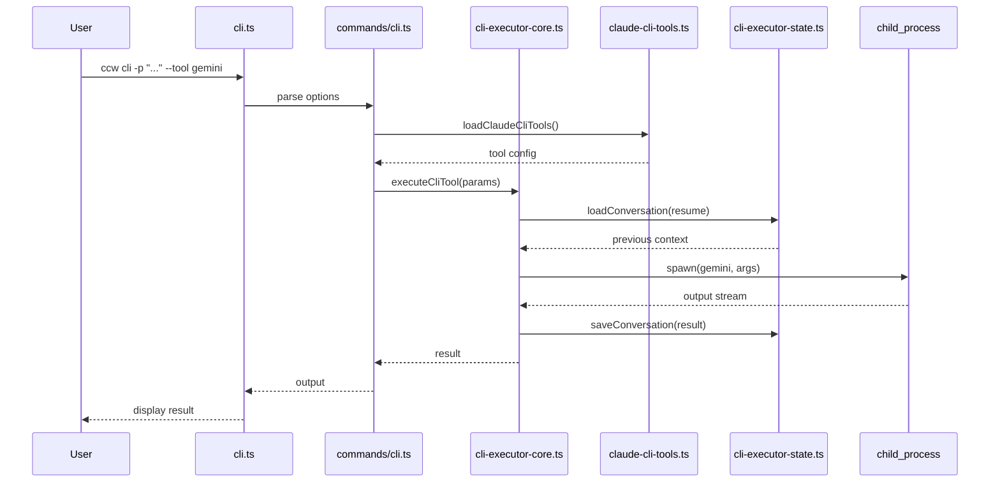

# CLI 执行深度文档

> CLI 执行链路、数据流、关键函数解析

---

## 执行链路概览

```
┌─────────────────────────────────────────────────────────────────────────┐
│                        CLI Execution Pipeline                            │
├─────────────────────────────────────────────────────────────────────────┤
│                                                                          │
│  cli.ts (Commander.js)                                                   │
│       │                                                                  │
│       ▼                                                                  │
│  commands/cli.ts                                                         │
│       │                                                                  │
│       ▼                                                                  │
│  cli-executor-core.ts                                                    │
│       │                                                                  │
│       ├──→ claude-cli-tools.ts (Config)                                 │
│       ├──→ template-discovery.ts (Templates)                            │
│       ├──→ cli-executor-state.ts (SQLite)                               │
│       └──→ cli-prompt-builder.ts (Resume)                               │
│       │                                                                  │
│       ▼                                                                  │
│  child_process.spawn()                                                   │
│       │                                                                  │
│       ▼                                                                  │
│  External CLI (gemini/codex/claude)                                      │
│                                                                          │
└─────────────────────────────────────────────────────────────────────────┘
```

---

## 1. cli.ts - 命令入口

### 职责
- 使用 Commander.js 定义 CLI 命令
- 解析命令行参数
- 路由到对应命令处理器

### 关键代码

```typescript
// cli.ts
program
  .command('cli')
  .description('Execute CLI tool with prompt')
  .option('-p, --prompt <text>', 'Prompt text')
  .option('--tool <tool>', 'Tool to use')
  .option('--mode <mode>', 'Execution mode')
  .action((options) => cliCommand(options));
```

### 参数解析
| 参数 | 类型 | 说明 |
|------|------|------|
| `-p, --prompt` | string | 提示词 |
| `--tool` | string | 工具选择 (gemini/codex/claude) |
| `--mode` | string | 执行模式 (analysis/write/review) |
| `--resume` | string | 恢复会话 ID |
| `--cd` | string | 工作目录 |

---

## 2. commands/cli.ts - 命令处理器

### 职责
- 处理 CLI 命令逻辑
- 加载配置和模板
- 调用执行器

### 关键函数

#### execAction()
```typescript
async function execAction(options: CliOptions) {
  // 1. 加载工具配置
  const toolConfig = await loadClaudeCliTools();

  // 2. 验证工具可用性
  const tool = getToolConfig(toolConfig, options.tool);

  // 3. 加载模板 (如果指定)
  const template = options.rule
    ? await loadTemplate(options.rule)
    : null;

  // 4. 构建完整提示词
  const prompt = buildPrompt(options.prompt, template);

  // 5. 执行
  await executeCliTool({
    tool: options.tool,
    prompt,
    mode: options.mode,
    resume: options.resume,
  });
}
```

---

## 3. cli-executor-core.ts - 核心执行器

### 职责
- 构建 CLI 命令
- 管理进程生命周期
- 处理输出流

### 关键函数

#### executeCliTool()
```typescript
export async function executeCliTool(params: ExecuteParams) {
  const { tool, prompt, mode, resume } = params;

  // 1. 检查工具可用性
  if (!await checkToolAvailability(tool)) {
    throw new Error(`Tool ${tool} not available`);
  }

  // 2. 构建命令
  const command = buildCommand(tool, { prompt, mode, resume });

  // 3. 生成事务 ID
  const transactionId = generateTransactionId();

  // 4. 注入事务 ID 到提示词
  const injectedPrompt = injectTransactionId(prompt, transactionId);

  // 5. 执行子进程
  const result = await spawnProcess(command, injectedPrompt);

  // 6. 保存对话历史
  await saveConversation(transactionId, result);

  return result;
}
```

#### buildCommand()
```typescript
function buildCommand(tool: string, options: CommandOptions): string {
  const toolConfig = getToolConfig(tool);

  switch (toolConfig.type) {
    case 'builtin':
      // gemini, qwen, codex
      return `${tool} -p "${options.prompt}" --mode ${options.mode}`;

    case 'cli-wrapper':
      // claude --settings
      return `claude --settings ${buildSettings(options)}`;

    case 'api-endpoint':
      // LiteLLM
      return `litellm --model ${toolConfig.id}`;
  }
}
```

### 工具类型
| 类型 | 工具 | 执行方式 |
|------|------|----------|
| `builtin` | gemini, qwen, codex | 直接调用 |
| `cli-wrapper` | claude | 通过 settings |
| `api-endpoint` | LiteLLM 模型 | HTTP API |

---

## 4. 数据流图



---

## 5. 恢复策略

### 三种恢复模式

| 策略 | 条件 | 命令模式 |
|------|------|----------|
| `new` | 无依赖 | `--id {session}-{task}` |
| `resume` | 1 父节点, 1 子节点 | `--resume {parent_id}` |
| `fork` | 1 父节点, N 子节点 | `--resume {parent} --id {new_id}` |
| `merge_fork` | N 父节点 | `--resume {id1},{id2} --id {new_id}` |

### 恢复示例
```bash
# 恢复上一个会话
ccw cli -p "继续" --resume

# 恢复特定会话
ccw cli -p "继续" --resume session-123

# 合并多个会话
ccw cli -p "合并分析" --resume session-1,session-2
```

---

## 6. 错误处理

### 错误类型
| 错误 | 处理方式 |
|------|----------|
| 工具不可用 | 提示安装，退出 |
| 超时 | 记录 ID，建议 --resume |
| 解析失败 | 回退到原始输出 |
| 权限错误 | 提示权限配置 |

### 重试逻辑
```typescript
async function executeWithRetry(fn, maxRetries = 2) {
  for (let i = 0; i < maxRetries; i++) {
    try {
      return await fn();
    } catch (error) {
      if (i === maxRetries - 1) throw error;
      await sleep(1000 * (i + 1));
    }
  }
}
```

---

## 7. 关键文件

| 文件 | 用途 |
|------|------|
| `ccw/src/cli.ts` | CLI 入口 |
| `ccw/src/commands/cli.ts` | 命令处理器 |
| `ccw/src/tools/cli-executor-core.ts` | 核心执行器 |
| `ccw/src/tools/claude-cli-tools.ts` | 配置管理 |
| `ccw/src/tools/cli-executor-state.ts` | SQLite 存储 |
| `ccw/src/tools/cli-prompt-builder.ts` | 提示词构建 |
| `ccw/src/tools/template-discovery.ts` | 模板发现 |

---

## 相关资源

- [设计决策](../architecture/design-decisions.md) - 技术选择
- [模块交互](../architecture/module-interactions.md) - 交互流程
- [代理生命周期](agent-lifecycle.md) - 代理执行

---

*CLI 执行深度文档 - CCW Deep Dive*
