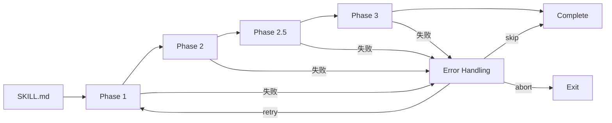

# 技能阶段系统

> Phase-based 设计原理、执行流程、完整示例

---

## 概述

CCW 技能系统采用 **Phase-based** 设计，将复杂工作流分解为有序执行阶段。

### 设计由来

Phase-based 设计从 `software-manual` 和 `copyright-docs` 两个成熟技能中提炼而来：
- 清晰的执行顺序
- 明确的输入输出契约
- 易于维护和扩展

---

## 1. 技能目录结构

```
skill-name/
├── SKILL.md              # 入口：元数据 + 执行流程
├── phases/               # 阶段定义（核心）
│   ├── 01-xxx.md         # 阶段 1
│   ├── 02-xxx.md         # 阶段 2
│   ├── 02.5-xxx.md       # 子阶段（可选）
│   └── 03-xxx.md         # 阶段 3
├── specs/                # 规范文件
│   └── constraints.md    # 约束定义
├── templates/            # 模板
│   └── output.md         # 输出模板
└── scripts/              # 辅助脚本
    └── validate.sh       # 验证脚本
```

---

## 2. SKILL.md 入口文件

### 结构

```markdown
---
name: skill-name
description: |
  技能描述。
  Examples:
  - Context: xxx
    Usage: /skill-name "task"
invoker: user | agent
---

# 技能标题

## Overview
简要描述技能功能和用途。

## Quick Start
快速使用示例。

## Workflow
```
Phase 1 → Phase 2 → Phase 3
```

## Implementation
详细实现说明。
```

### 元数据字段
| 字段 | 必填 | 说明 |
|------|------|------|
| `name` | 是 | 技能唯一标识 |
| `description` | 是 | 描述 + 触发示例 |
| `invoker` | 否 | 调用者类型 |

---

## 3. Phase 阶段定义

### 命名规范
- **数字前缀**: `01-`, `02-`, `03-` 控制执行顺序
- **子阶段**: `02.5-` 插入中间步骤
- **描述性名称**: `01-context-gathering.md`

### Phase 文件结构

```markdown
# Phase X: 阶段名称

## Objective
本阶段目标。

## Prerequisites
- 前置条件 1
- 前置条件 2

## Workflow Steps
1. 步骤 1
2. 步骤 2
3. 步骤 3

## Success Criteria
- [ ] 成功标准 1
- [ ] 成功标准 2

## Variables Set
- `var1`: 值
- `var2`: 值
```

---

## 4. 执行流程



### 执行规则
1. **顺序执行**: 按 Phase 编号顺序
2. **失败处理**: retry / skip / abort
3. **状态传递**: 上一 Phase 的输出作为下一 Phase 的输入

---

## 5. 完整示例: Brainstorm Skill

### 目录结构
```
brainstorm/
├── SKILL.md
├── phases/
│   ├── 01-topic-understanding.md
│   ├── 02-role-assignment.md
│   ├── 03-parallel-analysis.md
│   └── 04-synthesis.md
├── specs/
│   └── role-definitions.md
└── templates/
    └── analysis-output.md
```

### Phase 1: 主题理解
```markdown
# Phase 1: Topic Understanding

## Objective
理解用户主题，确定分析维度。

## Workflow Steps
1. 解析主题关键词
2. 识别相关维度 (架构/实现/性能/安全)
3. 确定分析深度
4. 初始化会话

## Success Criteria
- [ ] 主题已解析
- [ ] 维度已识别
- [ ] 会话已初始化

## Variables Set
- `topic`: 主题描述
- `dimensions`: 维度列表
- `sessionId`: 会话 ID
```

### Phase 2: 角色分配
```markdown
# Phase 2: Role Assignment

## Objective
根据主题分配分析角色。

## Prerequisites
- Phase 1 完成
- `dimensions` 已设置

## Workflow Steps
1. 匹配维度到角色
2. 加载角色定义
3. 配置分析任务

## Success Criteria
- [ ] 角色已分配
- [ ] 任务已配置

## Variables Set
- `roles`: 角色列表
- `tasks`: 任务列表
```

### Phase 3: 并行分析
```markdown
# Phase 3: Parallel Analysis

## Objective
并行执行多角色分析。

## Prerequisites
- Phase 2 完成
- `roles` 和 `tasks` 已设置

## Workflow Steps
1. 为每个角色启动代理
2. 并行执行分析
3. 收集结果

## Agent Configuration
| Agent | Role | Output |
|-------|------|--------|
| @cli-execution-agent | 分析者 A | analysis-a.md |
| @cli-execution-agent | 分析者 B | analysis-b.md |

## Success Criteria
- [ ] 所有分析完成
- [ ] 结果已收集
```

### Phase 4: 综合
```markdown
# Phase 4: Synthesis

## Objective
综合所有分析结果。

## Prerequisites
- Phase 3 完成
- 所有分析结果可用

## Workflow Steps
1. 提取共同主题
2. 识别冲突观点
3. 生成综合报告

## Success Criteria
- [ ] 综合报告已生成
- [ ] 建议已提出
```

---

## 6. 状态管理

### Session 变量
```json
{
  "sessionId": "WFS-xxx",
  "currentPhase": 3,
  "variables": {
    "topic": "优化认证架构",
    "dimensions": ["security", "performance"],
    "roles": ["security-expert", "performance-expert"]
  },
  "completedPhases": [1, 2],
  "artifacts": [
    "analysis-security.md",
    "analysis-performance.md"
  ]
}
```

### 变量引用
- `[variable_name]` - 引用 pre_analysis 输出
- `{{variable}}` - Template 占位符
- `${variable}` - Shell 变量

---

## 7. 错误处理策略

| 策略 | 行为 | 使用场景 |
|------|------|----------|
| `fail` | 停止执行 | 关键步骤失败 |
| `skip_optional` | 跳过继续 | 可选步骤失败 |
| `retry_once` | 重试一次 | 网络问题 |

### 示例
```markdown
## Error Handling
- 文件读取失败 → retry_once
- API 调用失败 → fail
- 可选分析失败 → skip_optional
```

---

## 8. 关键文件

| 文件 | 用途 |
|------|------|
| `.claude/skills/_shared/SKILL-DESIGN-SPEC.md` | 设计规范 |
| `.claude/skills/brainstorm/SKILL.md` | 完整示例 |
| `.claude/skills/workflow-plan/SKILL.md` | 规划示例 |

---

## 相关资源

- [心智模型](../architecture/mental-model.md) - 核心抽象
- [代理生命周期](agent-lifecycle.md) - 代理执行
- [添加新技能](../extension/add-new-skill.md) - 扩展指南

---

*技能阶段系统 - CCW Deep Dive*
