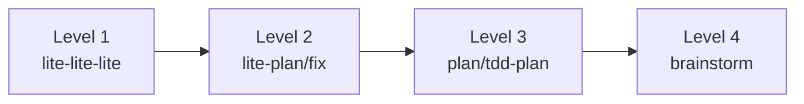

# Skills 索引

> **总数**: 27 个
> **最后更新**: 2025-02-15

---

## 概述

Skills 是 CCW 的工作流编排器，定义了多阶段执行流程。每个 Skill 包含：

- **SKILL.md** - 主编排文档，包含模式检测
- **phases/** - 阶段特定执行文档
- **specs/** - 质量标准和规则
- **templates/** - 输出模板

---

## 分类索引

### 工作流核心 (7)

最常用的核心工作流 Skills。

| Skill | 描述 | 阶段数 | 文档 |
|-------|------|--------|------|
| **workflow-plan** | 4 阶段规划工作流 | 4 | [详情](workflow-plan.md) |
| **workflow-execute** | Agent 执行协调 | 4 | [详情](workflow-execute.md) |
| **workflow-lite-plan** | 轻量级规划 | 2 | [详情](workflow-lite-plan.md) |
| **workflow-multi-cli-plan** | 多 CLI 规划 | 4 | [详情](workflow-multi-cli-plan.md) |
| **workflow-tdd** | TDD 工作流 | 6 | [详情](workflow-tdd.md) |
| **workflow-test-fix** | 测试修复管道 | 4 | [详情](workflow-test-fix.md) |
| **workflow-skill-designer** | Skill 设计元技能 | 4 | [详情](workflow-skill-designer.md) |

### 团队协作 (4)

多角色协作 Skills，用于复杂任务。

| Skill | 描述 | 角色数 | 文档 |
|-------|------|--------|------|
| **team-lifecycle** | 完整生命周期团队技能 | 8 | [详情](team-lifecycle.md) |
| **team-issue** | Issue 解决团队 | 4 | [详情](team-issue.md) |
| **team-command-designer** | 团队命令设计 | 4 | [详情](team-command-designer.md) |
| **team-skill-designer** | 团队 Skill 设计 | 4 | [详情](team-skill-designer.md) |

### Issue 管理 (3)

Issue 发现、解决和管理。

| Skill | 描述 | 阶段数 | 文档 |
|-------|------|--------|------|
| **issue-discover** | Issue 发现 | 4 | [详情](issue-discover.md) |
| **issue-resolve** | Issue 解决管道 | 5 | [详情](issue-resolve.md) |
| **issue-manage** | 交互式 Issue CRUD | 5 | [详情](issue-manage.md) |

### 分析 (4)

代码分析和架构探索。

| Skill | 描述 | 阶段数 | 文档 |
|-------|------|--------|------|
| **project-analyze** | 项目分析（Mermaid 图） | 6 | [详情](project-analyze.md) |
| **review-code** | 多维度代码审查 | 6 | [详情](review-code.md) |
| **brainstorm** | 多角色头脑风暴 | 6 | [详情](brainstorm.md) |
| **skill-tuning** | Skill 诊断与优化 | 12 | [详情](skill-tuning.md) |

### 文档生成 (3)

自动化文档生成。

| Skill | 描述 | 阶段数 | 文档 |
|-------|------|--------|------|
| **copyright-docs** | 软件著作权文档 | 6 | [详情](copyright-docs.md) |
| **software-manual** | TiddlyWiki 风格手册 | 8 | [详情](software-manual.md) |
| **spec-generator** | 规范文档生成 | 6 | [详情](spec-generator.md) |

### 内存管理 (2)

上下文和记忆管理。

| Skill | 描述 | 阶段数 | 文档 |
|-------|------|--------|------|
| **memory-capture** | 会话记忆捕获 | 3 | [详情](memory-capture.md) |
| **memory-manage** | CLAUDE.md 更新 | 4 | [详情](memory-manage.md) |

### 其他 (4)

辅助和元技能。

| Skill | 描述 | 阶段数 | 文档 |
|-------|------|--------|------|
| **ccw-help** | 命令帮助系统 | 3 | [详情](ccw-help.md) |
| **skill-generator** | 创建新 Skills | 5 | [详情](skill-generator.md) |
| **flow-coordinator** | 模板驱动工作流 | 4 | [详情](flow-coordinator.md) |
| **review-cycle** | 多维度审查循环 | 5 | [详情](review-cycle.md) |

---

## 工作流级别

CCW 支持 4 级工作流复杂度：



| 级别 | 名称 | 适用场景 | 典型 Skill |
|------|------|----------|------------|
| **1** | lite-lite-lite | 快速修复、配置更改 | 单步命令 |
| **2** | lite-plan / lite-fix | 单模块功能、Bug 修复 | workflow-lite-plan |
| **3** | plan / tdd-plan | 多模块开发、TDD | workflow-plan, workflow-tdd |
| **4** | brainstorm | 架构设计、新功能探索 | brainstorm, team-lifecycle |

---

## 使用场景对照表

| 场景 | 推荐 Skill | 工作流级别 |
|------|------------|------------|
| 快速修复配置文件 | 直接命令 | Level 1 |
| 添加简单的 API 端点 | workflow-lite-plan | Level 2 |
| 修复 Bug 并验证测试 | workflow-lite-plan + test-fix | Level 2 |
| 实现新功能模块 | workflow-plan | Level 3 |
| TDD 开发新组件 | workflow-tdd | Level 3 |
| 代码质量审查 | review-code | Level 3 |
| 架构重构 | brainstorm → workflow-plan | Level 4 |
| 新系统设计 | team-lifecycle | Level 4 |
| Issue 批量处理 | issue-discover → issue-resolve | Level 2-3 |
| 生成技术文档 | spec-generator | Level 2 |
| 多角色头脑风暴 | brainstorm | Level 4 |

---

## Skill 结构

每个 Skill 遵循标准目录结构：

```
.claude/skills/{skill-name}/
├── SKILL.md           # 主编排文档（含模式检测）
├── phases/            # 阶段执行文档
│   ├── orchestrator.md
│   └── actions/*.md
├── specs/             # 质量标准与规则
│   ├── quality-standards.md
│   └── rules/
└── templates/         # 输出模板
    └── *.md
```

### SKILL.md 核心结构

```yaml
---
name: skill-name
description: Skill 描述
allowed-tools: [Read, Write, Edit, Bash, Skill]
---

# Skill 标题

## 执行模式

### 模式 1: xxx
### 模式 2: xxx

## 阶段定义

### Phase 1: 准备
### Phase 2: 执行
### Phase 3: 验证

## 输出规范
```

---

## 学习建议

### 初学者路径

1. 从 **workflow-lite-plan** 开始，理解基本规划流程
2. 尝试 **issue-discover**，学习 Issue 发现机制
3. 使用 **review-code**，掌握代码审查流程

### 进阶路径

1. 学习 **workflow-plan**，理解完整规划流程
2. 掌握 **workflow-tdd**，实践 TDD 开发
3. 探索 **brainstorm**，进行架构探索

### 高级路径

1. 使用 **team-lifecycle**，协调多角色协作
2. 用 **skill-generator** 创建自定义 Skills
3. 使用 **skill-tuning** 优化现有 Skills

---

## 创建新 Skills

参考 [创建新 Skills](creating-new-skill.md) 获取完整指南。

**关键要求**:
1. 遵循 `SKILL-DESIGN-SPEC.md` 规范
2. 包含 YAML frontmatter
3. 支持多种执行模式
4. 提供基于阶段的编排

---

*由 CCW 知识系统自动生成*
