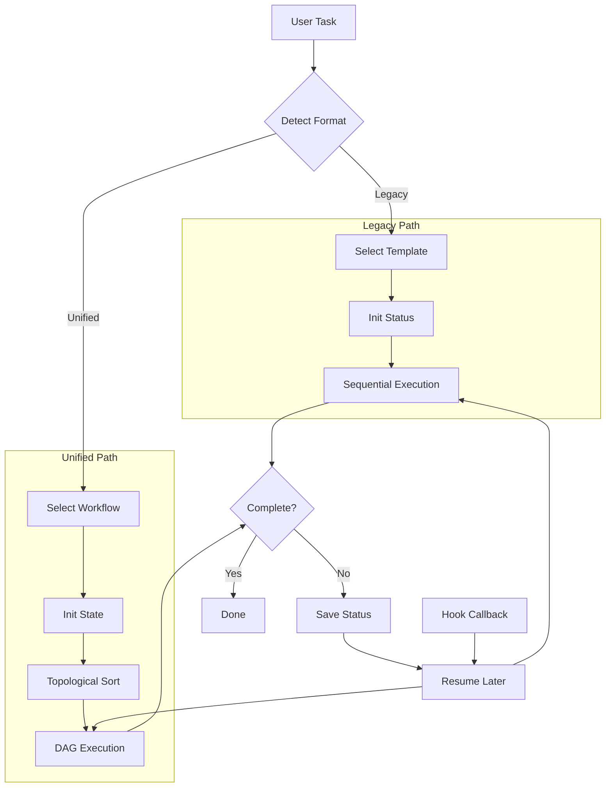

# flow-coordinator

> **分类**: Other
> **源文件**: [.claude/skills/flow-coordinator/SKILL.md](../../.claude/skills/flow-coordinator/SKILL.md)

## 概述

`flow-coordinator` 是一个轻量级的模板驱动工作流协调器，支持两种工作流格式：

1. **Legacy Templates（传统模板）**: 基于命令链的顺序执行，存储在 `templates/*.json`
2. **Unified Workflows（统一工作流）**: 基于 DAG 的 PromptTemplate 节点，存储在 `ccw/data/flows/*.json`

### 核心价值

- **双格式支持**: 同时支持传统命令链和现代 DAG 工作流
- **动态发现**: 运行时通过 Glob 自动发现工作流模板
- **可恢复执行**: 任意步骤可从中断点恢复
- **多执行模式**: 支持 mainprocess（阻塞）、async（后台）、analysis（只读）、write（写文件）
- **上下文传递**: 步骤间通过 `contextRefs` 和 `{{outputName}}` 语法传递数据

## 架构设计



### 架构说明

系统根据工作流 JSON 结构自动检测格式：
- 包含 `nodes` 和 `edges` 数组 → Unified Workflow（DAG 格式）
- 包含 `steps` 数组且第一步有 `cmd` 字段 → Legacy Template（命令链格式）

## 核心机制

### 格式检测

```javascript
function detectWorkflowFormat(content) {
  if (content.nodes && content.edges) {
    return 'unified';  // PromptTemplate DAG format
  }
  if (content.steps && content.steps[0]?.cmd) {
    return 'legacy';   // Command chain format
  }
  throw new Error('Unknown workflow format');
}
```

### 执行模式

| 模式 | 行为 | 使用场景 |
|------|------|----------|
| `analysis` | 只读，无文件变更 | 代码审查、探索 |
| `write` | 可创建/修改/删除文件 | 实现、修复 |
| `mainprocess` | 阻塞，同步执行 | 交互式步骤 |
| `async` | 后台，非阻塞 | 长时间运行任务 |

### 状态追踪

**位置**: `.workflow/.flow-coordinator/{session-id}/status.json`

**核心字段**:
- `id`: 会话 ID (fc-YYYYMMDD-HHMMSS 或 ufc-YYYYMMDD-HHMMSS)
- `template/workflow`: 模板/工作流名称
- `goal`: 用户任务描述
- `current`: 当前步骤索引
- `steps[]/nodeStates{}`: 步骤/节点状态
- `complete`: 是否全部完成

**步骤状态流转**: `pending` → `running` → `done` | `failed` | `skipped`

### 上下文引用语法

使用 `{{outputName}}` 语法引用前序步骤的输出：

```
Analyze {{requirements_analysis}} and create implementation plan.
```

**嵌套属性访问**:
```
If {{ci_report.status}} === 'failed', stop execution.
```

**多引用组合**:
```
Combine {{lint_result}}, {{typecheck_result}}, and {{test_result}} into report.
```

## 参数说明

| 参数 | 类型 | 必填 | 说明 |
|------|------|------|------|
| `--resume` | string | 否 | 从指定会话 ID 恢复执行 |
| `--template` | string | 否 | 直接指定模板名称（跳过选择） |
| `--list` | flag | 否 | 列出所有可用模板 |

## 使用场景

### 场景 1: 快速功能实现

使用 rapid 模板，适合简单功能：

```bash
/flow-coordinator
# 选择 "rapid" 模板
```

**执行步骤**:
1. `/workflow:lite-plan` - 创建轻量级计划
2. `/workflow:lite-execute --in-memory` - 内存中执行
3. `/workflow:test-cycle-execute` (可选) - 测试验证

### 场景 2: 复杂功能开发

使用 coupled 模板，包含完整验证流程：

```bash
/flow-coordinator
# 选择 "coupled" 模板
```

**执行步骤**:
1. `/workflow:plan` - 详细计划
2. `/workflow:plan-verify` - 计划验证
3. `/workflow:execute` - 执行实现
4. `/workflow:review-session-cycle` - 代码审查
5. `/workflow:review-cycle-fix` - 修复审查问题
6. `/workflow:test-fix-gen` - 生成测试
7. `/workflow:test-cycle-execute` - 执行测试

### 场景 3: TDD 开发

使用 tdd 模板，测试驱动开发：

```bash
/flow-coordinator
# 选择 "tdd" 模板
```

**执行步骤**:
1. `/workflow:tdd-plan` - TDD 规划
2. `/workflow:execute` - 实现
3. `/workflow:tdd-verify` - TDD 验证

### 场景 4: 从中断恢复

```bash
/flow-coordinator --resume fc-20250215-143000
```

**恢复流程**:
1. 读取 `.workflow/.flow-coordinator/fc-20250215-143000/status.json`
2. 找到第一个未完成步骤
3. 从该步骤继续执行

### 场景 5: 直接指定模板

```bash
/flow-coordinator --template rapid
```

跳过模板选择步骤，直接使用 rapid 模板。

## 实现细节

### Legacy Template 执行

```javascript
async function executeSteps(status, statusPath) {
  for (let i = status.current; i < status.steps.length; i++) {
    const step = status.steps[i];
    status.current = i;

    const execConfig = step.execution || { type: 'slash-command', mode: 'mainprocess' };

    if (execConfig.mode === 'async') {
      // 后台执行 - 停止并等待 hook 回调
      await executeSlashCommandAsync(step, status, statusPath);
      break;
    } else {
      // 同步执行 - 立即继续
      await executeSlashCommandSync(step, status);
      step.status = 'done';
      write(statusPath, JSON.stringify(status, null, 2));
    }
  }

  if (status.current >= status.steps.length) {
    status.complete = true;
    write(statusPath, JSON.stringify(status, null, 2));
  }
}
```

### Unified Workflow 执行

```javascript
async function executeUnifiedWorkflow(workflow, task) {
  // 1. 初始化执行状态
  const sessionId = `ufc-${timestamp()}`;
  const statusPath = `.workflow/.flow-coordinator/${sessionId}/status.json`;
  const state = {
    id: sessionId,
    workflow: workflow.id,
    goal: task,
    nodeStates: {},  // nodeId -> { status, result, error }
    outputs: {},     // outputName -> result
    complete: false
  };

  // 2. 拓扑排序确定执行顺序
  const executionOrder = topologicalSort(workflow.nodes, workflow.edges);

  // 3. 按 DAG 依赖关系执行节点
  await executeDAG(workflow, executionOrder, state, statusPath);
}

async function executeDAG(workflow, order, state, statusPath) {
  for (const nodeId of order) {
    const node = workflow.nodes.find(n => n.id === nodeId);
    const data = node.data;

    // 检查依赖是否满足
    if (!areDependenciesSatisfied(nodeId, workflow.edges, state)) {
      continue;
    }

    // 构建指令
    let instruction = buildNodeInstruction(data, state.outputs);

    // 执行节点
    state.nodeStates[nodeId] = { status: 'running' };
    write(statusPath, JSON.stringify(state, null, 2));

    const result = await executeNode(instruction, data.tool, data.mode);

    // 存储输出供下游节点使用
    state.nodeStates[nodeId] = { status: 'completed', result };
    if (data.outputName) {
      state.outputs[data.outputName] = result;
    }
    write(statusPath, JSON.stringify(state, null, 2));
  }

  state.complete = true;
  write(statusPath, JSON.stringify(state, null, 2));
}
```

### 指令构建

```javascript
function buildNodeInstruction(data, outputs) {
  const refs = data.contextRefs || [];

  // 如果设置了 slashCommand，从中构建指令
  if (data.slashCommand) {
    // 解析 slashArgs 中的变量
    const args = data.slashArgs
      ? resolveContextRefs(data.slashArgs, refs, outputs)
      : '';

    // 构建斜杠命令指令
    let instruction = `/${data.slashCommand}${args ? ' ' + args : ''}`;

    // 追加额外指令（如果有）
    if (data.instruction) {
      const additionalInstruction = resolveContextRefs(data.instruction, refs, outputs);
      instruction = `${instruction}\n\n${additionalInstruction}`;
    }

    return instruction;
  }

  // 回退：使用原始指令并解析上下文引用
  return resolveContextRefs(data.instruction || '', refs, outputs);
}

function resolveContextRefs(instruction, refs, outputs) {
  let resolved = instruction;
  for (const ref of refs) {
    const value = outputs[ref];
    const placeholder = `{{${ref}}}`;
    resolved = resolved.replace(new RegExp(placeholder, 'g'),
      typeof value === 'object' ? JSON.stringify(value) : String(value));
  }
  return resolved;
}
```

### Prompt 构建

```javascript
function buildCommandPrompt(step, status) {
  let prompt = `${step.cmd} -y`;

  // 添加参数（替换占位符）
  if (step.args) {
    const args = step.args
      .replace('{{goal}}', status.goal)
      .replace('{{prev}}', getPreviousSessionId(status));
    prompt += ` ${args}`;
  }

  // 基于 contextHint 添加上下文
  if (step.contextHint) {
    const context = buildContextFromHint(step.contextHint, status);
    prompt += `\n\nContext:\n${context}`;
  } else {
    const previousContext = collectPreviousResults(status);
    if (previousContext) {
      prompt += `\n\nPrevious results:\n${previousContext}`;
    }
  }

  return prompt;
}
```

## 模板列表

### Legacy Templates (`templates/*.json`)

| 模板 | 级别 | 用途 | 步骤数 |
|------|------|------|--------|
| `rapid` | 2 | 简单功能快速实现 | 4 |
| `coupled` | 3 | 复杂功能完整流程 | 7 |
| `bugfix` | 2 | Bug 修复流程 | 3 |
| `tdd` | 3 | 测试驱动开发 | 3 |
| `test-fix` | 2 | 修复失败测试 | 2 |
| `brainstorm` | 4 | 探索性头脑风暴 | 1 |
| `debug` | 3 | 调试流程 | 1 |
| `analyze` | 3 | 协作分析 | 1 |
| `issue` | 3 | Issue 工作流 | 3 |
| `review` | 3 | 代码审查 | 1 |
| `docs` | 2 | 文档生成 | 1 |
| `full` | 4 | 完整开发流程 | 9 |
| `lite-lite-lite` | 1 | 超轻量快速修复 | 2 |
| `multi-cli-plan` | 4 | 多 CLI 规划 | 4 |

### Unified Workflows (`ccw/data/flows/*.json`)

| 工作流 | 描述 | 节点数 |
|--------|------|--------|
| `demo-unified-workflow` | Auth 实现示例 | 7 |
| `parallel-ci-workflow` | CI/CD 流水线 | 8 |
| `simple-analysis-workflow` | 分析流水线 | 3 |

## 模板结构示例

### Legacy Template Schema

```json
{
  "name": "rapid",
  "description": "Quick implementation",
  "level": 2,
  "steps": [
    {
      "cmd": "/workflow:lite-plan",
      "args": "\"{{goal}}\"",
      "unit": "quick-implementation",
      "execution": { "type": "slash-command", "mode": "mainprocess" },
      "contextHint": "Create lightweight implementation plan"
    },
    {
      "cmd": "/workflow:lite-execute",
      "args": "--in-memory",
      "unit": "quick-implementation",
      "execution": { "type": "slash-command", "mode": "async" },
      "contextHint": "Execute plan from previous step"
    }
  ]
}
```

### Unified Workflow Schema

```json
{
  "id": "simple-analysis",
  "name": "Simple Analysis",
  "version": 1,
  "nodes": [
    {
      "id": "analyze",
      "type": "prompt-template",
      "data": {
        "label": "Analyze Code",
        "instruction": "Analyze the authentication module",
        "outputName": "analysis",
        "tool": "gemini",
        "mode": "analysis"
      }
    },
    {
      "id": "report",
      "type": "prompt-template",
      "data": {
        "label": "Generate Report",
        "instruction": "Based on {{analysis}}, generate report",
        "outputName": "report",
        "contextRefs": ["analysis"]
      }
    }
  ],
  "edges": [
    { "id": "e1", "source": "analyze", "target": "report" }
  ]
}
```

## DAG 执行语义

### 顺序执行

单输入边节点在前序完成后执行：

```
[A] ──▶ [B] ──▶ [C]
```

### 并行执行

同源多边触发并行执行：

```
      ┌──▶ [B]
[A] ──┤
      └──▶ [C]
```

### 合并点

多输入边节点等待所有前序完成：

```
[B] ──┐
      ├──▶ [D]
[C] ──┘
```

### 条件分支

边 `data.condition` 指定分支条件：

```json
{
  "id": "e-decision-success",
  "source": "decision",
  "target": "notify-success",
  "data": { "condition": "decision.result === 'pass'" }
}
```

## 关联组件

- **规范文档**: [spec/unified-workflow-spec.md](../../.claude/skills/flow-coordinator/spec/unified-workflow-spec.md)
- **Legacy 模板**: `templates/*.json`
- **Unified 工作流**: `ccw/data/flows/*.json`
- **相关 Skills**: [workflow-plan](workflow-plan.md), [workflow-execute](workflow-execute.md)

## 最佳实践

1. **选择合适级别**: 根据任务复杂度选择对应 level 的模板
   - Level 1: 超简单修复 → `lite-lite-lite`
   - Level 2: 简单功能 → `rapid`, `bugfix`
   - Level 3: 复杂功能 → `coupled`, `tdd`
   - Level 4: 探索/架构 → `brainstorm`, `full`

2. **利用恢复功能**: 中断后使用 `--resume` 恢复，避免重新开始

3. **理解执行模式**:
   - `mainprocess` 步骤会阻塞，适合需要用户交互的场景
   - `async` 步骤后台运行，适合长时间任务

4. **上下文传递**: 在 Unified Workflow 中使用 `outputName` 和 `contextRefs` 实现步骤间数据传递

5. **自定义模板**: 可在 `templates/` 目录创建自定义模板满足特定需求

## 常见问题

### Q: Legacy Template 和 Unified Workflow 有什么区别？

A: **Legacy Template** 是命令链格式，步骤顺序执行；**Unified Workflow** 是 DAG 格式，支持并行执行和条件分支。Legacy 适合简单顺序流程，Unified 适合复杂工作流。

### Q: 如何查看可用模板列表？

A: 使用 `--list` 参数或直接运行 `/flow-coordinator` 查看选项。

### Q: async 模式的步骤如何知道执行完成？

A: async 步骤通过 hook 回调通知完成。系统会保存状态，使用 `--resume` 恢复时自动继续。

### Q: 如何创建自定义模板？

A: 在 `templates/` 目录创建 JSON 文件，遵循 Legacy Template Schema。系统会自动发现。

### Q: contextHint 有什么作用？

A: contextHint 是自然语言提示，用于指导上下文组装。例如 "Summarize IMPL_PLAN.md" 会读取并总结计划文件。

---

*Auto-generated by CCW Knowledge System*
