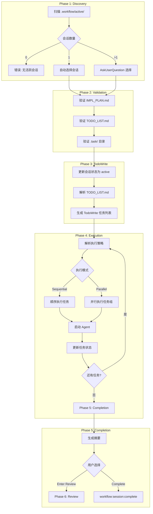

# workflow-execute

> **分类**: Workflow Core
> **源文件**: [.claude/skills/workflow-execute/SKILL.md](../../.claude/skills/workflow-execute/SKILL.md)

## 概述

`workflow-execute` 是 CCW 工作流系统的核心执行引擎，负责协调 Agent 执行、任务调度和进度追踪。该 skill 通过系统化的任务发现、Agent 协调和实时状态同步，实现**完全自主的工作流执行**（仅在多会话场景需要用户选择）。

### 核心价值

- **自主执行**: 除初始会话选择外，整个工作流无需用户干预
- **智能调度**: 基于 IMPL_PLAN 的执行策略，支持顺序/并行/分阶段等多种执行模式
- **进度可见**: 通过 TodoWrite 实时追踪整个工作流的执行状态
- **容错恢复**: 支持 `--resume-session` 从中断点恢复执行
- **自动提交**: 可选的 `--with-commit` 模式在每个任务完成后自动提交变更

## 架构设计



### 架构说明

整个执行流程分为 6 个阶段（Phase 1-6），其中 Phase 1-5 是主要执行流程，Phase 6 是可选的后置审查阶段。系统采用**延迟加载策略**优化性能，仅在任务即将执行时读取对应的 Task JSON 文件。

## 核心机制

### 延迟加载策略

为优化大型工作流的内存使用和启动性能，采用智能延迟加载：

```
TODO_LIST.md     → Phase 3 读取（任务元数据和状态）
IMPL_PLAN.md     → Phase 2 验证存在，Phase 4A 解析执行策略
Task JSONs       → Phase 4B 按需加载（仅在任务执行前）
```

**优势**:
- 减少启动时的文件 I/O
- 降低内存占用
- 支持超大型工作流（100+ 任务）

### 执行模式

| 模式 | 触发条件 | TodoWrite 行为 |
|------|----------|----------------|
| Sequential | IMPL_PLAN 指定或无并行指导 | 同时仅一个 `in_progress` |
| Parallel | IMPL_PLAN 明确指定并行组 | 同批任务均为 `in_progress` |
| Phased | IMPL_PLAN 指定分阶段执行 | 每阶段内遵循顺序或并行规则 |
| Fallback | IMPL_PLAN 缺少执行策略 | 分析任务结构智能选择 |

### 会话恢复

使用 `--resume-session` 标志可从任意中断点恢复：

```bash
/workflow:execute --resume-session="WFS-auth-system"
```

**恢复流程**:
1. 跳过 Phase 1（会话发现）和 Phase 2（验证）
2. 直接进入 Phase 3（TodoWrite 生成）
3. 从当前进度继续执行

### 自动提交模式

启用 `--with-commit` 后，每个任务完成自动提交：

```bash
/workflow:execute --yes --with-commit
```

**提交原则**:
- **最小化提交**: 仅提交当前任务修改的文件
- **智能消息**: 从摘要文档生成 `{type}: {title} - {summary}` 格式
- **类型映射**: `feature→feat`, `bugfix→fix`, `refactor→refactor`

## 参数说明

| 参数 | 类型 | 必填 | 说明 |
|------|------|------|------|
| `--yes` / `-y` | flag | 否 | 自动模式：自动选择第一个会话，自动完成会话 |
| `--with-commit` | flag | 否 | 任务完成后自动 git commit |
| `--resume-session` | string | 否 | 指定恢复的会话 ID，跳过发现和验证阶段 |

**标志解析逻辑**:
```javascript
const autoYes = $ARGUMENTS.includes('--yes') || $ARGUMENTS.includes('-y')
const withCommit = $ARGUMENTS.includes('--with-commit')
const resumeSession = $ARGUMENTS.match(/--resume-session="?([^"\s]+)"?/)?.[1]
```

## 使用场景

### 场景 1: 交互式执行

默认模式，适合需要人工确认的场景：

```bash
/workflow:execute
```

**流程**:
1. 发现活跃会话
2. 如果有多个会话，询问用户选择
3. 执行所有任务
4. 完成后询问用户：审查或完成会话

### 场景 2: 自动化执行

适合 CI/CD 或自动化脚本：

```bash
/workflow:execute --yes
```

**自动行为**:
- 自动选择第一个（最新的）活跃会话
- 完成后自动执行 `/workflow:session:complete --yes`

### 场景 3: 带自动提交的执行

适合需要版本追踪的场景：

```bash
/workflow:execute --yes --with-commit
```

**提交行为**:
- 每个任务完成后读取 `.summaries/{task-id}-summary.md`
- 提取 "Files Modified" 部分的文件列表
- 执行 `git add <files> && git commit -m "<message>"`

### 场景 4: 恢复中断的工作流

从中断点恢复执行：

```bash
/workflow:execute --yes --resume-session="WFS-auth-system"
```

**跳过阶段**: Phase 1（发现）、Phase 2（验证）
**入口点**: Phase 3（TodoWrite 生成）

## 实现细节

### Phase 1: 会话发现

```bash
# 统计活跃会话
find .workflow/active/ -name "WFS-*" -type d 2>/dev/null | wc -l

# 获取会话元数据
for dir in .workflow/active/WFS-*/; do
  session=$(basename "$dir")
  project=$(jq -r '.project // "Unknown"' "${dir}workflow-session.json")
  total=$(grep -c '^\- \[' "${dir}TODO_LIST.md")
  completed=$(grep -c '^\- \[x\]' "${dir}TODO_LIST.md")
  progress=$((completed * 100 / total))
  echo "$session | $project | $completed/$total tasks ($progress%)"
done
```

### Phase 4: Agent 执行模式

**路径式调用**（推荐）: 传递路径和触发标记，让 Agent 自主解析任务 JSON：

```bash
Task(
  subagent_type="{meta.agent}",
  run_in_background=false,
  prompt="Implement task {task.id}: {task.title}

  [FLOW_CONTROL]

  **Input**:
  - Task JSON: {session.task_json_path}
  - Context Package: {session.context_package_path}

  **Output Location**:
  - Workflow: {session.workflow_dir}
  - TODO List: {session.todo_list_path}
  - Summaries: {session.summaries_dir}

  **Execution**: Read task JSON → Execute pre_analysis → Check execution_config.method → (CLI: handoff to CLI tool | Agent: direct implementation) → Update TODO_LIST.md → Generate summary",
  description="Implement: {task.id}"
)
```

**关键标记**:
- `Implement`: 触发技术栈检测和指南加载
- `[FLOW_CONTROL]`: 触发 pre_analysis 执行

### TodoWrite 协调规则

**规则 1: 初始创建**
- Normal Mode: 从待处理任务生成完整 TodoWrite
- Resume Mode: 从现有会话状态和进度生成

**规则 2: 进行中任务数量**
- 顺序执行: 同时仅一个任务为 `in_progress`
- 并行执行: 同批所有任务均为 `in_progress`

**规则 3: 状态更新**
- 每个任务/批次完成后立即更新
- 与 JSON 任务文件同步
- 持续追踪直到工作流完成

**并行执行示例**:
```javascript
TodoWrite({
  todos: [
    {
      content: "Execute IMPL-1.1: Build Auth API [code-developer] [execution_group: parallel-auth-api]",
      status: "in_progress",  // 批次任务 1
      activeForm: "Executing IMPL-1.1: Build Auth API"
    },
    {
      content: "Execute IMPL-1.2: Build User UI [code-developer] [execution_group: parallel-ui-comp]",
      status: "in_progress",  // 批次任务 2（并发运行）
      activeForm: "Executing IMPL-1.2: Build User UI"
    },
    {
      content: "Execute IMPL-2.1: Integration Tests [depends_on: IMPL-1.1, IMPL-1.2]",
      status: "pending",  // 下一批次（等待当前批次完成）
      activeForm: "Executing IMPL-2.1: Integration Tests"
    }
  ]
});
```

## 工作流文件结构

```
.workflow/active/WFS-[topic-slug]/
├── workflow-session.json     # 会话状态和元数据
├── plan.json                # 结构化计划概览（机器可读）
├── IMPL_PLAN.md             # 计划文档和需求（人类可读）
├── TODO_LIST.md             # 进度追踪（由 Agent 更新）
├── .task/                   # 任务定义（仅 JSON）
│   ├── IMPL-1.json          # 主任务定义
│   └── IMPL-1.1.json        # 子任务定义
├── .summaries/              # 任务完成摘要
│   ├── IMPL-1-summary.md    # 任务完成详情
│   └── IMPL-1.1-summary.md  # 子任务完成详情
└── .process/                # 计划产物
    ├── context-package.json # 智能上下文包
    └── ANALYSIS_RESULTS.md  # 计划分析结果
```

## 错误处理与恢复

### 常见错误

| 错误类型 | 原因 | 恢复策略 | 最大重试 |
|----------|------|----------|----------|
| **发现错误** ||||
| 无活跃会话 | `.workflow/active/` 中无会话 | 创建或恢复会话: `/workflow:plan "project"` | N/A |
| 多个会话 | 多个活跃会话 | 提示用户选择 | N/A |
| 会话损坏 | JSON 文件无效 | 重建会话结构或验证文件 | N/A |
| **执行错误** ||||
| Agent 失败 | Agent 崩溃/超时 | 简化上下文重试 | 2 |
| 流程控制错误 | 命令失败 | 跳过可选步骤，失败关键步骤 | 1 |
| 上下文加载错误 | 依赖缺失 | 从 JSON 重载，使用默认值 | 3 |
| JSON 文件损坏 | 文件系统问题 | 从备份恢复/重建 | 1 |

### 错误预防

- **预检**: 执行前验证会话完整性
- **备份**: 重大操作前创建任务快照
- **原子更新**: 使用原子操作更新 JSON 文件
- **依赖验证**: 检查所有 `depends_on` 引用存在
- **上下文验证**: 确保所有必需上下文可用

## Phase 6: 后置审查（可选）

当用户在 Phase 5 选择 "Enter Review" 时执行。

### 审查类型

| 类型 | 焦点 | 使用场景 |
|------|------|----------|
| `quality` | 代码质量、最佳实践、可维护性 | 默认通用审查 |
| `security` | 安全漏洞、数据处理、访问控制 | 安全审计 |
| `architecture` | 架构模式、技术债务、设计决策 | 架构合规检查 |
| `action-items` | 需求满足、验收标准验证 | 部署前验证 |

### 审查流程

1. **选择审查类型**: 使用 AskUserQuestion 或自动默认 `quality`
2. **验证完成状态**: 确认 `.summaries/` 存在完成的实现
3. **加载上下文**: 读取摘要、测试结果、变更文件列表
4. **执行专业分析**: 使用 Gemini/Qwen 进行深度分析
5. **生成审查报告**: 写入 `REVIEW-{type}.md`
6. **后续提示**: 询问用户是否运行其他审查或完成会话

## 关联组件

- **前置 Skills**: [workflow-plan](workflow-plan.md) - 生成实现计划和任务 JSON
- **执行中调用**: `/workflow:session:complete` - 归档已完成会话
- **后置 Skills**: [review-cycle](review-cycle.md) - 多维度代码审查
- **扩展建议**: `/issue:new` - 创建后续 issue（test/enhance/refactor/doc）

## 最佳实践

1. **使用 Auto Mode**: 在 CI/CD 或确定场景使用 `--yes` 减少人工干预
2. **启用自动提交**: 需要版本追踪时使用 `--with-commit`，确保每个任务变更有清晰的提交记录
3. **恢复而非重建**: 中断后使用 `--resume-session` 恢复，而非重新开始
4. **延迟加载优化**: 大型工作流依赖延迟加载策略，避免启动时加载所有任务 JSON
5. **并行执行**: 在 IMPL_PLAN 中明确并行组，充分利用并行能力

## 常见问题

### Q: 如何查看当前有哪些活跃会话？

A: 检查 `.workflow/active/` 目录：
```bash
find .workflow/active/ -name "WFS-*" -type d
```

### Q: 任务执行失败后如何恢复？

A: 使用 `--resume-session` 从中断点恢复：
```bash
/workflow:execute --resume-session="WFS-your-session-id"
```

### Q: 如何让任务完成后自动提交代码？

A: 使用 `--with-commit` 标志：
```bash
/workflow:execute --yes --with-commit
```

### Q: Phase 6 审查是必须的吗？

A: 不是。默认情况下，测试通过即视为代码批准。Phase 6 仅在用户明确选择 "Enter Review" 时执行，用于专业审查（安全/架构/质量/验收）。

### Q: 一个 Agent 可以执行多个任务吗？

A: 不可以。遵循 "ONE AGENT = ONE TASK JSON" 原则，每个 Agent 实例仅执行一个任务 JSON 文件。并行执行时启动多个 Agent 实例，每个负责一个任务。

---

*Auto-generated by CCW Knowledge System*
