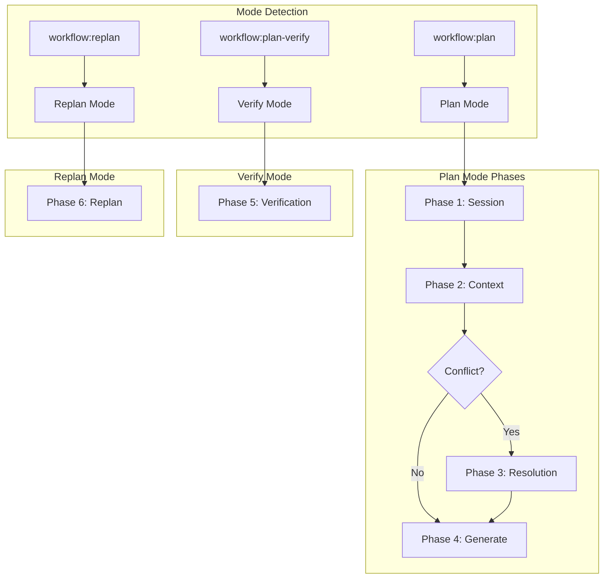
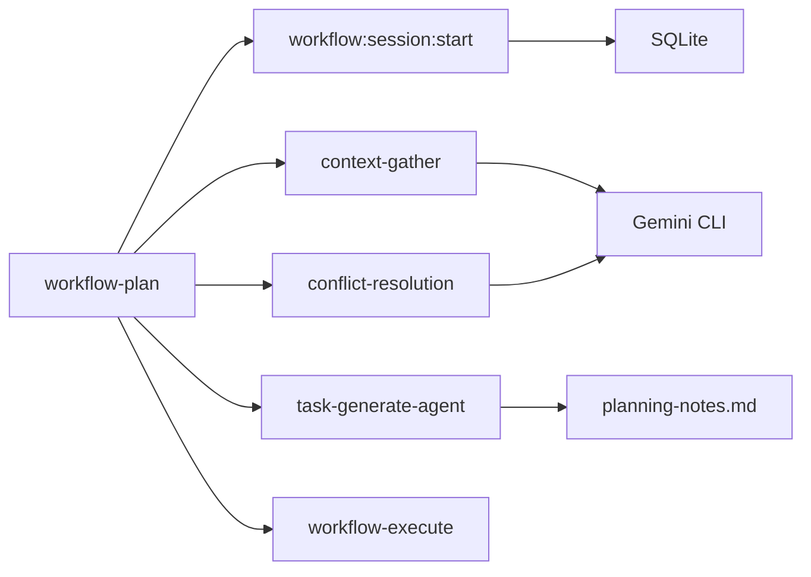

# workflow-plan

---
id: SKILL-workflow-plan
version: 1.0.0
status: active
source_path: ../../.claude/skills/workflow-plan/SKILL.md
source_hash: a1b2c3d4e5f6
---

> **Category**: Workflow Core
> **Phase Count**: 6 (4 plan + 1 verify + 1 replan)
> **Complexity**: Level 3

---

## 概述

`workflow-plan` 是 CCW 的统一规划技能，提供 4 阶段规划工作流、计划质量验证和交互式重规划功能。作为规划核心，它协调上下文收集、冲突检测和任务生成，产出可执行的实施计划。

**核心产出**:
- `IMPL_PLAN.md` - 实施计划主文档
- `task JSONs` - 任务分解文件
- `PLAN_VERIFICATION.md` - 质量验证报告
- `planning-notes.md` - 规划过程笔记

---

## 核心能力

### 多模式路由



### 关键设计原则

| 原则 | 说明 |
|------|------|
| **Pure Orchestrator** | SKILL.md 仅路由协调，执行细节在阶段文件 |
| **Progressive Loading** | 仅在阶段执行时加载阶段文档 |
| **Task Attachment** | 子任务附加到编排器，顺序执行后折叠 |
| **Auto-Continue** | 阶段完成后自动执行下一阶段 |
| **Accumulated State** | planning-notes.md 跨阶段传递上下文 |

---

## 工作流程

### Phase 1: Session Discovery

**目的**: 创建或发现工作流会话

**执行步骤**:
1. 解析用户输入为结构化格式 (GOAL/SCOPE/CONTEXT)
2. 调用 `/workflow:session:start --auto "structured-description"`
3. 获取 sessionId (格式: WFS-xxx)
4. 初始化 `planning-notes.md`

**输出**:
```json
{
  "sessionId": "WFS-20260216-001",
  "sessionPath": ".workflow/sessions/WFS-20260216-001",
  "artifacts": ["planning-notes.md"]
}
```

### Phase 2: Context Gathering

**目的**: 收集项目上下文和分析代码库

**任务分解** (Task Attachment):
```
→ Analyze codebase structure
→ Identify integration points  
→ Generate context package
```

**执行步骤**:
1. 加载 `phases/02-context-gathering.md`
2. 分析项目结构，识别关键文件
3. 检测依赖关系和集成点
4. 生成 `context-package.json`
5. 评估冲突风险 (conflictRisk)

**输出**:
```json
{
  "contextPath": ".workflow/sessions/WFS-xxx/context-package.json",
  "conflictRisk": "medium",
  "criticalFiles": ["src/auth/*.ts", "src/middleware/*.ts"],
  "architecture": "Express.js + TypeScript"
}
```

### Phase 3: Conflict Resolution (条件执行)

**触发条件**: `conflictRisk ≥ medium`

**任务分解**:
```
→ Detect conflicts with CLI analysis
→ Present conflicts to user
→ Apply resolution strategies
```

**执行步骤**:
1. 加载 `phases/03-conflict-resolution.md`
2. 使用 CLI 工具分析潜在冲突
3. 向用户展示冲突选项
4. 应用解决策略
5. 修改 brainstorm artifacts

**输出**:
```json
{
  "resolved": true,
  "modifiedArtifacts": ["brainstorm-analysis.md"],
  "strategies": ["merge", "override"]
}
```

### Phase 4: Task Generation

**目的**: 生成实施计划和任务分解

**执行步骤**:
1. 加载 `phases/04-task-generation.md`
2. 读取 planning-notes.md + context-package.json
3. 分解任务为 IMPL-N 格式
4. 生成任务 JSON 文件
5. 创建 TODO_LIST.md

**输出**:
```
.workflow/sessions/WFS-xxx/
├── IMPL_PLAN.md
├── tasks/
│   ├── IMPL-001.json
│   ├── IMPL-002.json
│   └── IMPL-003.json
└── TODO_LIST.md
```

### Phase 5: Plan Verification

**触发**: 用户选择 "Verify Plan Quality" 或 `/workflow:plan-verify`

**执行步骤**:
1. 加载 `phases/05-plan-verify.md`
2. Agent 驱动的质量验证
3. 检查完整性、可行性、依赖关系
4. 生成质量门禁建议

**输出**: `PLAN_VERIFICATION.md`

```markdown
# Plan Verification Report

## Quality Gate: PROCEED

| Criterion | Status | Score |
|-----------|--------|-------|
| Completeness | ✅ Pass | 95% |
| Dependency | ✅ Pass | 100% |
| Feasibility | ✅ Pass | 90% |
| Testability | ⚠️ Warning | 75% |
```

### Phase 6: Interactive Replan

**触发**: `/workflow:replan`

**执行步骤**:
1. 模式检测 (task vs session)
2. 需求澄清
3. 影响分析
4. 备份当前计划
5. 应用修改
6. 验证更新

**输入格式**:
```bash
/workflow:replan --session WFS-xxx IMPL-002 "Add error handling"
```

---

## 使用示例

### 基础规划

```bash
# 从任务描述开始
/workflow:plan "实现用户认证系统"

# 带详细要求
/workflow:plan "
GOAL: 实现 JWT 认证
SCOPE: 登录、注册、Token 刷新
CONTEXT: Express.js + TypeScript
"
```

### 自动模式

```bash
# 跳过所有确认
/workflow:plan "Add API endpoint" --auto
```

### 验证计划

```bash
# 验证当前会话计划
/workflow:plan-verify

# 验证指定会话
/workflow:plan-verify --session WFS-xxx
```

### 重规划

```bash
# 修改特定任务
/workflow:replan IMPL-002 "Add input validation"

# 会话级修改
/workflow:replan --session WFS-xxx "Change authentication method"
```

---

## 使用场景

### 单模块功能开发

适用场景：添加新 API 端点、实现单个组件

```bash
/workflow:plan "添加用户资料 API"
```

### 多模块系统开发

适用场景：跨模块功能、需要架构协调

```bash
/workflow:plan "
GOAL: 实现实时通知系统
SCOPE: WebSocket 服务、消息队列、前端集成
CONTEXT: 现有 Express.js 后端 + React 前端
"
```

### TDD 开发流程

适用场景：测试驱动开发，需要先写测试

```bash
/workflow:plan "实现支付模块" --tdd
```

### 复杂架构重构

适用场景：系统级重构，需要多方协调

```bash
# 先头脑风暴
/workflow:brainstorm "微服务拆分方案"
# 再规划
/workflow:plan "拆分用户服务"
```

## 最佳实践

### 1. 结构化输入

**推荐**：提供明确的 GOAL/SCOPE/CONTEXT

```bash
/workflow:plan "
GOAL: [明确的目标]
SCOPE: [边界范围]
CONTEXT: [技术背景和约束]
"
```

**避免**：模糊的描述

```bash
# 不推荐
/workflow:plan "做个好用的功能"
```

### 2. 利用自动模式

对于重复性任务，使用 `--auto` 跳过确认：

```bash
/workflow:plan "Add log endpoint" --auto
```

### 3. 验证后执行

始终在执行前验证计划质量：

```bash
/workflow:plan "..."
# 选择 "Verify Plan Quality"
# 验证通过后再执行
```

### 4. 增量重规划

使用 replan 进行小范围修改，而非重新开始：

```bash
/workflow:replan IMPL-002 "Add validation"
```

---

## 参数说明

| 参数 | 类型 | 必需 | 默认值 | 说明 |
|------|------|------|--------|------|
| `--session` | string | 否 | auto | 会话 ID |
| `--auto` | flag | 否 | false | 自动模式，跳过确认 |
| `task-id` | string | 否 | - | 重规划任务 ID (IMPL-N 格式) |
| `description` | string | 是 | - | 任务描述或需求 |

---

## TodoWrite 模式

### 任务附加 (Phase 2 示例)

```json
[
  {"content": "Phase 1: Session Discovery", "status": "completed"},
  {"content": "Phase 2: Context Gathering", "status": "in_progress"},
  {"content": "  → Analyze codebase structure", "status": "in_progress"},
  {"content": "  → Identify integration points", "status": "pending"},
  {"content": "  → Generate context package", "status": "pending"},
  {"content": "Phase 4: Task Generation", "status": "pending"}
]
```

### 任务折叠 (完成后)

```json
[
  {"content": "Phase 1: Session Discovery", "status": "completed"},
  {"content": "Phase 2: Context Gathering", "status": "completed"},
  {"content": "Phase 4: Task Generation", "status": "pending"}
]
```

---

## 模块交互

### 调用关系



### 依赖模块

| 模块 | 用途 | 阶段 |
|------|------|------|
| `session:start` | 会话创建 | Phase 1 |
| `context-gather` | 上下文收集 | Phase 2 |
| `conflict-resolution` | 冲突检测 | Phase 3 |
| `task-generate-agent` | 任务生成 | Phase 4 |
| `workflow-execute` | 执行计划 | 确认后 |

### 被调用方

- `/ccw` - 主编排器 (Level 3+ 任务)
- `/workflow:brainstorm:artifacts` - 头脑风暴后
- `/issue:plan` - Issue 规划

---

## 相关文档

- [Skills 索引](_index.md)
- [Architecture](../architecture.md)
- [workflow-execute](workflow-execute.md)
- [workflow-lite-plan](workflow-lite-plan.md)

---

## 错误处理

| 错误 | 处理方式 |
|------|----------|
| Parsing Failure | 重试一次，然后报告错误 |
| Validation Failure | 报告缺失的文件/数据 |
| Command Failure | 保持 `in_progress`，报告错误 |
| Session Not Found | 报告错误并列出可用会话 |
| Task Not Found | 报告错误并列出可用任务 |

---

*本文档由 CCW 知识系统维护 | source-hash: a1b2c3d4e5f6*
