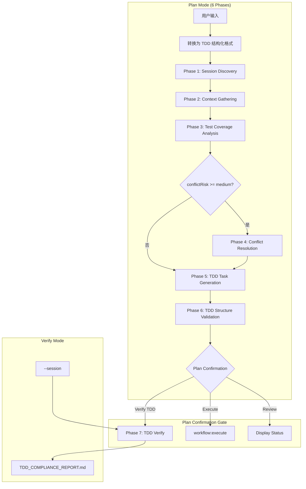

# workflow-tdd

> **分类**: Workflow Core
> **源文件**: [.claude/skills/workflow-tdd/SKILL.md](../../.claude/skills/workflow-tdd/SKILL.md)

## 概述

`workflow-tdd` 是一个统一的 TDD（测试驱动开发）工作流 skill，将 6 阶段 TDD 规划与 Red-Green-Refactor 任务链生成相结合，并提供 4 阶段 TDD 验证与合规性报告。

### 核心价值

- **TDD 铁律**: 无失败测试不写生产代码 - 在任务结构中强制执行
- **完整 TDD 周期**: 每个任务内部包含完整的 Red-Green-Refactor 循环
- **质量门禁**: 验证模式生成带有推荐决策的 TDD_COMPLIANCE_REPORT.md
- **量化强制**: 所有测试用例、覆盖率要求和实现范围必须包含明确数量
- **双模式支持**: Plan 模式（6 阶段规划）+ Verify 模式（4 阶段验证）

## 架构设计



### 架构说明

系统采用**纯协调器模式**，SKILL.md 仅负责路由和协调，具体执行细节在 phase 文件中。支持**渐进式阶段加载**，仅在需要执行时读取 phase 文档。

## 核心机制

### TDD 铁律 (The Iron Law)

```
NO PRODUCTION CODE WITHOUT A FAILING TEST FIRST
```

**强制方法**:
- Phase 5: `implementation` 包含 test-first 步骤（Red → Green → Refactor）
- Green 阶段: 包含 test-fix-cycle 配置（最多 3 次迭代）
- 自动回退: 达到最大迭代次数仍未通过测试时触发

### 任务附加/折叠模式

**关键原则**:

1. **任务附加**（阶段执行时）:
   - 子任务**附加**到协调器的 TodoWrite
   - Phase 3, 4, 5: 附加多个子任务
   - Phase 1, 2, 6: 单任务（原子操作）
   - 第一个附加任务标记为 `in_progress`，其他为 `pending`

2. **任务折叠**（子任务完成后）:
   - 适用于 Phase 3, 4, 5: 从 TodoWrite 移除详细子任务
   - **折叠**为高级阶段摘要
   - Phase 1, 2, 6: 无需折叠（单任务，仅标记完成）

### Red-Green-Refactor 结构

每个 TDD 任务包含 3 个实现步骤：

| 阶段 | tdd_phase | 目标 | Agent |
|------|-----------|------|-------|
| Red | `"red"` | 编写失败的测试 | @code-review-test-agent |
| Green | `"green"` | 实现最小代码使测试通过 | @code-developer |
| Refactor | `"refactor"` | 改进代码质量，保持测试通过 | @code-developer |

### TDD 合规检查点

| 检查点 | 验证阶段 | 所需证据 |
|--------|----------|----------|
| Test-first 结构 | Phase 5 | `implementation` 有 3 个步骤 |
| Red 阶段存在 | Phase 6 | Step 1: `tdd_phase: "red"` |
| Green 阶段带 test-fix | Phase 6 | Step 2: `tdd_phase: "green"` + test-fix-cycle |
| Refactor 阶段存在 | Phase 6 | Step 3: `tdd_phase: "refactor"` |

## 参数说明

| 参数 | 类型 | 必填 | 说明 |
|------|------|------|------|
| 无参数 | - | - | 默认进入 Plan 模式 |
| `--session` | string | 否 | Verify 模式指定会话 ID |
| `--yes` / `-y` | flag | 否 | 自动模式，跳过所有确认 |

**模式检测**:
```javascript
function detectMode(args) {
  // Skill trigger 确定模式
  if (skillName === 'workflow:tdd-verify') return 'verify'
  return 'plan'  // default: workflow:tdd-plan
}
```

## 使用场景

### 场景 1: TDD 规划（Plan 模式）

```bash
/workflow:tdd-plan "Build authentication system with JWT"
```

**执行流程**:
1. **Phase 1**: 创建/发现 TDD 工作流会话
2. **Phase 2**: 收集项目上下文
3. **Phase 3**: 分析测试覆盖率和框架
4. **Phase 4** (条件): 如果冲突风险 >= medium，执行冲突解决
5. **Phase 5**: 生成 TDD 任务（含内部 Red-Green-Refactor 循环）
6. **Phase 6**: 验证 TDD 结构

**Plan Confirmation Gate**:
- "Verify TDD Compliance" (推荐) → 进入 Phase 7
- "Start Execution" → `Skill(skill="workflow-execute")`
- "Review Status Only" → 显示会话状态

### 场景 2: TDD 验证（Verify 模式）

```bash
/workflow:tdd-verify --session WFS-auth-system
```

**执行流程** (Phase 7):
1. **Step 7.1**: 会话发现和验证
2. **Step 7.2**: 任务链结构验证
3. **Step 7.3**: 覆盖率和周期分析
4. **Step 7.4**: 生成合规报告

### 场景 3: 自动模式

```bash
/workflow:tdd-plan --yes "Add user registration"
```

**自动行为**:
- 跳过 Phase 0 用户配置问题
- 使用默认值（无补充材料，Agent 执行器）
- 自动选择 "Verify TDD Compliance"
- 如果 APPROVED，自动继续执行

## 实现细节

### Phase 0: 用户配置

收集执行偏好：

```javascript
AskUserQuestion({
  questions: [
    {
      question: "是否跳过所有确认步骤（自动模式）？",
      options: [
        { label: "Interactive (Recommended)", description: "交互模式" },
        { label: "Auto", description: "跳过所有确认" }
      ]
    },
    {
      question: "Select execution method for generated TDD tasks:",
      options: [
        { label: "Agent (Recommended)", description: "Claude agent 直接执行 Red-Green-Refactor" },
        { label: "Hybrid", description: "Agent 协调，复杂步骤调用 CLI" },
        { label: "CLI Only", description: "所有 TDD 周期通过 CLI 工具" }
      ]
    }
  ]
})
```

### Phase 5: TDD Task Generation

**任务结构哲学**:
- **1 feature = 1 task**，内部包含完整 TDD 循环
- 每个任务顺序执行 Red-Green-Refactor 阶段
- Task count = Feature count（通常 5 个功能 = 5 个任务）

**任务限制**:
- **最多 18 个任务**（TDD 工作流硬限制）
- 层级: 扁平（<=5 简单功能）| 两级（6-10 复杂功能带子任务）
- 超过 18 个任务需要拆分为多个 TDD 会话

**任务 JSON 结构**:
```json
{
  "id": "IMPL-1",
  "title": "User Authentication",
  "meta": {
    "tdd_workflow": true,
    "max_iterations": 3,
    "execution_config": {
      "method": "agent|cli|hybrid",
      "cli_tool": "codex|gemini|qwen",
      "enable_resume": true
    }
  },
  "cli_execution": {
    "id": "WFS-auth-IMPL-1",
    "strategy": "new|resume|fork|merge_fork"
  },
  "tdd_cycles": [
    {
      "test_count": 5,
      "test_cases": ["case1", "case2", "case3", "case4", "case5"],
      "implementation_scope": "5 functions in auth.ts lines 10-150",
      "expected_coverage": ">=85%"
    }
  ],
  "implementation": [
    {
      "step": 1,
      "tdd_phase": "red",
      "action": "Write 5 test cases: [login success, invalid password, locked account, token expiry, refresh flow]"
    },
    {
      "step": 2,
      "tdd_phase": "green",
      "action": "Implement 5 functions in auth.ts lines 10-150: [login(), validate(), lock(), expire(), refresh()]",
      "test_fix_cycle": {
        "max_iterations": 3,
        "auto_revert": true
      }
    },
    {
      "step": 3,
      "tdd_phase": "refactor",
      "action": "Apply 3 refactorings: [extract validation logic, add error handling, optimize token cache]"
    }
  ],
  "focus_paths": ["/src/auth/", "/src/middleware/"],
  "convergence": {
    "criteria": [
      "All 5 tests pass with >=85% coverage",
      "No TypeScript errors",
      "Refactoring maintains green tests"
    ]
  }
}
```

### Phase 7: TDD Verification

**质量门禁标准**:

| 推荐决策 | 分数范围 | 严重违规 | 操作 |
|----------|----------|----------|------|
| **APPROVED** | ≥90 | 0 | 可以合并 |
| **PROCEED_WITH_CAVEATS** | ≥70 | 0 | 可继续，处理小问题 |
| **REQUIRE_FIXES** | ≥50 | 有 | 必须修复后合并 |
| **BLOCK_MERGE** | <50 | 有 | 阻止合并直到解决 |

**合规分数计算**:
```
基础分: 100 分

扣分项:
链结构:
   - 缺少 TEST 任务: -30 分/功能
   - 缺少 IMPL 任务: -30 分/功能
   - 缺少 REFACTOR 任务: -10 分/功能
   - 依赖错误: -15 分/错误
   - Agent 错误: -5 分/错误
   - tdd_phase 错误: -5 分/错误

TDD 周期合规:
   - 测试初始未失败: -10 分/功能
   - IMPL 后测试未通过: -20 分/功能
   - REFACTOR 期间测试失败: -15 分/功能
   - 过度工程化: -10 分/功能

覆盖率质量:
   - 行覆盖率 < 80%: -5 分
   - 分支覆盖率 < 70%: -5 分
   - 函数覆盖率 < 80%: -5 分

最终分数: Max(0, 基础分 - 总扣分)
```

### TodoWrite 模式示例

**初始状态 (Plan 模式)**:
```json
[
  {"content": "Phase 1: Session Discovery", "status": "in_progress"},
  {"content": "Phase 2: Context Gathering", "status": "pending"},
  {"content": "Phase 3: Test Coverage Analysis", "status": "pending"},
  {"content": "Phase 5: TDD Task Generation", "status": "pending"},
  {"content": "Phase 6: TDD Structure Validation", "status": "pending"}
]
```

**Phase 3 (任务附加)**:
```json
[
  {"content": "Phase 1: Session Discovery", "status": "completed"},
  {"content": "Phase 2: Context Gathering", "status": "completed"},
  {"content": "Phase 3: Test Coverage Analysis", "status": "in_progress"},
  {"content": "  → Detect test framework", "status": "in_progress"},
  {"content": "  → Analyze existing coverage", "status": "pending"},
  {"content": "  → Identify coverage gaps", "status": "pending"},
  {"content": "Phase 5: TDD Task Generation", "status": "pending"}
]
```

**Phase 3 (折叠后)**:
```json
[
  {"content": "Phase 1: Session Discovery", "status": "completed"},
  {"content": "Phase 2: Context Gathering", "status": "completed"},
  {"content": "Phase 3: Test Coverage Analysis", "status": "completed"},
  {"content": "Phase 5: TDD Task Generation", "status": "pending"}
]
```

## 输出文件结构

```
.workflow/active/WFS-{session-id}/
├── workflow-session.json          # 会话元数据
├── plan.json                      # 结构化计划概览（TDD 变体）
├── IMPL_PLAN.md                   # TDD 实现计划
├── TODO_LIST.md                   # 带 TDD 阶段指示器的任务列表
├── TDD_COMPLIANCE_REPORT.md       # 合规报告（Verify 模式）
├── .task/
│   ├── IMPL-1.json                # 完整 TDD 任务（内部 Red-Green-Refactor）
│   ├── IMPL-2.json                # 完整 TDD 任务
│   └── ...
└── .process/
    ├── context-package.json       # 上下文包
    ├── test-context-package.json  # 测试覆盖分析
    ├── conflict-resolution.json   # 冲突解决（如存在）
    ├── test-results.json          # 测试结果（Verify 模式）
    ├── coverage-report.json       # 覆盖率报告（Verify 模式）
    ├── tdd-cycle-report.md        # TDD 周期报告（Verify 模式）
    └── tdd-warnings.log           # 非阻塞警告
```

## Phase 参考文档

| Phase | 文档 | 用途 | 模式 |
|-------|------|------|------|
| 1 | phases/01-session-discovery.md | 创建或发现 TDD 会话 | plan |
| 2 | phases/02-context-gathering.md | 收集项目上下文 | plan |
| 3 | phases/03-test-coverage-analysis.md | 分析测试覆盖和框架 | plan |
| 4 | phases/04-conflict-resolution.md | 检测和解决冲突（条件） | plan |
| 5 | phases/05-tdd-task-generation.md | 生成 TDD 任务 | plan |
| 6 | phases/06-tdd-structure-validation.md | 验证 TDD 结构 | plan |
| 7 | phases/07-tdd-verify.md | 完整 TDD 合规验证 | verify |

## 关联组件

- **前置 Skills**: 无（可选运行 brainstorm 命令）
- **调用 Skills**:
  - `/workflow:session:start` - Phase 1
  - `/compact` - Phase 4 内存优化
  - `Skill(skill="workflow-execute")` - 开始 TDD 实现
- **后置 Skills**:
  - `/workflow:tdd-verify` - 验证 TDD 合规性
  - `/workflow:plan-verify` - 验证计划质量

## 最佳实践

1. **遵循 TDD 铁律**: 永远不要在没有失败测试的情况下编写生产代码

2. **使用量化指标**:
   - Red Phase: "Write N test cases: [case1, case2, ...]"
   - Green Phase: "Implement N functions in file lines X-Y"
   - Refactor Phase: "Apply N refactorings: [improvement1, ...]"

3. **任务数量控制**:
   - 保持在 18 个任务以内
   - 超过则拆分为多个 TDD 会话

4. **利用验证模式**: 规划完成后运行 `/workflow:tdd-verify` 验证合规性

5. **选择合适执行方法**:
   - Agent: 适合简单 TDD 周期
   - Hybrid: 复杂周期用 CLI，简单用 Agent
   - CLI Only: 所有周期通过 CLI 工具

## 常见问题

### Q: TDD 任务的典型结构是什么？

A: 每个 TDD 任务包含 3 个实现步骤：
1. **Red Phase**: 编写失败的测试（tdd_phase: "red"）
2. **Green Phase**: 实现最小代码使测试通过（tdd_phase: "green"，含 test-fix-cycle）
3. **Refactor Phase**: 改进代码质量（tdd_phase: "refactor"）

### Q: 什么时候需要使用子任务？

A: 当满足以下条件之一时：
- 功能复杂度 >2500 行或 >6 文件/TDD 周期
- 多个独立子功能需要并行执行
- 存在强技术依赖阻塞（如 API 先于 UI）
- 同一功能涉及不同技术栈或领域

### Q: 质量门禁的四种推荐决策分别意味着什么？

A:
- **APPROVED**: 分数≥90，无严重违规，可以合并
- **PROCEED_WITH_CAVEATS**: 分数≥70，无严重违规，可继续但需注意小问题
- **REQUIRE_FIXES**: 分数≥50或有严重违规，必须修复后才能合并
- **BLOCK_MERGE**: 分数<50，阻止合并直到解决

### Q: 如何处理超过 18 个任务的情况？

A: 将项目拆分为多个 TDD 工作流会话，每个会话处理一组相关功能。

### Q: Red Flags（红旗）模式有哪些？

A:
- 代码在测试之前编写
- 测试立即通过（未见证 Red 阶段）
- 无法解释测试为何应该失败
- "就这一次"的合理化
- "事后测试能达到同样目标"的想法

---

*Auto-generated by CCW Knowledge System*
